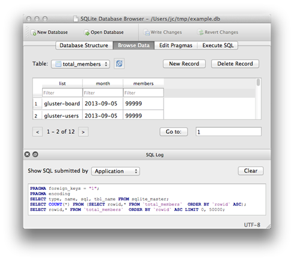

# VERİ TABANI

## Birlikte Düşünelim

Farklı veri tabanlarını aynı anda kullanmak mümkün müdür? Hangi veriyi
artık silmek bir risk taşımayacaktır?
>
Veri tabanlarının bulut bilişimde yeri nedir?

## Başlamadan Önce

Bu bölüm veri tabanıyla ilgili temel olguları gözden geçirmemiz, bir
giriş yapmamız ve temelde amacımızın ne olduğunu hatırlatmak için
hazırlandı. Veriyi saklamak için 1970'ten beri kullandığımız bu yöntem
neden hala en popüler olanı? Yeni teknolojiler etrafımızı sarmışken
veri alanında bu kadar uzun süre kullanışlı kalabilen bu yöntemin ve
yaklaşımın sırrı nedir? Bu bölüm içerisinde veri tabanı ve
özelliklerini tartışarak geçen dönem aldığınız Veri Tabanı Tasarımı
dersine bir göz kırpacağız. Sonra da tasarladığımız veri tabanlarını
yönetmeyi öğreneceğiz.

## Veri ve Veri Tabanı

Veri kavramını bilgisayar programcılığından ayrı düşünmek mümkün
değil. Bilgisayar programcılığı sayesinde bilgisayarı büyük bir hesap
makinesi gibi kullanıyor ve çeşitli süreçleri otomatik hale
getiriyoruz. Bu süreçler genellikle veri ya da veriden elde edilen
enformasyonun çeşitli biçimler arasındaki geçişini konu ediniyor.
Bilgelik Hiyerarşisi, verinin enformasyona, enformasyonun bilgiye,
bilginin ise bilgeliğe dönüşebildiğini gösterirken her bir adım miktar
olarak azalan ancak değer olarak artan bir yapıya sahip olduğunu
göstermektedir (Rowley, 2007).
>
Günümüz teknolojik altyapısı, içinde bulunduğumuz çevreyle ilgili
gözlemlediğimiz ya da gözlemleyemediğimiz çok miktarda veriyi kayıt
altına alabilecek kapasitededir. Otonom sürüşün artık hayatımıza dahil
olduğu bu süreçte bir araç, otonom sürüş yapabilmek için insanın sahip
olduğu algıların çok daha fazlasına sensörler sayesinde sahiptirler.
Sahip olduğumuz teknolojik altyapı güçlendikçe daha fazla veriyi
ölçmek ve kayıt altına almak için çalışmalara devam ediyoruz. Bunun
sebebi, ne kadar fazla veri toplarsak, çok daha fazla enformasyona da
sahip olabilecek olmamızdır.
>
En nihayetinde daha fazla veri toplayabiliyor olsak da topladığımız
veriyi etkili bir şekilde kaydedemediğimizde ve işleyemediğimizde
bizim için anlamsız ve gereksiz maliyet oluşturan bir süreçle karşı
karşıya kalabiliriz. Büyük veri olarak adlandırılan kavram özetle
“başa çıkılamayacak kadar çok veri” olarak tanımlanabilir.
İşleyebileceğimizden daha fazla veriyi kaydettiğimiz sürece, sahip
olduğumuz teknik altyapıdan bağımsız olarak büyük veri kavramıyla
karşı karşıya kalacağız. Daha fazla veriyi kaydetmek, daha fazla
veriyi işlemek için gerekli altyapıyı kurmak, daha hızlı algoritmalar
geliştirmek ve elde edilen sonuçları gerçek hayata uygulamak;
birbirini zorlayan ve daha ileri gidilmesini sağlayan mekanizmalardır.
Veri bilimi kavramının özel sektörde kendine çok daha fazla yer
bulması da bu sürecin bir sonucudur. Verinin üretilmesi ya da
toplanması aşamasından, belirli bir problemin çözülmesi için
kullanılması aşamasına kadar olan süreçler çeşitli uzmanlıklar
gerektirmektedir. Bu uzmanlıklar da günümüzde karşımıza veri bilimcisi
olma şemsiyesi ile çıkmaktadır.
>
Verinin kayıt altına alınmasıyla ilgili zaman içerisinde çeşitli
yöntemler geliştirilmiştir. Her ne kadar çok sayıda yöntem bulunsa da
1970 yılında önerilen (Codd, 1969; Codd, 1970) ilişkisel veri
tabanları günümüzde hala en çok kullanılan yöntemdir. Statista'nın
Ağustos 2022 raporuna göre en çok kullanılan 4 veri tabanı yönetim
sistemi (Oracle, MySQL, Microsoft SQL Server, PostgreSQL) ilişkisel
veri tabanıdır.!

>
İlişkisel veri tabanları, verinin niteliklerinin (farklı kaynaklarda
nitelik yerine sütun, değişken, özellik, boyut, gösterge kelimeleri de
kullanılmaktadır) gruplanarak küçük veri yapıları oluşturması ve bu
veri yapılarının birbirleriyle ilişkilendirilmesi ilkesine bağlı
olarak çalışmaktadır. Böylece birbirleriyle fonksiyonel bağımlılık
ilişkilisine sahip nitelikler gruplanarak küçük tablolar
oluşturulmasını sağlarlar. Hangi niteliklerin hangi kümede bulunması
gerektiği konusu veri tabanı tasarımcılığı ile ilgilidir ve genellikle
bilgiyle birlikte deneyimi de gerektirir. Bu konuda bir önceki
dönemdeki dersiniz olan Veri Tabanı Tasarımı, birçok bilgi ve deneyim
kazanmanızı sağlayacak atölyeler içermektedir. Eğer veri tabanı
tasarlama konusunda daha fazla pratiğe ihtiyaç duyuyorsanız ilgili
dersin kaynaklarından tekrar faydalanmanız faydalı olabilir. İyi
tasarlanmış veri tabanları geleneksel veri saklama yöntemine göre
birçok avantaja sahiptirler. İlişkisel veri tabanının önerilmesinde 3
motivasyon bulunmaktadır (Codd, 1982).
>
Bunlardan birincisi fiziksel ve mantıksal boyutların birbirlerinden
tamamen ayrılmasıdır. Bu durumu iki açıdan ayrı ayrı inceleyebiliriz.
Birincisi eldeki fiziksel altyapıya uygun veri toplamanın getireceği
problemlerdir. Veri toplamak için ayrılan belirli bir bilgisayar
altyapısı mevcut ise, veri toplama aşamasında bu altyapı düşünülerek
toplanacak verinin niteliğinin belirlenmesi doğru bir yaklaşım
değildir. Toplanacak veri, bir problemin çözümüne yönelik elde edilmek
istenilen enformasyonu ortaya çıkarabilecek nicelik ve nitelikte
olmalıdır. Burada fiziksel kapasite bir limit oluşturmamalıdır.
Örneğin on yıllık satış verileri incelenirken disk kapasitesi
yetersizliği sebebiyle 7 yıllık satış verisi toplamak etkin bir
yaklaşım olmayacaktır. Diğer bir yandan verinin mantıksal boyutunun da
fiziksel boyutu üzerinde etkili olmaması sağlanmalıdır. Veri tabanları
genellikle çok tablodan ya da farklı zaman dilimlerine ait verilerden
oluşmaktadır. Boyut miktarı arttıkça veri hacmi de artabilir. Veri
hacminin artması fiziksel altyapının yetersiz gelmesine sebep
olabilir. Ancak bu durumun çözümü verinin parçalara bölünerek farklı
fiziksel ortamlarda bir araya getirilmesi değildir. İlişkisel veri
tabanları, verinin bir yığın olarak görülmesinin önüne geçmiş; bunun
yerine ilişkisel ve mümkün olan en küçük tablolarda, veri tekrarı
olmadan barındırılması ve sorgulanması konusunda avantajlar ortaya
koymuştur. Bu sayede fiziksel ve mantıksal boyutlar birbirlerinden
bağımsız olarak değerlendirilebilmekte ve uygulanabilmektedir. Günümüz
teknolojileri ile bu konuda zaman
>
zaman zorluk yaşansa da yeni yaklaşımlar ve yöntemler ile etkin bir
veri yönetimi süreci sürdürülebilmektedir.
>
İkinci motivasyon daha “kolay” bir yaklaşım elde etmektir. Ham veri
kümeleri; satır ve sütunlara sahip, düşük hacimlerde gözle dahi
kolayca incelenebilen veri yapılarıdır. Veri miktarı arttıkça gözle
incelemek zorlaşsa da üzerinde işlem yapmak kullanıcıların kolayca
anlayabildiği ve uygulayabildiği işlemlerdir.
>
Örneğin bir sütunda yer alan değerlerin ortalamasını almak MS Excel
yazılımıyla oldukça kolaydır. Ancak burada “kolay”dan kasıt kolayca
anlaşılabileceğidir. Yani bir veri kümesi GB'lar mertebesine
ulaştığında ortalama almaktan biraz daha karmaşık bir işlem fiziksel
altyapı için oldukça zorlayıcı olabilecekken, kullanıcı için anlaması
hala oldukça basittir. Nihayetinde veri kümesinde bir sütunda yer alan
değerler üzerinde basit bir işlem yapılmasını gerektirir. Geleneksel
veri saklama yöntemlerinde iyileştirmeler yaptıkça verinin saklanılma
biçimi değiştiği için veri üzerinde işlem yapmak için düşünce
yapısında da güncelleme yapmak gerekmektedir. Tek bir veri kümesi iken
bir sütun üzerinde işlem yapabiliyorken, parçalara bölünmüş bir veri
kümesi üzerinde aynı işlemi yapmak için biraz daha farklı düşünmek
gerekecektir. Codd, ilişkisel veri tabanı önerisinin ikinci
motivasyonunda bu konuyu ön plana almaktadır. Kendisi, geleneksel veri
saklama yöntemlerine göre daha etkin bir yöntem sunmakla birlikte bu
yöntemin tüm kullanıcı ve programcılar tarafından kolayca
anlaşılabilmesi gerektiğini düşünüyordu. Çünkü ortaya atılan yeni
yaklaşım, her ne kadar çok daha performanslı olsa da nasıl
kullanılacağı insanlar tarafından anlaşılamıyorsa kullanılması da pek
mümkün olmayacaktı. İlişkisel veri tabanlarının yapısına baktığımızda,
görünüm olarak ham veri kümesi yapısına oldukça benziyor. Bu da
geliştiricilerin veri tabanını ilk kez gördüklerinde bile tanıdıkları
bir yapıya sahip olduğu izlenimini oluşturuyor. Ayrıca niteliklerin
gruplanarak çok sayıda küçük tablo oluşturmak, çok büyük bir veri
kümesini gözle incelemekten çok daha kolaydır. Örneğin kullanıcılarla
ilgili bir veri tabanı tablosunu incelersek kullanıcıya ait
özelliklerin tutulduğu sütunlar ve bu sütunlar altındaki kayıtları
görüntüleyebiliriz. En nihayetinde Codd'un amacına uygun bir yapı
önerdiği yorumunu yapabiliriz. Programlamaya yeni başlayan ve hatta
ilgisi olmayan biri dahi bir veri tabanı ile karşılaştığında kolayca
yorumlayabilecektir.
>
Üçüncü motivasyon kayıtlar üzerinde çeşitli işlemleri
gerçekleştirebilmek üzere hazırlanmış bir üst seviye dil
kullanılmasıdır. Programlama dilleri alt, orta ve üst seviye olarak
üçe ayrılır. Üst seviye diller kullanıcının doğal (konuştuğu) dile
oldukça yakın ve dolayısıyla kolay öğrenilebilir ve geliştirme
yapılabilir dillerdir.
>
Ham veri kümeleri üzerinde analiz yapmak, doğrudan nitelikleri ve
kayıtları kullandığımız için çok daha kolay anlaşılır; bir programlama
dili kullanılsa bile satır ve sütun indisleri ile kolayca erişilebilir
durumdadır. Ancak ilişkisel veri tabanı gibi bir yapı içerisinde
ilgili veriyi filtrelemek, analiz etmek ve gerektiğinde yeni
kayıtların doğru tabloya doğru şekilde eklenmesini sağlamak daha fazla
dikkat ve bilgi gerektiren bir süreç olarak karşımıza çıkmaktadır.
Codd, ilişkisel veri tabanını önerirken motivasyonlarından birinin bu
olduğunu; bir veri tabanını yönetme aşamasında üst seviye ve evrensel
bir dile ihtiyaç duyulduğunu belirtmiştir. Bu amaçla kullanılan en
yaygın dil olan SQL bu dersin kapsamındadır. Üçüncü bölümde SQL
tanıtılacaktır. Bununla birlikte nispeten daha yeni ve kullanım oranı
her geçen gün artan veri tabanı sorgulama yaklaşımı olan ORM de üçüncü
bölüm içerisinde tanıtılacaktır. Ders boyunca verilecek tüm örnekler
hem SQL hem de ORM ile birlikte sunulacak, öğrencilerin bu iki
yaklaşıma da hâkim olması beklenecektir. SQL dili geleneksel ve en sık
kullanılan yöntem olması, ORM ise özel sektörde hızla daha da
yaygınlaşması sebebiyle bu dersi alan öğrencilerin biliyor olması
gereken teknolojilerdir.
>
İlişkisel veri tabanlarının beraberlerinde getirdiği avantajlar zaman
içerisinde çeşitli çalışmalarla incelenmiştir. Şimdi veri tabanlarının
avantajlarını ele alalım (Sumathi ve Esakkirajan, 2007; Zeng & diğ.,
2010).
>
İlk ve en önemli avantaj, ilişkisel veri tabanlarının yapılandırılmış
veriyi saklayabiliyor olmasıdır. Yapılandırılmış veri, satır ve
sütunlara bölünmüş hücreler içerisinde kayıtların atomik olarak
saklanılması durumudur. Günümüzde toplanan verinin çok büyük bir kısmı
yapılandırılmamış veriden oluşmaktadır.
>
Bunun en büyük sebebi de sosyal medya ve Web'den toplanan verilerdir.
Günümüzde Twitter adlı mikro blog web sitesinde yer alan veriler
birçok amaçla analiz edilmektedir. Ancak buradan toplanan veriler
doğrudan kişiler tarafından yazılan metinler olduğu için satır ve
sütunlarla kayıt altına alınamazlar. Benzer şekilde bir anahtar kelime
ile araştırma yaptığımızda birçok web sitesi ile karşılaşırız ve bu
sitelerin içerdiği verileri toplayabiliriz. Ancak her web sitesinin
sayfa yapısı birbirinden farklı olduğu için yine yapılandırılmamış
veriyle karşı karşıya kalmış oluruz. Tüm bu durumlar büyük veri
ifadesiyle kesişmekte; yeni araç ve yöntemlere gerek duyulmasına sebep
olmaktadır. Ancak bu konu bu dersin kapsamı dışındadır. İlişkisel veri
tabanları doğrudan satırlar ve sütunlarla ifade ettiğimiz ya da
yapılandırılmamış bir verinin bir takım ön
>
işleme çalışmalarının ardından yapılandırılmış veriye
dönüştürülmesiyle elde edilen veri kümelerinin yönetilmesini kapsar.
Verinin yapılandırılmış olarak saklanması özellikle sorgulama ve
ihtiyaç duyulan veriye hızlıca ulaşılması konusunda fayda
sağlayacaktır. Veri tabanında ihtiyaç duyulan sorgu sonucu, belirli
bir tabloda ve belirli nitelikler altında tanımlanmış durumda
olmalıdır. Bu da her ihtiyaç duyulduğu anda verinin sorgulanması ve
çeşitli raporlama sistemlerinin anlık olarak güncellenebilmesi
sağlanabilmektedir.
>
Yapılandırılmamış veri keşfedilmeyi bekleyen enformasyonu içeriyor
olsa da anlık ihtiyaçlara yanıt veremez; bunun ötesinde daha karmaşık
veri madenciliği tekniklerinin uygulanması ve çeşitli sorulara yanıt
aranmasını sağlarlar.
>
İlişkisel veri tabanları, verinin en düşük hacimle, tekrarsız olarak
saklanılmasını sağlamaktadırlar. Bir elektronik satış sitesinde, satın
alan yapan kullanıcının bilgilerinin her satış bilgisiyle birlikte
tekrar tekrar kaydedilmesi etkin bir çözüm olmayacaktır. Ya da bir
kütüphane sisteminde her ödünç alma işleminde ödünç alanın iletişim
bilgilerinin tekrar kaydedilmesi gereksiz tekrara ve daha büyük kayıt
yerine ihtiyacı beraberinde getirecektir. İlişkisel veri tabanları
içerisinde her bir olgu ya da eylem, bir veri tabanı tablosu olarak
saklanır. Kullanıcı, satış, ürün ve mağaza tablo adlarına birer
örnektir. Her bir tablo, o tabloya ait kayıtları bir kez
bulunduracaktır. Örneğin sistemde yer alan bir kullanıcı, ilgili
tabloda bir kez tanımlanır. Bu kullanıcı sistem üzerinde ne kadar çok
işlem gerçekleştirirse gerçekleştirsin kullanıcı kaydı yalnızca 1
satırdır. Kullanıcının bilgilerinin kullanılması gereken yerlerde, tüm
kayıtlar yerine birincil anahtarı kullanılır. Böylece kullanıcı
verilerinde gerçekleştirilmesi gereken bir güncelleme yalnızca tek
satırlık kayıt üzerinde gerçekleştirilir. Bu kaydı birincil anahtarı
ile çağıran diğer tüm kayıt alanları bu güncellemeden otomatik olarak
etkilenirler. Veri tabanı içerisinde veri tekrarını en aza indirmek,
bazı dosya sıkıştırma algoritmalarına benzer süreçler içermekte ve
nihayetinde verinin en az yer kaplayarak saklanılmasına olanak
sağlamaktadırlar.
>
İlişkisel veri tabanları ölçeklenebilirler. Yani daha yüksek erişim ya
da veri saklama kapasitesine ihtiyaç duyulması durumunda destekleyici
teknolojiler sayesinde bu ihtiyaca karşılık verebilirler.
Ölçeklenebilirlik, günümüzün önemli ihtiyaçlarından biridir. Bir
sistem, ne kadar düzenli ve kontrol altında olursa olsun genellikle
zamanla büyüyecektir. Sürekli büyüyen bir sistem için altyapının da
sürekli genişletilmesi gerekecektir. Küçük bir sistem için geniş bir
altyapı gereksiz maliyet oluşturacağı gibi büyük bir sistemin limitli
bir altyapı üzerinde çalışması sistem fonksiyonelliğini azaltacaktır.
Değişken kapasiteli altyapı günümüz sistemlerin genel ihtiyacıdır.
Sistemlerin zamanla genişlemesinin yanında, bazı sistemlerin dönemsel
olarak genişlemesi ve daralması da söz konusu olabilir. Örneği bir
online yemek sipariş sistemi, akşam saatlerinde çok yoğun olarak
ziyaretçi karşılayabilir ancak sabah saatlerine doğru minimum
yoğunluğa geri döner. Böyle bir sistem için statik altyapı hazırlamak
oldukça kötü bir çözüm olacaktır.
>
Yoğun saatlere göre yapılan planlama, diğer saatlerde gereksiz kaynak
oluşturacak; boş saatlere göre yapılan planlama ise yoğun saatlerde
aksamalara sebep olacaktır. Bu sebeplerle sistemlerin ihtiyaca göre
otomatik olarak ölçeklendirilebilmesi gerekmektedir. İlişkisel veri
tabanları ölçeklendirme teknolojileriyle uyumlu çalışmaktadır. Böylece
ilişkisel veri tabanı kullanan sistemlerin ölçeklendirme ihtiyaçlarını
karşılamaları kolaylaşmaktadır.
>
İlişkisel veri tabanları, hangi tür veriyi sakladığınızdan ve bu
veriye nereden eriştiğinizden bağımsız bir yapıya sahiptir. Bir veri
kümesini olgular ve eylemlere bağlı daha küçük veri kümelerine
bölebilmeniz ve bu veri kümeleri içerisinde satırlar ve sütunları
kullanmanız durumunda ilişkisel veri tabanlarını kullanabilirsiniz.
Tabloların hangi amaca hizmet ettiği, ne kadar veri sakladığı,
tablolar arasındaki ilişkilerin niceliği ve niteliği önemsizdir. Bu
sayede çok farklı amaçlar için bile ilişkisel veri tabanlarından
faydalanılabilir. Ayrıca veriye hangi platformdan erişileceği de
çeşitlendirilebilir. Bir veri tabanına mobil, web, masaüstü ve hatta
nesneler (akıllı ev aletleri vb.) üzerinden de erişilebilir. Dahası,
bu platformların bir kombinasyonu da veri tabanına erişiyor olabilir.
Mobil cihazdan girilen bir veri aynı anda web sitesindeki görünümü
etkileyebilir. Ya da mobil uygulamadan verdiğimiz bir komut evimizdeki
akıllı robot süpürgeye görev olarak yansıyabilir. İlişkisel veri
tabanları, veri tabanı yönetim sistemlerinin yetenekleri limitlerinde
çok sayıda platformla etkileşime geçebilir ve sağlanan yönetici
izinlerine bağlı olarak tümüne aynı anda hizmet sunabilir.
>
Eğer bir veri kümesi, MS Excel gibi bir yazılımla bilgisayar üzerinde
tutuluyorsa, aynı anda yalnızca tek bir kişi tarafından
kullanılabilir. Her ne kadar bu dosya ağ üzerinden paylaşıma
açılabiliyor olsa da bir dosyaya aynı anda erişim sağlanması birçok
problemi beraberinde getirecektir. Öncelikle bir dosyanın aynı anda
birden fazla kişi tarafından değiştiriliyor olması için yazılımın buna
uygun geliştirilmiş olması gerekir.
>
Ancak birçok geleneksel veri saklama yazılımı bu yapıya uygun olarak
geliştirilmemiştir. Çok kullanıcının
>
aynı anda güncelleme yapmasına uygun yazılımlar genellikle bulut
tabanlı olarak karşımıza çıkmaktadır. Ancak bunlar dahi bir veri
kümesi üzerinden birden fazla kullanıcının mükemmel etkinlikte
çalışmasını sağlayamazlar. Bir veri kümesi içerisinde farklı
konumlarda yer alan kayıtlar üzerinde değişiklik yapmak muhtemelen
güvenlik bir eylem olacaktır. Ancak aynı kayıt üzerinde aynı anda
birden fazla kullanıcının işlem yapması, işlemlerin çatışmasına ve
veri bütünlüğünün bozulmasına sebep olabilir. Bir kullanıcı kimlik
numarasını 11111111111 olarak girenlerin kayıtlarını silmeyi denerken
başka bir kullanıcı böyle bir kişi için satış kaydı yapıyorsa
muhtemelen büyük bir veri tutarsızlığı oluşmak üzeredir. İlişkisel
veri tabanları aynı anda çok sayıda kullanıcının erişimine izin
vermektedir. Her bir erişim, o izin için tanımlanan eylemleri
gerçekleştirebilir. Yani bazı kullanıcılar sadece veri kayıtlarını
okuyabilirken bazıları yeni kayıt oluşturabilir. Ya da kayıtların
güncellenmesi yetkisi özel bir kullanıcı grubuna verilebilir. Bununla
birlikte gelen okuma, güncelleme, ekleme ve silme komutları veri
tabanı yönetim sistemi tarafından bir sıraya koyularak veri
bütünlüğünü bozmayacak şekilde sırayla işlenir. Her bir sorgunun
sonucunda komut gönderen kullanıcıya sorgusunun hangi yanıtı aldığı
bilgisi dönülür. Böylece komut bir hata ile sonuçlandıysa kullanıcı bu
durumdan anında haberdar olabilir.

## Veri Tabanı Tasarımcılığı

Tablo biçimindeki bir verini, herhangi bir elektronik tablo (MS Excel
gibi) yazılımıyla kayıt altına almak oldukça kolaydır. Veriyi
kopyalar, yapıştırır ya da elle girişini yapar ve kaydedersiniz. Bir
veri kümesinin veri tabanı yapısına dönüştürülerek kaydedilmesi için
ise ilişkili veri kümeleri oluşturmaktan ve bu şekilde kayıt altına
almaktan bahsetmiştik. Peki elimizde n tane sütuna, m tane satıra
sahip bir veri kümesi varken bu parçalama işlemini nasıl yapacağız?
Rastgele mi? Elbette hayır. Kaç tane küme oluşturmamız gerekli? Her
birinde kaç tane ve hangi sütunlar yer almalı? Böldüğümüz kayıtların
gerektiğinde yeniden birleştirilebilmesi için ne yapmak gerekir? Bu
bir veri tabanı tasarımı sürecidir.
>
Veri tabanı tasarlamak, sistem analizi ve tasarımı sürecinin önemli
bir parçasıdır. Yeni bir sistem geliştirilmeden önce uygulanan birçok
adım ve verilen karar içerisinde sistemin sahip olması gereken bileşen
ve yetenekler belirlenir. Buna göre de sistemin teknik bileşenlerine
karar verilir. Yazılımla ilgili mimari tasarımının yanı sıra veri
tabanı tasarımının da tüm ihtiyaç ve gerekliliklere paralel
hazırlanması gerekmektedir.
>
Veri tabanı tasarımı süreci özneldir (sübjektif), zordur ve risklidir.
Ayrıca deneyim gerektirir. Şimdi bu olguların sebeplerini tartışalım.
>
Veri tabanı tasarım süreci içerisinde risk barındırmaktadır. Bunun
sebebi, kurgulanan bir veri tabanının faaliyete başladıktan sonra
tasarımdaki bazı hatalardan dolayı veri üzerinde işlemlerin tam
performansla gerçekleştirilememesi ve işleyen bir veri tabanı
tasarımında güncelleme yapmanın farklı riskler barındırıyor olmasıdır.
Yeni bir sistem için sistem analizi ve tasarımı süreçleri görece daha
az streslidir. Çünkü bu süreçte yapılan hatalar, süreç sonlanmadan
giderildiği sürece bir tehlike içermezler. Hatalı ya da eksik
algoritmalar, unutulan bir kullanıcı rolü, testi tamamlanmamış
bileşenler, kayıt altına alınması gereken bir özelliğin göz ardı
edilmesi gibi konular sistem analizi ve tasarımı sürecinin kaçınılmaz
parçasıdır. Zaten bu süreç kendi içerisinde bu hataları yok etme
odaklı çok miktarda iş yükü ve sinerji gerektirmektedir. Sistem
analizi ve tasarımı süreci tamamlandığında gerçekleştirilecek sistem,
bütün ayrıntısıyla dokümante edilmiş durumda olur. Bu durum yeni
yapılacak bir binanın bütün planlarının hazırlanması gibidir. Yapım
süreci başladığında bilgisayar programcıları, tasarımcılar ve
mühendisler eldeki dokümanların yönlendirmelerine bağlı olarak sistemi
inşa ederler. Sistem tasarımı sürecinde tüm ayrıntılar ele alındığı
için genellikle gerçekleştirme sürecinde karar verme ihtiyacı
bulunmamaktadır. Gerçekleştirmenin tamamlanmasının ardından yine
ilgili dokümana göre gerekli testler yapılır ve sistem hazırdır.
Sistem, seçilen stratejiye göre alfa, beta ve benzeri test
süreçleriyle kademeli ya da doğrudan herkesin erişimine açılır. Veri
tabanıyla ilgili sözünü ettiğimiz risk bu noktada karşımıza çıkar. Bir
sistem canlıya alındığında (genel kullanıma açıldığında) daha önce
test edilmemiş bir durum ya da sistem analizi aşamasında akla gelmeyen
bir ihtiyaç fark edilebilir. Bu ihtiyaç, mevcut süreçleri zora sokan,
derhal gerçekleştirilmesi gereken, aksi halde mevcut süreçlerin devam
edememesine sebep olabilecek bir ihtiyaç olabilir. Ya da daha az
riskli olan bir yan süreç; geliştirilmesi için bir süre beklemenin
göze alınabileceği bir ihtiyaç da olabilir. Her iki durumda da sistem
analizi ve tasarımı süreçlerinin ilgili adımlarına dönülür, eksik
kalan ihtiyaç analiz edilir ve mevcut sisteme entegresi için gerekli
planlama yapılarak sistem üzerinde güncelleme süreci başlar. Ancak bu
süreç yeni bir sistem gerçekleştirmekten daha stresli olabilir.
Kimsenin kullanmadığı bir sistemin (yeni) geliştirilmesi sürecinde
>
kullanıcılar bu sürecin bir parçası değildir. Ancak kullanımda olan
bir sistemde değişiklik yapmak; her şey yolunda gitse bile
memnuniyetsizliklere yol açabilir. Sisteme erişim kesintileri
yaşanabilir, güncellemeler mevcut işleyişte hatalara sebep olabilir,
geliştirilen özellik tam olarak istenildiği şekilde hazırlanmamış
olabilir. Bu süreç içerisinde veri tabanı tasarımında yapılması
gereken güncellemeler, programlama tarafında olanlara göre daha riskli
olabilir. Bunun sebeplerinden bazıları;

- Veri tabanı tasarımı güncellendikten sonra mevcut veri tabanındaki
  verilerin yeni tasarıma uygun şekilde yerleştirilmesi gerekliliği,

- Yazılım içerisindeki veri tabanı bağlantılarının veri tabanına göre
  güncellenmesi gerekliliği,

- Yeni tasarımın genellikle yeterince test edilememesinden kaynaklı veri
  yönetiminde hatalar görülmesi olarak sayılabilir.

Yazılımda görülen hatalar, yazılım üzerindeki güncellemelerle
giderilebilirken; veri tabanı tasarımında görülen hatalar hem
yazılımda hem de eldeki veri bütünlüğünde de güncellemeler ve çeşitli
kontroller yapılmasını gerektirebilir. Bu sebeplerden dolayı sistem
analizi ve tasarımı süreçlerinde veri tabanı tasarımlarının daha fazla
zaman ve iş yükü maliyetini göze alarak dahi doğru şekilde
gerçekleştirilmesi, geliştirilen sistemin ihtiyaç duyulan duruma daha
uygun olmasını sağlayacaktır.
>
Veri tabanı tasarımını, yalnızca ihtiyaçların ve hedeflerin
doğrultusunda gerçekleştirmeye çalışmak; hangi kararların alınacağı
konusunda her zaman yeteri kadar yol gösterici olmayabilir.
Geliştirilen sistem, analiz ve tasarım aşamasında elde edilen
hedeflere göre yazılım geliştirme aşamalarından geçecektir. Ancak veri
tabanı tasarımı süreci, aynı zamanda verinin en iyi ne şekilde
yönetileceği, hangi sorgulara ihtiyaç duyulacağı, elde ne tür veriler
olduğu, gelecekte ne tür veriler ekleneceğini tahmin etmeye dayalı
olarak farklı seviyelerde karmaşıklıklara sahip olabilir. Veri tabanı
tasarımı gerçekleştirmek, geleceğe yönelik bazı tahminleri yapmayı da
gerektirebilir. Bir hastaneye ait bilgi sisteminin geliştirilmesi
sürecinde hastanenin mevcut süreçlerinin yazılıma aktarılması elbette
beklenen bir istek olacaktır. Ancak bunun yanında hali hazırda devam
eden bazı süreçlerin bilgi sisteminin desteğiyle daha az iş gücü ve
zaman gerektiren farklı bir yolla yapılması istenebilir, idari çeşitli
değişikliklerin sisteme yansıtılması gerekebilir, çeşitli yeni
süreçlerin de bilgi sistemleriyle birlikte hayata geçirilmesi hemen ya
da bir süre sonra istenebilir. Mevcut bir kurum için bir bilgi sistemi
tasarlanması süreci bile çok miktarda belirsizlik içerirken yeni bir
sistemin tasarlanma süreci içerisinde çok daha fazla belirsizlik
bulunması beklenebilecek bir gerçektir.
>
İyi bir veri tabanı tasarlamak için hâkim olunması gereken iki konu
vardır: Bunlardan birincisi iyi bir ilişkisel veri tabanının sahip
olduğu özellikler, ikincisi ise normal formlardır. İyi bir veri tabanı
tasarımının sahip olması gereken özellikleri bilmek, bir veri tabanı
tasarımı yaparken sürekli bunu gözetmeyi de gerektirecektir. Örneğin
veri ne şekilde çağrılacak, kaç istemci aynı anda erişecek, hangi
veriye ne şekilde ihtiyaç duyulacak, hangi veri parçası hangi diğer
parçalarla birlikte bir küme olmalı? Bu soruların yanıtını aramak daha
kullanışlı ve yüksek performanslı veri tabanı tasarımı
gerçekleştirmenin anahtarı olacaktır.
>
Normal formlar, iyi bir veri tabanı tasarımı gerçekleştirilmek için
uyulması gereken kuralları sunmaktadır (Fagin, 1981; Hoffer, 2016).
Normal formlara uygun olarak tasarlanmış bir veri tabanına normalize,
bu sürece ise normalizasyon adı verilmektedir (Lee, 1995; Hoffer,
2016). Bölüm 6 içerisinde normalizasyon konusunu ve normal formları
ayrıntılı inceleyeceğiz. Burada değinmiş olmamızın sebebi, bir veri
tabanı tasarımı yaparken sahip olunması gereken bilgi birikimini
vurgulamak. Teknik olarak veri tabanlarının özelliklerini ve normal
formları bilmek iyi bir veri tabanı tasarımı gerçekleştirmek için
yeterli olmalı. Ancak veri tabanı tasarımı; tasarımcının deneyim,
tecrübe ve bilgi birikimiyle ilgilidir. Bunun yanında tasarımcılar bu
özelliklerin tamamına sahip olsalar da yine de aynı proje için farklı
tasarımlar ortaya koyabilirler (Akadal, 2021). Bu da veri tabanı
tasarımının nesnel (objektif) değil, öznel (sübjektif) olmasına yol
açmaktadır.
>
Veri tabanı tasarımı sürecinin öznellik içeriyor olması çok da
şaşırtıcı bir olay değildir. Tasarım sürecinin başında elde bir veri
kümesi varsa, nispeten elde edilmesi beklenen veri tabanı tasarımı
yapısı daha net olacaktır. Veri kümesinde bulunması gereken tüm
alanlar, içerisinde örnek veriyle birlikte sunuldukları zaman,
oluşturulacak veri tabanı tasarımı için yol gösterici olabilecektir.
Ancak bu durumda bile mükemmel veri tabanı tasarımına ulaşmak mümkün
olmayabilir. Daha önce geleneksel yöntemlerle saklanılan bir veri
kümesinin, bir bilgi sistemi hazırlandıktan sonra aynı şekilde
kullanılacağı garanti değildir. Veri kümesinde, veri yapısında,
bileşenlerde, kullanıcı ve paydaşlarda çeşitli güncellemeler ve
genişlemeler gerçekleştirilebilir. Dahası, bu potansiyel değişiklikler
planlanmamış ve hatta henüz düşünülmemiş bile
>
olabilir. Bu durumda veri tabanı tasarımcısının rolünün önemi öne
çıkmaktadır. Veri tabanı tasarımı gerçekleştiren kişi karşılaşılması
muhtemelen durumları önceden belirlemek, bunlarla ilgili hem
geliştiriciler hem de sistemi yönetecek ve kullanacak kişilerle iş
birliği yapmak mecburiyetindedir. Elde bir veri kümesi varken bile bu
risklerle karşılaşma ihtimali varken, elde yalnızca istek ve
öngörülerin olduğu bir sistem analizi ve tasarımı sürecinde çok daha
fazla belirsizlik olması beklenecek bir şey olacaktır.
>
Ulaştığımız bu noktada, iyi bir veri tabanı tasarlamak için
“deneyim”in sahip olunması gereken bir özellik olduğunu savunabiliriz.
Bunun sebebi, bahsettiğimiz riskleri öngörme olasılığının deneyimle
arttırılmasıdır. Biraz daha açalım. İyi bir veri tabanı tasarımı
yapabilmek için sahip olunması gereken bilgi ve beceriye her zaman
yeterli gelmeyecektir. Eldeki tüm bilgi ve beceri kullanıldığında dahi
veri tabanı tasarımı oluşturulduktan ve bilgi sistemi faaliyete
alındıktan sonra süreçte hatalar ya da geliştirilmesi gereken durumlar
keşfedilebilir. Bir kez bu süreci deneyimlemiş olan uzman, gelecekte
benzer projeler içerisinde yer aldığında daha önce yaşanmış
problemleri hatırlayarak sistem analizi ve tasarımı sürecinde
tanımlanmamış kullanım durumlarını da hesaba katabilir ve tasarımını
buna göre güçlendirebilir. Bazı yazılım projeleri hayata geçtikten
sonra krizlere sebep olabilir, geliştirme sürecinden daha yoğun bir
iyileştirme süreci geçirilmesine sebep olabilir. Bu gibi durumlar için
tasarım aşamalarında deneyimli geliştiricilerin yönlendirmeleri
riskleri ve bunlara bağlı krizleri en aza indirebilir.
>
Veri tabanı tasarlama süreci normal formlar sayesinde kurallarla
gerçekleştirilen bir süreç gibi görülebilir. Benzer şekilde
karşılaşılan durumlar karşısında benzer faaliyetleri göstermek,
tasarım gerçekleştirmenin uzmanlık ve deneyim gerektirmeyeceğini
düşünmeye sebep olabilir. Ele alınan girdiye uygulanan bazı işlemlerin
sonucunda çıktı elde etmek, algoritması yazılabilen ve dolayısıyla
bilgisayar programı hazırlanabilecek bir süreci işaret etmektedir.
Veri tabanı tasarımı gerçekleştirme sürecini bilgisayar programıyla
otomatikleştirmek, uzun yıllar boyunca farklı algoritmalarla denenmiş;
ancak kullanıcıdan alınan ek girdiler sayesinde kısmen
gerçekleştirilebilmiştir. Akadal (2017), yalnızca ham veri kümesini
girdi alarak ilişkisel veri tabanı tasarımı önerisi sunan bir
algoritma önermiştir. Bu konu hala gelişmekte olan, üzerinde çalışılan
bir alandır. Otomatik veri tabanı tasarımı gerçekleştirmenin mümkün
olmadığı gerçeği, veri tabanı tasarımının normal formların kurallarına
göre kolayca yapılamayacağını da göstermektedir. Tüm bilginin elde
olmasına rağmen yine de iyi bir veri tabanı tasarımı oluşturmayı
garanti edememenin sebebi deneyim ve buna bağlı olarak özgün/öznel
yaklaşım gerekliliğidir. Dahası, yeterli bilgi birikimi ve tecrübeye
sahip iki uzmanın önereceği veri tabanı tasarımlarında da farklılıklar
görülmesi olasıdır. Bu iki uzman, farklı durumları deneyimlemiş,
farklı riskleri öngörerek karar almış olabilirler. Bu noktada siz
değerli öğrencilerin yapması gereken şey en fazla sayıda örnek
uygulama görerek mümkün tüm riskleri tahmin etmeniz ve kullanım
sırasında probleme yol açmayacak bir veri tabanı tasarımı
gerçekleştirebilmenizdir.
>
Veri tabanı tasarlama süreci bir veri kümesinde yer alan niteliklerin
anlamlandırılması ve kümelendirilmesiyle başlayarak bu kümeler
arasındaki ilişkilerin belirlenmesi süreciyle devam etmektedir. Bir
önceki dönem dersi olan Veri Tabanı Tasarımı, bu konuda yapılması
gerekenleri adım adım ve örneklerle sunmaktaydı. Bu ders ise tasarımı
tamamlanmış bir veri tabanı üzerinde ne şekilde operasyonlar
gerçekleştirilebileceği ve en etkin yönetim şeklini öğretmek üzerine
kuruludur.

## Veri Tabanı Yönetimi

Veri tabanı tasarlama işinin sistem analizi sürecine bağlı olarak
gerçekleştiğinden bahsetmiştik. Sistem analizi sürecinin
tamamlanmasıyla birlikte veri tabanı tasarımı da tamamlanmış ve
dokümante edilmiş olmalıdır. Geliştirme aşaması, sistem analizi
aşamasında elde edilen tüm bulgu ve tasarımların gerçeğe
dönüştürüldüğü aşamadır. Seçilen yönteme göre bu aşamanın nasıl
uygulanacağı değişebilir ancak bu değişim genellikle bilgisayar
programlama açısından önemlidir. Biz, dersimiz kapsamında veri tabanı
açısından inceleyeceğiz.
>
Veri tabanı tasarımı tamamlandığında elimizde bir varlık-ilişki (ER:
Entity-relationship) diyagramı bulunmaktadır. Sistemin geri kalanının
tasarımı ve bunun dokümantasyonuyla birlikte sistemin tamamı herhangi
bir kodlama yapılmadan kâğıt üzerinde izlenebilir hale gelmektedir.
Gerçekleştirme aşamasına geldiğimizde kâğıt üzerinde tasarladığımız;
tablolar, değişkenler ve ilişkileri veri tabanı olarak kurgulamamız
gerekecektir. Bunun için de yapmamız gereken bazı tercihler
bulunmaktadır.
>
Geliştirilecek sistemin hangi dil ve platformda gerçekleştirileceği
oldukça önemlidir. Ancak bu karar veri tabanından bağımsız alınan bir
karardır. Çünkü daha önce de belirttiğimiz gibi veri tabanları farklı
platformlar ile problemsiz şekilde uyum sağlayabilirler. Platform
kararı genellikle kurulacak sistemin hangi cihazlar üzerinde
kullanılacağı ve kullanıcı deneyimi göz önünde bulundurularak tercih
edilirler. Bunun veri tabanı tarafını ilgilendiren kısmı ise seçilen
platforma uygun veri tabanı türünün ve veri tabanı yönetim sisteminin
tercih edilmesidir. Bu tercihin gerçekleştirilmesiyle ilgili konular
bir sonraki bölümde ayrıntılı olarak ele alınacaktır.
>
Sistemin tamamıyla uyumlu bir veri tabanı yönetim sistemi seçildikten
sonra uygulama süreci başlamaktadır. Geliştirilen sistem nerede
kullanılacak olursa olsun genellikle öncelikle geliştirici
bilgisayarında hayata geçirilir. “Localhost” olarak adlandırılan yapı,
geliştiricinin kendi bilgisayarını bir sunucu gibi kullanarak
geliştirme sürecini daha hızlı gerçekleştirebilmesi üzerinedir.
Geliştirme süreci tamamlandığında ya da kısmi yayına alınması
gerektiğinde bu işlemden sorumlu ekip üyesi (bu kişi genelde DevOps'çu
olarak adledilir) sistemin mevcut halini kullanıma açılacak altyapı
üzerine taşır. Bu süreç alınan sistem geliştirme yöntemine göre
takvimlendirilir.
>
Hazırlanan geliştirme ortamı üzerinde, sistem analizi ve tasarımı
aşamasında hazırlanan veri tabanı tasarımının gerçekleştirilmesi
gerekmektedir. Bu aşamada veri tabanı ile etkileşime geçmek üzere
çeşitli yöntemler bulunmaktadır: Arayüz üzerinden, SQL ve ORM.
>
Birçok veri tabanı yönetim sistemi, yönetimini sağlayan bir yazılım ya
da bulut sisteme sahip. Bu arayüzler, birkaç fare tıklaması ve
yalnızca tablolarla değişkenlerin adlarını yazarak veri tabanı
tasarımını gerçekleştirmeye olanak sağlıyorlar. Bu işlemleri kod
yazarak gerçekleştirmek en etkin çözüm olsa da günümüzde veri tabanı
yönetimini sağlayan yazılımlar her türlü fonksiyonelliği, oldukça
kolaylaştırarak bize sunmaktadırlar.
>
SQL (Structured Query Language – Yapısal Sorgu Dili), veri tabanı
yönetimi için kullanılan en eski ve yaygın yöntemdir. Neredeyse tüm
programlama dilleri SQL sorgularını çalıştırabilen yazılım paketlerine
sahiptirler. Codd'un motivasyonlarından biri olan üst seviye bir dil
ile veriyi yönetme isteği, SQL dili ile karşılanabilmektedir. Farklı
yazılım dilleriyle uyumlu çalışabilen SQL, oldukça basit bir yazım
şekline sahiptir.
>
ORM (Object-Relational Mapping – Nesne-İlişkisel Eşleme), nesne odaklı
yazılım geliştirme süreçleri içerisinde kullanılan; her bir nesnenin
doğrudan veri tabanıyla bağlantılı olmasını sağlayan bir yapıdır. Bu
yapı sayesinde programlama süreci içerisinde yazılım geliştiren kişi
nesneler üzerinde çeşitli işlemler yaparak bunların veri tabanına
yansımasını sağlayabilir. Böylece zaten nesneler üzerinde
gerçekleştirdiği işlemler için tekrar SQL kodu yazmasına gerek kalmaz.
ORM kullanmanın en büyük dezavantajı, her bir programlama dili için
farklı bir paket ile gerçekleştiriliyor olması; dolayısıyla her dil
için tekrar bir öğrenme süreci gerektirmesidir. SQL dili her
programlama dili içerisinde aynı şekilde çalışırken ORM için bu durum
geçerli değildir.
>
Veri tabanının ilk kez gerçekleştirme aşaması yalnızca bir kez yapılan
adımlar içerdiği için bu süreç genellikle arayüzler kullanılarak
gerçekleştirilir. Yalnızca tek bir kez çalıştırılacak SQL ve ORM
kodları yazmak genellikle daha fazla zaman maliyetine sebep olabilir.
Ancak sistem çalışmaya başladıktan sonra her bir sürecin otomatik
olarak veri tabanına iletilmesi gerekmektedir. Bu durumda SQL veya ORM
yöntemlerinden biri tercih edilerek programlamaya dahil edilir. Bu
sayede kullanıcının arayüz üzerinde gerçekleştirdiği bir hareket, arka
planda bir veri tabanı işlemini tetikleyebilir. Her nasıl ki veri
tabanının ilk kez kurulması aşamasında SQL veya ORM kullanmak zaman
maliyetine sahip olacaksa sistemin işleyişi esnasında da arayüz
üzerinden bu işlemlerin gerçekleştirilmesi gerçekleştirilebilir
değildir. SQL ve ORM'in nasıl kullanılacağı ve dersimize nasıl entegre
olacağıyla ilgili bilgiler üçüncü ünite içerisinde ayrıntılı olarak
sunulacaktır. Tüm ders boyunca örneklerin hem SQL hem de ORM ile
uygulanması konusunda yönlendirmelerle karşılaşacaksınız. İki yöntemin
de öğrenilmesi gereken çok önemli ve yaygın yöntemler olduğunu
bilmenizde fayda var.
>
Veri tabanının kurulma sürecinden sonra yönetimiyle ilgili süreçler de
devam etmektedir. Veri tabanına erişim için çeşitli kullanıcı
hesapları tanımlanır. Bu hesaplardan birisi yazılımın kendisine ait
olmalıdır. Çünkü yazılım da veri tabanına erişirken bir kullanıcı rolü
ile erişir. Bunun dışında yöneticiler de çeşitli rollere sahip
kullanıcı hesapları edinirler. Süreç boyunca veri tabanında
gerçekleştirilecek iyileştirme,
>
raporlama amaçlı sorgulama, yeni modüllerin devreye alınması gibi
özellikler için veri tabanına erişerek çeşitli önemli işlemlerin
gerçekleştirilmesine ihtiyaç duyulmaktadır.

## Bölüm Özeti

Bilgelik hiyerarşisi; veri, enformasyon, bilgi ve bilgelik adımlarını
içermektedir. Bu hiyerarşi içerisinde verinin enformasyona dönüşmesi
süreci dersimizle oldukça ilgilidir. Bilgisayar programları elde
ettikleri veriden anlam çıkararak kullanıcıya sunmak üzere
hazırlanırlar. Bunun için de verinin etkin şekilde saklanılması ve
performanslı şekilde sorgulanabilmesi ve işlenebilmesi gerekmektedir.
Tüm bu süreçler veri tabanlarının gerekliliğini göstermektedir.
İlişkisel veri tabanları Edgar Frank Codd tarafından üç motivasyonun
öne çıkarak önerildiği bir veri tabanı yapısıdır. Bu üç motivasyon;
fiziksel ve mantıksal beklentilerin birbirinden ayrılması, programcı
ve kullanıcıların kolay anlayabileceği bir yapı oluşturmak, veri
yönetiminde kullanılabilecek üst seviye bir dil ortaya çıkartmaktır.
Veri yönetiminde ilişkisel veri tabanı kullanmak birçok avantajı
beraberinde getirmektedir. İlişkisel veri tabanları veri tekrarından
kaçınmayı mümkün hale getirirler. Veriyi yapılandırılmış olarak
saklayabilir, bu sayede veri üzerinde analiz ve sorgulama yapmayı
kolaylaştırırlar. Veri tekrarını en aza indirmesi sayesinde veriyi çok
daha düşük bir hacimle barındırabilir. Aynı anda birden fazla
kullanıcının erişmesine olanak sağlar ve bu esnada veri bütünlüğüne
herhangi bir zarar gelmemesini mümkün kılar. Birçok platform
tarafından aynı anda kullanılabilir. Böylece farklı platformlardaki
uygulamaların eşlenik olarak çalışmasını mümkün hale getirir.
>
Veri tabanı tasarımı, eldeki bir probleme uygun şekilde toplanacak
verinin elektronik olarak kayıt altına alınması için gerçekleştirilen
hazırlık sürecini ifade etmektedir. Bu sürecin başarısı, veri tabanı
ilkelerine ve veri kümesini inceleyen kişinin olası riskleri
öngörebilmelerine göre ortaya çıkmaktadır. Bu ders kapsamında veri
tabanı tasarımı konuları ele alınmayacak olsa da bu ders ve
öğretilerinde başarılı olabilmek için veri tabanı tasarlama konusunda
başarı sağlamış olmak gerekmektedir.
>
Bir veri tabanını hayata geçirmek için öncelikle bir veri tabanı
yönetim sistemi seçilmelidir. Bu seçim, geliştirilen sistemin hangi
platform üzerinde çalıştırılacağına bağlı olarak seçilecektir. Her ne
kadar herhangi bir veri tabanı herhangi bir platformda genellikle
uyumlu çalışabilir olsa da platformlarla birlikte sıklıkla kullanılan
veri tabanı yönetim sistemleri bulunmaktadır.
>
Veri tabanı gerçekleştirme ve yönetme üç yolla gerçekleştirilmektedir.
Bunlardan birincisi arayüzdür. Birçok veri tabanı yönetim sisteminin
doğrudan ya da aracı uygulamalarla erişilebilecek kullanışlı
arayüzleri bulunmaktadır. Bir veri tabanını hayata geçirme sırasında
yapılan işlemler genellikle bir kez gerçekleştirildiği için bu süreci
arayüz üzerinden gerçekleştirmek kolaylık sağlamaktadır. İkinci yöntem
SQL kullanmaktır. SQL, veri tabanı yönetiminde en sık başvurulan, üst
seviye ve evrensel bir dildir. Neredeyse bütün programlama dilleri SQL
yorumlayıcı fonksiyonlara sahiptirler. Yazılan bilgisayar programları
içerisinde veri tabanı üzerinde bir işlem gerçekleştirilmesi istenilen
aşamada SQL komutu ile ilgili istek işlenir. Böylece bilgisayar
programları otomatize şekilde veri tabanı üzerinde işlem
gerçekleştirebilirler.
>
SQL, birçok veri tabanı tablosunu bağlantılı şekilde sorgulamak ve
güncellemekle ilgili yeteneklere sahiptir. Üçüncü ve son yöntem ise
ORM teknolojisinden faydalanmaktır. Bu yöntem, nesneye yönelik
programlama ile birlikte kullanılan; programlama başvurulan nesne
yönetimiyle veri tabanı yapısının entegre olduğu bir yaklaşımdır.
Bilgisayar programcısı, oluşturduğu nesnelerle veri tabanını
eşleştirdikten sonra kodlama esnasında veri tabanı nesneleri üzerinde
gerçekleştirdiği herhangi bir işlemin veri tabanında otomatik olarak
işlem yapmasına müsaade edebilmektedir. Örneğin bir nesne kullanılarak
oluşturulan bir örnek, veri tabanında yeni bir kayıt olarak
işlenecektir. Benzer şekilde nesne üzerinde yapılan bir sorgulama da
veri tabanından ilgili kaydın çekilerek örneğe yüklenmesini
sağlayabilir.

### Kaynakça

Akadal, E. 2017. Ham verilerin genetik algoritmalarla ilişkisel
veritabanlarına dönüştürülmesi ve bir uygulama. İstanbul Üniversitesi
Fen Bilimleri Enstitüsü. Doktora Tezi.
>
Akadal, E. 2020. Veritabanı Tasarlama Atölyesi. Türkmen Kitabevi,
İstanbul.
>
Codd, E. F., 1969. Redundancy and consistency of relations stored in
large data banks. SIGMOD Rec., 17- 36.
>
Codd, E. F., 1970. A relational model of data for large shared data
banks. Commun. ACM, 13(6):377–387.
>
Codd, E. F., 1982. Relational database: a practical foundation for
productivity. Communications of the ACM 25.2, 109-117.
>
Jennifer Rowley. 2007. The wisdom hierarchy: representations of the
dikw hierarchy. Journal of information science, 33(2):163–180.
>
Sumathi, S. & Esakkirajan, S. 2007. Fundamentals of relational
database management systems, volume 47.
>

# VERİ TABANI YÖNETİM SİSTEMLERİ

## Birlikte Düşünelim

Çok miktarda veriye sahip organizasyonlar, aradıkları veriyi kolayca
nasıl bulabiliyorlar?
>
İlişkisel veri modeli konsepti ilişkisel veri tabanı yönetim
sistemlerine dönüşürken ne tür süreçlerden geçmişlerdir?
>
Neden çok sayıda ilişkisel veri tabanı yönetim sistemi ihtiyacı
oluştu?
>
İlişkisel veri tabanı yönetiminde kullanılan dil olan SQL, neden bazı
veri tabanı yönetim sistemlerinde ek özellikler kazanmaktadır? Bunun
avantaj ve dezavantajları nelerdir?
>
Birden fazla tablo üzerinde aynı anda sorgu yapmak ve sonuçları
birleşik olarak göstermek için SQL yeterli midir?
>
Hangi durumlarda SQL, programlama dilinin gücünden faydalanmalıdır,
hangi durumlarda tek başına SQL sorgusu ile sonuca ulaşılabilir?
>
Yalnızca SQL kullanılarak bir bilgisayar programı yazılabilir mi?

## Başlamadan Önce

Veri tabanı kavramsal bir gerçekliktir. Bir veri tabanını işler hale
getiren uygulama örneklerine ise veri tabanı yönetim sistemi (VTYS)
adı verilir. VTYS, verinin toplanması, kaydedilmesi ve işlenmesiyle
ilgili yazılım bileşenlerini içerisinde bulunduran, SQL dilini
destekleyen yazılımlardır. Her bir VTYS genellikle bir yönüyle öne
çıkmaktadır. Hız, kapasite, ölçek, veri saklama yöntemi ve benzeri
birçok açı, farklı VTYS için tercih sebebi olabilir.
>
Bu bölümde en sık kullanılan VTYS'leri ve özelliklerini ele alacağız.
Beklentimiz, bir sistem inşaası sırasında hangi VTYS'nin daha
avantajlı olacağının belirlenmesi konusunda bilgi tabanı
oluşturmaktır. Geliştirilen sistemin altyapısı, özellikleri ve hayati
önem taşıyan tarafları belirlendiği takdirde en uygun VTYS kolayca
seçilebilir.
>
Bölüm içerisinde yer alan VTYS'ler, güncel istatistiklere göre en sık
kullanılan sistemler olmakla birlikte kullanım oranlarına göre
sıralanmışlardır. Bu sebeple bahsedilen tüm VTYS'ler hakkında genel
bilgiye sahip olmanız, profesyonel hayatta ihtiyaca yönelik tercih
yapabilmeniz konusunda sizi yönlendirebilecektir. Her bit VTYS için,
kullanım denemesi yapılabilecek grafik arayüz aracı önerisinde de
bulunulmuştur. Herhangi bir sistemi kendi web sitesinden indirerek
bilgisayarınızda denemeler yapabilirsiniz.

## Veri Tabanının Yönetimi

Codd tarafından 1969 yılında önerilen ilişkisel veri modeli ve 1970'te
ilişkisel veri tabanı idi. Bu önerinin üzerine yıllar boyunca çeşitli
çalışmalar gerçekleştirildi. Avantajlar ve dezavantajlar tartışıldı.
En nihayetinde yapılan tüm çalışmalar; ilişkisel veri tabanlarının
nasıl çalışacağı, hangi kurallara uygun geliştirileceğini, nasıl
dokümante edileceğini, farklı programlar ya da araçlar vasıtasıyla
nasıl kullanılacağı gibi sorunlara çözümler önerdiler. İlişkisel veri
modelinden önce yaygın olarak kullanılan CODASYL sistemi,
geliştiricileri pek de memnun etmiyordu. Karmaşık ve zordu. Codd bir
IBM çalışanı olduğu için önerisinin genel bir yaygınlığa ulaşması
biraz zaman aldı. 1974'te yeni bir sorgu dili olan QUEL ortaya
çıkarıldı. Kısa bir süre sonra da geliştirildi ve SQL adını aldı.
>
İlişkisel veri tabanlarının benimsenmesi yıllar boyunca sürdü. Ortada
bir konsept bulunmaktaydı ancak mantıksal olarak tartışmalar
yapılıyordu. Bunun pratiğe dökülmesi için eldeki verinin ilişkisel
veri tabanı kuramlarına bağlı olarak saklanması ve işlenmesini
sağlayan yazılımlara ihtiyaç duyulmaktaydı. Veri tabanı yönetim
sistemi (VTYS) kavramının ortaya çıkışı ve karşıladığı ihtiyaç da tam
olarak bu noktadadır. VTYS, verinin saklanması ve işlenmesiyle ilgili
etkili bir yol sunan yazılımlardır.
>
Zaman içerisinde çeşitli VTYS'lerin ortaya çıktığını gözlemlemekteyiz.
Bu çeşitlenmenin temelde iki sebebi var. Birincisi, veri tabanının
kullanılacağı platforma en uygun VTYS'yi geliştirmek; ikincisi ise
çeşitli ek özellikler ile diğer VTYS'lere göre daha performanslı
yazılımlar ortaya çıkartmak.
>
Bu noktada özgür yazılım felsefesinin katkısını da es geçmemek
gerekmektedir. Günümüzde son kullanıcılar özgür yazılım (free
software) ve açık kaynak kodunu (open source) ücretsiz dağıtılan
yazılımlar olarak algılamaktadırlar. Bu yazılımların ücretsiz olması,
özgür yazılım dünyasının çıktılarından yalnızca bir tanesidir.
Buradaki “free” kelimesinin ücretsiz değil özgür anlamıyla
yorumlanması gerektiğini unutmayalım. Özgür yazılım, geliştiricisinin
kullanıcısına çok geniş yetkiler tanıdığı bir yazılım türüdür.
>
Linux işletim sisteminin ortaya çıkması sürecinde tanımlanan GNU
lisansı, bugün birçok yazılım için kullanılmaktadır. Ayrıca başka
diğer özgür yazılım lisansları da ortaya çıkmıştır. GNU, temelde
kullanıcıya 4 özgürlük sunar:
>
Özgürlük 0: Herhangi bir amaç için yazılımı sınırsız kullanma 

Özgürlük 1: Yazılımın kodlarını inceleyebilme
>
Özgürlük 2: Yazılımı dağıtabilme
>
Özgürlük 3: Yazılımı değiştirerek, değiştirilmiş kopyayı dağıtabilme
>
Özgür yazılımlar, genellikle bir topluluk tarafından geliştirilen;
geliştirme aşaması dahil tüm aşama ve dosyalarının herkese açık olarak
paylaşıldığı yazılımlardır. En büyük avantajı, sayısız gönüllü
yazılımcının hatasız bir yazılım geliştirebilecek olmasıdır. İkinci en
büyük avantaj ise elbette özgür olarak geliştirilen bir yazılıma
herkesin ücretsiz olarak erişebiliyor olmasıdır. En büyük dezavantaj
ise bir şirketin olmaması sebebiyle yazılımın savunucusunun
bulunmaması; bu görevin kendi topluluğu tarafından üstlenilmiş
olmasıdır. Bir özgür yazılım, topluluğu tarafından terk edilirse
geliştirme süreci doğallıkla sona ermiş olacaktır. Bugün, tüm
ölçeklerde en çok kullanılan ikinci VTYS olan MySQL bu şekilde
geliştirilmiş, 2009 yılında Oracle firması tarafından satın alınmış
(MySQL'e sahip olan firma olan Sun'ı satın alarak) bir yazılımdır. En
çok kullanılan yazılımın da Oracle Database olduğu düşünülürse VTYS
dünyasında güncel olarak en büyük firmanın Oracle olduğu söylenebilir.
>
Bilgisayar programcılığı bölümü okuyan ve bu işi (umuyorum)
profesyonelleştirmek isteyen bireyler olarak özgür yazılımın
yazılımcıya nasıl bir getiri sağlayabildiği sorusu zihinlerinizde
canlanmıştır. Özgür yazılım felsefesini destekleyen ve gelir modeli
oluşturan iki temel unsur bulunmaktadır. Öncelikle bu tür yazılımları
geliştirmek bir sosyal proje olarak da görülebilir. Yalnızca firmalar
tarafından çözümlerin üretildiği bir dünyada fiyat rekabeti oluşturmak
ve yazılımcılara ihtiyaç duyulan yazılımı sunmak pek de kolay
olmamaktadır. Linux işletim sistemi Windows ve Unix işletim
sistemlerinin pazarı domine ediyor olmasına bir tepki olarak ortaya
çıkmıştır. Bugün gelinen noktaya baktığımızda bilgisayarlarda Linux
işletim sistemi kullanmak oldukça yaygın olarak tercih edilen bir
yöntemdir. Mobil cihazlara baktığımızda ise bu durumun çok daha göz
önünde olduğunu görmekteyiz. Piyasadaki en büyük payın sahibi olan iki
mobil işletim sistemi olan Android ve iOS'tan; Android, Linux tabanlı
bir özgür yazılımken iOS, Apple firmasına ait lisanslı ve özgür
olmayan bir işletim sistemidir. iOS işletim sistemi yalnızca Apple
cihazlarda kullanılabilirken Android, dileyen tüm firmalar tarafından
özelleştirilerek kullanılabilen bir yazılımdır. Gelir modeli konusuna
geldiğimizde ise, bu yazılımların geliştirilmesinden sonraki tüm
süreçlerin desteklenmesi örnek verilebilir.
>
Özgür yazılımı kolayca edinebilirsiniz. Ancak o yazılımı kurmak,
kullanmayı öğrenmek, problemsiz güncellemeler gerçekleştirmek uzmanlık
gerektiren süreçlerdir ve bu konularda genellikle ücretli
danışmanlıklar alınır. Özgür yazılım dünyasının gelir modeli büyük
ölçüde bu süreçlerin özel sektöre ücretli olarak sunulmasıyla
gerçekleşmektedir.
>
Bu bölümde çeşitli VTYS yazılımlarını inceleyecek ve öne çıkan
özelliklerini vurgulayacağız. Böylece tasarladığınız bir veri tabanını
yazılıma dönüştürürken hangi VTYS'den faydalanmanız gerektiği
konusunda daha bilinçli bir tercih gerçekleştirebilirsiniz.

## Oracle Database

Oracle, ağırlıklı olarak B2B (business-to-business, işletmeden
işletmeye) alanda hizmet gösteren bir firmadır. Veri tabanları üzerine
özelleşmiş, işletme ihtiyaçlarını karşılamak üzere çeşitlendirilmiş
yazılım ürünleri ve bu yazılımları sunan hizmetleri bulunmaktadır.
Firma, otonom ve yüksek performanslı veri tabanı çözümleri
sunmaktadır.

Oracle Database tarafından sunulan bazı avantajlar şu şekilde
listelenmektedir:

- Güvenli bir veri tabanı elde etmek için karşılaşılan karmaşıklık,
  Oracle Database sayesinde aşılmaktadır. Bir sistem, az sayıda
  kullanıcının az sayıda işlemine hizmet vermesi durumunda kullanılan
  altyapı hayati önem arz etmeyebilir. Ancak geliştirilen sistemin
  kullanıcı sayısının sürekli artacak olması öngörülüyorsa
  ölçeklenebilirlik kavramı da dikkate alınmalıdır. Oracle Database,
  özellikle ölçeklenebilirlik ve yüksek performansı aynı anda sunması,
  iyi bir seçenek olmasına olanak sağlamaktadır. Oracle Database altında
  otonom veri ambarı, otonom kayıt işleme ve otonom JSON veri tabanı
  ürünleri bulunmaktadır.

- Oracle Database'in, Exadata adı verilen bir platform üzerinde
  çalıştırıldığında rakiplerine göre 3 kat daha hızlı olduğu
  belirtilmektedir. Kayıtların işlenmesi, işletme analitiği ve diğer
  enformasyon teknolojileri işlemleri bu kapsamda
  hızlandırılabilmektedir. Exadata platformu, bu hizmetlerden
  faydalanacak olan sistem sahibinin kendi veri merkezinde
  çalıştırılabileceği gibi Oracle tarafından sunulan bulut altyapı
  (Oracle Cloud Infrastracture) üzerinde de çalıştırılabilir.

- Her sistemin, kullanıcılarına sunduğu özellikler farklılaşabilir ve
  bazı özelliklerin öne çıkması istenebilir. Örneğin bulut dosya saklama
  sisteminde kapasite oldukça önemlidir. Ancak çevrimiçi oyun ya da
  kişilerin anlık etkileşimde oldukları sistemlerde sistem gecikmesinin
  düşük olması öne çıkacaktır. Bir kullanıcının sisteme gönderdiği bir
  isteğe ne kadar sürede yanıt aldığı bazı projeler için proje
  başarısını doğrudan etkilemektedir. Sistem gecikmesi (latency), Oracle
  Database tarafından da dikkate alınan bir konudur. Daha önce anılan
  Exadata platformu, gecikmelerin en aza indirilmesi konusunda fayda
  sağlamaktadır.

- Güncellemeler, yazılım geliştiriciler için büyük önemdedir. Kullanılan
  bir servisin bir güncelleme alması ve bu güncellemeyle birlikte bazı
  değişiklikler gerçekleştirmesi neticesinde sistemin işleyişinde
  çeşitli aksaklıklarla karşılaşılabilir. Oracle Database,
  geliştiricinin bir sürümü tercih etmesi ve özellikle bir sürümü
  kullanarak geliştirme yapmasını mümkün kılar. Böylece yeni sürümler,
  özellikle uygulanmadığı sürece sistemin işleyişini tehlikeye
  atmayacaktır.

- İlişkisel veri tabanları, yapılandırılmış veriyi saklamak için en
  etkin yöntemdir. Ancak günümüzde sosyal medya ve web sitelerinden
  toplanan bilgiler belli bir şablona uymadığı için yapılandırılmamış
  kabul edilmekle birlikte miktar olarak büyük yer kaplamaktadır. Oracle
  Database, JSON biçimini destekleyen bir altyapıya sahiptir. Böylece
  doküman tabanlı, yapılandırılmamış büyük verinin saklanması için de
  Oracle Database'den faydalanılabilir.

- Oracle Database, Oracle firmasının sahibi olduğu MySQL veri tabanını
  bir bulut hizmet olarak sunabilmektedir. Ayrıca MySQL veri tabanının
  yeteneklerini, sunulan altyapı hızlandırma eklentileriyle birlikte
  daha performanslı hale getirdiklerini belirtmektedirler.

- Oracle Database; NoSQL, doküman tabanlı ve anahtar-değer veri
  modellerini destekleyebilmektedir.

## MySQL

MySQL veri tabanı, açık kaynak kodlu olarak geliştirilen, SUN
firmasına aitken Oracle'ın SUN firmasını satın almasıyla birlikte
Oracle bünyesine geçen bir VTYS'dir. İlişkisel veri tabanı oluşturmayı
ve yönetmeyi destekleyen MySQL, çoğunlukla Linux işletim sistemi
üzerinde, PHP diliyle yazılmış web uygulamaları ile birlikte
kullanılmaktadır. YouTube, Facebook, Twitter, Netflix, Uber gibi
birçok firma MySQL'den faydalanmaktadır.
>
MySQL, HeatWave adı verilen bir sürümü ile bulut hizmet olarak
sunulmaktadır. Bu sürüm; OLTP, OLAP ve makine öğrenmesi uygulamaları
için kullanılabilir bir yapı sunmaktadır. Resmî web sitesinde verilen
sayılara göre MySQL HeatWave, birçok rakibine göre çok daha hızlıdır.
>
MySQL veri tabanları, birçok veri tabanı yönetim aracıyla uyumlu olsa
da sıklıkla birlikte kullanılan yazılımlar bulunmaktadır. Bu
yazılımlardan, internet tabanlı çalışan phpMyAdmin, yazılım olarak
çalışan ise MySQL Workbench'tir.

phpMyAdmin PHP diliyle yazılmış, veri tabanını web üzerinden yönetmeyi
sağlayan özgür yazılımdır. MySQL ve MariaDB veri tabanlarını
desteklemektedir. phpMyAdmin sayesinde doğrudan SQL komutları
çalıştırılabilir ya da arayüz üzerinden birçok veri tabanı yönetim
işlemi gerçekleştirilebilir.
>

>
MySQL Workbench, veri tabanı mimarları, geliştiricileri ve
yöneticileri için hazırlanmış bütünleşik bir görsel araçtır. Veri
modellemeyi, SQL komutları yazmayı ve yönetimsel birçok eylemi
gerçekleştirmeyi sağlamaktadır.

## Microsoft SQL Server

Eski adıyla Sybase SQL Server, Microsoft firması tarafından satın
alındıktan sonra Microsoft SQL Server olarak hizmet vermeye
başlamıştır. Microsoft ekosistemiyle birlikte sıklıkla kullanıla
VTYS'dir. Microsoft Windows üzerinde C++ ve C# gibi programlama
dilleriyle sıklıkla kullanılmaktadır. Ancak son zamanlarda sunulan
yeni güncellemelerle Microsoft ürünlerinin Windows dışındaki işletim
sistemlerinde de kullanılabilmesi mümkün hale getirilmiştir. Microsoft
SQL Server, bulut hizmet olarak da sunuluyor olmakla birlikte, yapay
zekâ içeren bazı sürümleri sebebiyle geliştiricilerin bulut hizmetten
faydalanması motive edilmektedir. Microsoft, SQL Server'ın veri
üzerinde otomatik olarak makine öğrenmesi algoritmaları
çalıştırabiliyor olmasını ön plana çıkartmaktadır.

Microsoft SQL Server'ın birkaç özel sürümü bulunmaktadır. Datacenter
adıyla veri merkezlerinde yüksek işlemci sayısını ve hafızayı
destekleyen; Enterprise adıyla ihtiyaca göre özelleştirilmiş
bileşenleri içeren yüksek kapasiteli bir sürümü; Web adıyla
yazılımların web sürümleri için daha hafif ancak performanslı bir
seçeneği; Workgroup adıyla en temel özellikleri barındıran bir
sürümünü; Express adıyla kısıtlı donanım imkanları altında çalışan
ücretsiz bir seçeneği sunmaktadırlar. Ayrıca Standard adlı seçenek ile
bazı özelliklerin daha kısıtlı olarak sunulduğu ancak çoğu sistem için
yeterli özellikleri içerecek bir sürümü de mevcuttur.

## PostgreSQL

PostgreSQL, en gelişmiş açık kaynak kodlu ilişkisel veri tabanı olarak
lanse edilmektedir. 35 yıldır geliştirme süreci devam eden PostgreSQL,
sağlamlık ve yüksek performansı sebebiyle sıkça tercih edilmektedir.
VTYS, tüm önde gelen işletim sistemleri üzerinde
çalıştırılabilmektedir.

pgAdmin, PostgreSQL için tasarlanmış açık kaynak kodlu veri tabanı
yönetimi ve geliştirme aracıdır. PostgreSQL, standart SQL komutlarına
uyumlu çalışmakla birlikte bu komutları zenginleştirmek üzere çeşitli
ek özellikler içermektedir. Ayrıca temel veri türlerinin yanı sıra
doküman, geometrik ve özel tipte verileri de saklayabilmektedir.

## MongoDB

MongoDB, doküman tabanlı bir VTYS'dir. Kullanım oranları
incelendiğinde ilişkisel veri tabanlarından sonra doküman tabanlı
VTYS'ler gelmekte ve MongoDB bu türdeki veri tabanları için en sık
kullanılan seçenektir. Büyük ve yapılandırılmamış veri kavramlarının
çok daha öne çıktığı günümüzde, doküman tabanlı veri tabanları, bu
türde verilerin saklanılması konusunda MongoDB etkin bir çözüm
sunmaktadır. MongoDB, çok sayıda programlama diliyle uygun
çalışabilmektedir. Ayrıca veri aktarımı açısından JSON türünde veri
işlemektedir.
>

>
MongoDB Compass, MongoDB veri tabanını yönetmek için hazırlanmış
özelleştirilmiş ve yetenekli bir araçtır. Bu dersin kapsamında
yalnızca ilişkisel veri tabanları olsa da doküman tabanlı veri
tabanları da bir bilgisayar programcısının mutlaka aşina olması
gereken konular arasındadır. Bu konuda kendinizi geliştirmek
isterseniz; büyük veri, yapılandırılmamış veri, doküman tabanlı veri
tabanları, NoSQL ve JSON kavramlarına hâkim olmanız fayda
sağlayacaktır.

## Redis

Redis; çok sayıda geliştirici tarafından veri tabanı, ön bellek, yayın
motoru ve mesajlaşma için kullanılan bellek içi ve açık kaynaklı bir
VTYS'dir. Redis'in en önemli farkı, bellek içi veri tabanı olmasıdır.
Bilgisayar RAM belleğinin, sabit diske göre çok daha hızlı olması
sebebiyle Redis, diğer veri tabanlarına göre yüksek hız avantajı
sağlamaktadır. Ancak çoğu avantaj beraberinde bir dezavantaj da
getirmektedir. RAM bellek, verinin elektronik olarak saklanmasını
sağlamaktadır. Bu da elektriğin yokluğunda verinin de kaybolacağı
anlamına gelmektedir. Sabit diskler ise veriyi fiziksel olarak
kaydettikleri için elektrik kaybı veri kaybına sebep olmaz.
>
Veri tabanlarının en önemli özelliklerinden biri veri bütünlüğünü
koruması ve veri üzerinde yapılan işlemlerin güvenliğinden sorumlu
olmasıdır. Redis, yüksek kız kazanabilmek uğruna bu noktada bir
dezavantaja katlanmaktadır. Redis üzerinde yapılan işlemler bellek
içerisinde gerçekleştirildiği için, bellekte yer alan verilerin sabit
diske kaydedilememesi ve bu esnada elektrik kaybı yaşanması; veri
tabanı üzerinde gerçekleştirilen bir grup işlemin yok olması anlamına
gelecektir.
>
Redis, sahip olduğu veri kaybı riski sebebiyle genellikle veri
kaybının mağduriyet yaşatmayacağı ve yüksek hız gerektiren alt sistem
ve bileşenler için kullanılırlar. Ön bellek, mesajlaşma ve anlık
aktarım gibi işlemler hız gerektiren ancak veri kaybından dolayı krize
sebep olmayacak projelerdir.
>

>
Redis, çoğunlukla komut istemi (terminal) üzerinden çalıştırılıyor
olsa da arayüz ile yönetilmesini sağlayan projeler de bulunmaktadır.
Redis Desktop Manager, en çok kullanılan Redis yönetim aracıdır.

1. **IBM DB2**

DB2, diğer adı ile IBM Database 2, 1983'te IBM tarafından MVS
mainframe platformu üzerinde bir VTSY çözümü olarak piyasaya
sürülmüştür. Sistem, erken dönemlerinde sadece IBM'in platformlarında
çalışmak üzere geliştirilmiş, 90'ların başı ile platform bağımsız bir
hale getirilmiştir. Kullanıcılar DB2'yu Linux, Unix veya Windows
işletim sistemlerinden biri ile kolaylıkla kullanabilecekleri gibi
bütçeleri doğrultusunda IBM'in sunduğu bulut ortamlarından biri ile de
kullanabilmektedirler.

Veri tabanı işlemlerini optimize ederek yüksek performans sağlayan DB2
ölçeklenebilirlik, güvenilirlik ve stabilizasyon özellikleri ile ön
plana çıkmaktadır. Yönetim açısından kullanıcı dostu bir GUI'ye
(grafik arabirimi) sahip DB2'da GUI'nin yanında terminal için yerleşik
(embeded) dil desteği bulunmaktadır.
>
Terminal ortamında geliştirme süreçleri Cobol scriptleri ile
yürütülmektedir. Geliştirme ve işletme süreçlerinde karşılaşılabilecek
problemlere karşı IBM destek hizmeti sunmakta, bu hizmet ise
kullanıcıların bu VTYS'ni tercih etmelerinde etkili olmaktadır.
>
Sunduğu özelliklerin yanında DB2 için IBM tarafından talep edilen
yüksek lisans ücretleri DB2'nun genellikle büyük ölçekli yapılar
tarafından tercih edilmesine yol açmıştır. Ülkemizde bankalar ve
çeşitli kamu kurumları tarafından tercih edilen DB2'ya özellikleri
kırpılmış bir versiyon olan Community (Topluluk) versiyonu sayesinde
ücretsiz şekilde erişebilmek de mümkündür.

## Elasticsearch

Elasticsearch bir arama motoru örneği olup büyük hacimli veriler
üzerinde etkin çalışma performansı için geliştirilmiştir. Platform
bağımsız bir şekilde çalışabilen Elasticsearch yapısal olarak Apache
Lucene üzerine kurulu, açık kaynak ve ücretsiz bir arama/analiz
motorudur. Log (günlük) kayıtları gibi yüksek hacimli ve gerçek
zamanlı verilerin merkezi bir şekilde depolanması ve analizi için
kullanılıp verileri belge şeklinde depolamaktadır. Elasticsearch
verileri sorgulamak için SQL'den başka fakat SQL ile benzer işleri
yerine getirebilen KQL (Kibana Query Language) dilini kullanmaktadır.
KQL, JSON diline yapısal olarak oldukça benzerdir.

Hem yapılandırılmış hem de yapılandırılmamış veriler ile çalışma
olanağı sunan Elasticsearch matris tabanlı çalışabilmesinin yanı sıra
jeo-uzamsal verilere dayalı da çalışabilecek kadar esnek bir veri
tabanı tasarımı imkânı sunar. Basit, hızlı, ölçeklenebilir ve dağıtık
çalışabilme yetenekleriyle donatılı Elasticsearch veri depolamanın
yanı sıra veri analizi, görselleştirme ve zenginleştirme araçları ile
de dikkat çekmektedir. Başta güvenlik analitiği olmak üzere pazarlama
(ürün öneri ve arama sistemleri), coğrafi bilgi sistemleri ve oto
tamamlama araçları gibi sistemlerde tercih edilmektedir

## Microsoft Access

Microsoft tarafından Kasım 1990'da piyasa sürülen Access gelişimine
Office 365 konsepti altında devam etmektedir. Access yapı olarak hızlı
ve kullanışlı bir VTYS olup genellikle küçük ve orta ölçekli
kullanıcılar tarafından tercih edilmektedir. Access başlı başına bir
yerel VTSY sistemi olarak kullanılabileceği gibi başka veri tabanları
ile de bağlantılı ve eş zamanlı bir şekilde çalışabilmektedir. Örneğin
işletmede depo için kullanılan bir Access veri tabanı şirketin başka
bir veri tabanı Oracle ile bağlanarak daha büyük bir VTYS'nin parçası
gibi kullanılabilmektedir.

Lisans ücreti, sadece Windows sistemleri üzerinde çalışabilmesi ve
kendine özgü bir dosya sistemi kullanması Access'in bir Microsoft
ürünü olmasına rağmen geliştiriciler tarafından daha az tercih
edilmesiyle sonuçlanmıştır.

## SQLite

SQLite Ağustos 2000'de D.Richard Hipp tarafından geliştirilmiştir.
Kurulum ve kullanım için herhangi bir özel yapılandırma istemeyen
SQLite platform bağımsız çalışabilen açık kaynak ve ücretsiz bir
VTYS'dir. Boyutlarının aksine yüksek performans ve düşük kaynak
tüketimi ile bilinir. Native olarak SQLite Database Browser ile
yönetilebileceği gibi DBeaver benzeri bir editörle de
yönetilebilmektedir.
>
Basit yapısı sayesinde geliştiricilere pek çok kolaylık sağlayan
SQLite benzeri VTYS'lerine göre iş yükü tasarrufu da sağlamaktadır.
Örneğin veri tabanını tek bir dosya şeklinde saklayan SQLite,
istenildiği taktirde çalışılan veri tabanını basit bir dosya transferi
ile taşıma imkânı sunmaktadır.

Genellikle az kaynak tüketimi istenilen, verilerin hızlı ve yüksek
performanslı işlenmesinin istendiği yerlerde tercih edilen SQLite
mobil uygulamalar başta olmak üzere irili ufaklı pek çok cihaz
altyapısında karşımıza çıkmaktadır.

## Cassandra

Cassandra ilk olarak 2008 yılında Facebook tarafından geliştirilmiş
bir NoSQL VTYS örneğidir. Google Big Table ve Amazon Dynamo'nun
kombinasyonu olarak “Gelen Kutusu Arama” özelliği için
geliştirilmiştir.
>
Facebook tarafından Temmuz 2008'de açık kaynak hale getirilen proje
Mart 2009'dan bu yana bir Apache projesidir.
>

>
Cassandra benzeri Elasticsearch gibi dağıtık veri tabanları şeklinde
çalışabilirken, yine Elasticsearch gibi yüksek hacimli veri kümelerini
hızlı ve etkili bir şekilde analiz edebilme beceresine sahiptir.
Cassandra verileri sorgulamak için SQL'den başka fakat SQL ile benzer
işleri yerine getirebilen CQL (Cassandra Query Language) dilini
kullanılır.
>
Günümüzde Amazon, Facebook, Netflix gibi büyük şirketlerin çeşitli
yapılarında kullanılmakta olan Cassandra, Jeo-uzamsal uygulamalar,
mesajlaşma uygulamaları ve arama sistemleri gibi pek çok alanda
kullanılmaktadır.

## MariaDB

MySQL'in Oracle tarafından satın alınmasının ardından, bir grup
yazılımcı MySQL bünyesinden ayrılarak MariaDB'yi kurmuşlardır.
Kültürel olarak pek çok özelliğini MySQL'den miras alan MariaDB SQL
tabanlı iş yürütmekte olup açık kaynak ve ücretsiz bir VTYS'dir.

Kullanımı oldukça kolay olan MariaDB'de MySQL tarafından bir migration
(bir VTYS'deki verilerin bir başka VTYS'ye aktarılması) işlemi
yapılmak istenirse bunu desteklemektedir. Ayrıca MySQL için
geliştirilmiş pek çok araç ve eklentiyi de destekleyen MariaDB,
MySQL'e nazaran daha yenilikçi yaklaşımı ile gün geçtikçe
geliştiriciler tarafından daha çok tercih edilmektedir.

## Snowflake

Snowflake büyük hacimli verileri hızlı ve etkin yönetmek için
tasarlanmış, SQL dilini kullanan, bulut tabanlı bir VTYS'dir. Benzeri
VTYS'lerinden farklı olarak bulut özelinde çalışmak için
tasarlanmıştır. Genellikle veri mühendisliği ve veri bilimi
uygulamalarında tercih edilen Snowflake gerçek zamanlı veriler ile
etkin bir şekilde çalışma kabiliyetine sahiptir.

## Splunk

Splunk yüksek hacimli ve genellikle gerçek zamanlı verileri depolamak,
hızlı bir şekilde işleyip analiz etmek ve veri görselleştirme amacıyla
kullanılan bir platformdur. Yüksek hacimli ve gerçek zamanlı veriler
ile ekin çalışma kabiliyetine sahip Splunk şirketlerin BT
ihtiyaçlarına göre yarı yapılandırılmış verileri ve log kayıtlarını
izler, depolar ve analiz eder.

Splunk süreci ve analiz sonuçlarını program üzerinde çeşitli araçlar
ile monitör edilebilmektedir. Genellikle güvenlik sistemleri
uygulanmalarında kullanılan Splunk ihtiyaca göre yerel veya bulut
çözümleri ile kullanılabilmektedir.

## Bölüm Özeti

Veri tabanı kavramı, ilişkisel veri modeli ve ilişkisel veri tabanı
üzerine yazılan iki makaleyle bugün en sık kullandığımız veri tabanı
sistemleri haline gelmiştir. Başlarda bu bir fikir olsa da zamanla
yazılım haline getirilmiş ve sistemlerle birlikte kullanılır hale
gelmiştir. Veri tabanı üzerine ele aldığımız her şey bu kavramların
bir parçası olmakla birlikte, veri tabanı yönetim sistemleri (VTYS) bu
kavramın vücut bulmuş, yazılıma dönüştürülmüş halidir.
>
Çok sayıda VTYS bulunmaktadır. Neredeyse tüm VTYS'ler ortak bir dil
olarak SQL dilini benimsemiş ve süreçlerine katmışlardır. Ancak bazı
VTYS'ler, özel durumlarda avantaj sağlayabilmek için SQL ve yazılım
süreçlerine eklemeler yaparak yeni yeteneklere sahip olmuşlardır.
Bununla birlikte en yetenekli olmak VTYS'ler için her zaman birincil
hedef olmamaktadır. Bazı VTYS'ler minimum özellik sunarak minimum
kaynak tüketimi ile oldukça düşük kapasiteli cihazlarda bile
çalıştırılabilir hale gelmektedir. Bazı VTYS'ler ise çok daha hızlı
okuma ve yazma yapmaya odaklıdır. Bazı VTYS'ler ise özellikle belirli
platformlara yönelik geliştirilmişlerdir. Çoğu programlama dili, çoğu
VTYS'yi destekliyor olsa da her bir VTYS'nin en etkin çalıştığı bir
platform bulunmaktadır. Bu da VTYS seçiminde dikkat edilmesi gereken
durumlardan biridir.
>
Bu bölüm içerisinde çok sayıda VTYS, temel özellikleri gözetilerek ele
alınmıştır. Bununla birlikte hangi programlama dili, hangi platform,
hangi amaç, hangi veri türü ile işlem yapılacağına bağlı olarak VTYS
seçilebileceği konusunda da çeşitli bilgiler sunulmuştur. Her bir VTYS
için ekran görüntüleri sunulmuştur.
>
Sonuç olarak bir VTYS'nin seçiminde “en iyi VTYS” gibi bir yaklaşımın
mümkün olmadığı, geliştirilen projenin, geliştiricinin ve fiziki
olanakların durumuna bağlı bir tercih yapılması gerektiği
vurgulanmıştır.

### Kaynakça

[<u>Access.</u(<u>31 Mart 2022). Microsoft Learn. Erişim: 18 Aralık
2022. <https://learn.microsoft.com/en-</u>>
<u>us/office/client-develo</u>p<u>er/access/access-home</u>](https://learn.microsoft.com/en-us/office/client-developer/access/access-home)
>
Coronel, C., & Morris, S. (2018). Database Systems: Design,
Implementation, & Management (13th ed.). Cengage Learning.
>
[Getting Started Guides. Elastic.Co. Erişim: 18 Aralık 2022,
<u>htt</u>p<u>s://www.elastic.co/guide/en/welcome-to-</u>
<u>elastic/current/</u>g<u>etting-started-guides.html</u>](https://www.elastic.co/guide/en/welcome-to-elastic/current/getting-started-guides.html)
>
Getting Started with MySQL Database Service. Oracle Help Center.
Erişim: 18 Aralık 2022,
[<u>htt</u>p<u>s://docs.oracle.com/en-us/iaas/mysql-database/doc/getting-started-mysql-database-service.html</u>](https://docs.oracle.com/en-us/iaas/mysql-database/doc/getting-started-mysql-database-service.html)
>
Hoffer, J. A., Prescott, M. B., & McFadden, F. R. (2022). Modern
Database Management (8th ed.). Pearson College Div.
>
IBM DB2 Documentation. IBM. Erişim: 18 Aralık 2022,
[<u>htt</u>p<u>s://www.ibm.com/docs/en/db2</u>](https://www.ibm.com/docs/en/db2)
Introduction to Redis. Redis. Erişim: 18 Aralık 2022.
[<u>htt</u>p<u>s://redis.io/docs/about/</u>](https://redis.io/docs/about/)
>
MariaDB Server Documentation. MariaDB KnowledgeBase. Erişim: 18 Aralık
2022,
[<u>htt</u>p<u>s://mariadb.com/kb/en/documentation/</u>](https://mariadb.com/kb/en/documentation/)
>
Microsoft SQL documentation. (15 Mart 2022). Microsoft Co. Erişim: 18
Aralık 2022.
[<u>htt</u>p<u>s://learn.microsoft.com/en-us/sql/?view=sql-server-ver16</u>](https://learn.microsoft.com/en-us/sql/?view=sql-server-ver16)
>
Oracle database documentation. (12 Aralık 2017). Oracle Help Center.
Erişim: 18 Aralık 2022.
[<u>htt</u>p<u>s://docs.oracle.com/en/database/oracle/oracle-database/index.html</u>](https://docs.oracle.com/en/database/oracle/oracle-database/index.html)
>
Plugge, E., Membrey, P., & Hawkins, T. (2010). The definitive guide to
MongoDB: The NoSQL database for cloud and desktop computing (1st ed.).
APress.
>
PostgreSQL 15.1 Documentation. (10 Kasım 2022). PostgreSQL
Documentation. Erişim: 18 Aralık 2022.
[<u>htt</u>p<u>s://www.postgresql.org/docs/current/index.htm</u>](https://www.postgresql.org/docs/current/index.htm)
>
SQLite Documentation. SQLite. Erişim: 18 Aralık 2022,
[<u>htt</u>p<u>s://www.sqlite.org/docs.html</u>](https://www.sqlite.org/docs.html)
>
Welcome to Apache Cassandra's Documentation!. Apache Cassandra.
Erişim: 18 Aralık 2022,
[<u>htt</u>p<u>s://cassandra.apache.org/doc/latest/</u>](https://cassandra.apache.org/doc/latest/)
>
Welcome to Snowflake Documentation. Snowflake. Erişim: 18 Aralık 2022,
[<u>htt</u>p<u>s://docs.snowflake.com/en/Documentation</u>](https://docs.snowflake.com/en/Documentation)
>

# SQL VE ORM

## Bölümle İlgili Özlü Söz

Yarın ölecekmiş gibi yaşa. Sonsuza kadar yaşayacakmışsınız gibi
öğrenin. Mahatma Gandhi

## Kazanımlar

1. Veri tabanıyla ilgili temel kavramlara hakim olur.

2. Veri tabanıyla ilgili gösterim yöntemlerini bilir.

3. Kaz Ayağı gösterim yöntemine hakim olur.

4. Fonksiyonel bağımlılık gösterimine hakim olur.

5. Veri kümesi, veri ambarı, tablo, nitelik, kayıt ve benzeri
    kavramlarını bilir.

## Birlikte Düşünelim

Bilgisayar programlama sürecinin tamamı bilgisayar ortamında mı gerçekleştirilir?

Veri tabanı tasarımı dersi için “tasarım” kelimesi özellikle
seçilmiştir. Tasarım kelimesini kullanınca ne hayal ediyorsunuz?
Tasarım süreci doğası gereği hangi faaliyetleri barındırır?

Bir veri tabanı tasarımı gerçekleştirmekle sanat eseri tasarlamak
arasında nasıl benzerlikler bulabiliriz? Veri tabanı tasarımında
“bilgelik” yeterli midir?

Bir veri tabanının performansı nasıl ölçülebilir?

## Başlamadan Önce

Yazılım geliştirme -eğer hobi projesi değilse- bir ekip işidir. Aynı
zamanda genellikle kısa bir süreç de değildir. Yazılım geliştirme
süreci boyunca ekibin hangi amaç ve motivasyonla yazılım geliştirdiği
ve önceliklerin neler olduğunu; yol haritasının ne şekilde
tanımlandığının bilinmesi oldukça önemlidir. Bunun için de yazılım
projelerinde sistem analizi ve tasarımı ile buna bağlı olarak
dokümantasyon süreçleri oldukça önemlidir. Bir yazılımcı için
dokümantasyon oluşturma ve inceleme zaman zaman sıkıcı olabilse de
projenin sağlıklı yürütülmesi açısından gereklidir.
>
Veri tabanı tasarımı da sistem analizi ve tasarımı sürecinin bir
parçasıdır. Bu sebeple henüz bilgisayar ortamında geliştirmeye
başlanmadan önce yapılan çeşitli faaliyetler içerir. Bu faaliyetler
neticesinde de bir dokümantasyon elde edilir. Elde edilen çıktının tüm
proje ekibi ve potansiyel diğer ekip üyeleri tarafından rahatlıkla
anlaşılabilir ve uygulanabilir olması gerekmektedir. Bunu sağlamak
için ortak kullanılan çeşitli kavram ve diyagramlar bulunmaktadır. Bu
bölüm içerisinde temel kavramların anlamları ve gösterim şekilleriyle
ilgili temel bilgileri edinebilecek; bu tür teknik dokümanları
oluşturmak ve incelemek için gerekli altyapıyı edinmiş olacaksınız.

## Veri Yönetimi

İlk iki ünitede veri tabanına dair hem birçok konuyu tekrar gözden
geçirdik, hem de veri yönetimi konusunda bolca ayrıntıya değindik. Bu
ders boyunca amaç, kavramsal olarak sunulan başlıklar da dahil olmak
üzere sizlere tanımsal öğretiler sunmak değil; bir kavramın pratik
anlamda sağlayacağı katkılar konusunda çeşitli bilgiler sunmak ve
yorum gücünüzü arttırmaktır. Veri tabanıyla ilgili çalışırken bir veri
tabanının öne çıkan özelliklerine hâkim olmak, veri tabanı tasarlama
ve yönetme süreçlerinde fayda sağlayacaktır. Nihayetinde veri tabanı
konusuna eğilme sebebimiz, zaten elimizde bulunan ya da
toplayabileceğimiz bir veriyi daha etkin şekilde saklayabilmek ve
sorgulayabilmektir.
>
Veri tabanları, doğrudan grafik arayüze sahip bir yazılım ile
yönetilebilirler. Herhangi bir veri tabanı seçilip oluşturulduktan
sonra, bir veri tabanı yönetim aracı ile bu veri tabanına
bağlanılabilir; tüm içerikler görüntülenebilir, klavye ve mouse
hareketleriyle kontrol edilebilir. Ayrıca komut istemi ve SQL erişimi
de yine bu yazılımlarla mümkündür. Bunun nasıl yapılacağına geri
döneceğiz. Ancak şu an bilgisayar programcılığı üzerine çalıştığımızı
hatırlatıp, veri tabanı yönetimini bu perspektiften incelemeye devam
etmeliyiz.
>
Bilgisayar programları, sistematik bir şekilde tekrar edilen işlerin
bilgisayara yaptırılabilmesi için hazırlanan, bilgisayar tarafından
yorumlanabilen komutlar bütünüdür. Bir bilgisayar programının
işlettiği süreçlerde, veri işleme de bu süreçlerin bir parçası
olabilmektedir. Bir bilgisayar programı, yapacağı işlem için girdi
(input) veriye ihtiyaç duyabilir, çalışma süreci içerisinde bir veri
üretimi ya da toplanması işlemi gerçekleştirebilir, çalışma sürecinin
sonucu olarak bir çıktı (output) veri üretebilir. Ayrıca bunların bir
kombinasyonu da mümkündür.
>
Örnek olarak veri analizi gerçekleştiren bir bilgisayar programı,
girdi veri kümesine ihtiyaç duyacak, iç süreçlerinde bu veri kümesi
üzerinde çeşitli işlemler gerçekleştirecektir. Ancak çıktı bir rapor
formatında olabilir. Bir diğer örnek olarak, bilgisayar programı
çalıştırılması esnasında bir veri kümesi oluşturabilir. Örneğin bir
optimizasyon yönteminin performansının ölçülmesi esnasında rastgele
parametreler kullanılarak aramalar yapılabilir ve bu aramaların
sonuçları kayıt altına alınır. Ardından bu kayıtlar üzerinde bir veri
analizi gerçekleştirilerek rapor elde edilir. Böylece girdi ya da
çıktı veri kümesi mevcut olmasa da program, çalıştırılması sürecinde
bir veri kümesi üretmiş ve kullanmıştır. Son bir örnek olarak ise bir
bilgisayar programının veri kümesi üretmesi mümkündür. Örneğin Twitter
üzerinde İstanbul Üniversitesi araması yapıldığında karşılaşılan
Tweet'lerin toplanıp bir veri kümesi olarak kayıt altına alınması
mümkündür. Bu amaçla yazılan bir bilgisayar programı, girdi olarak
sadece parametrelere ihtiyaç duyarken bir veri kümesi çıktısı üretmiş
olacaktır.
>
Bilgisayar programları ile sıklıkla veri kümelerini kullanarak
işlemler gerçekleştirilmektedir. Bu noktada şu teknik bilgiyi aktarmak
da önemli olacaktır. Bir bilgisayarın hızını en çok etkileyen ölçü
genellikle sabit diske yazma işlemidir. Güncel teknolojiler
gözetildiğinde genellikle bilgisayar üzerinde en yavaş süreç diske
yazma sürecidir. Bu da yapılan işlemler sırasında diske yazmak için
diğer süreçlerin bekletilmesi gerekliliğini ortaya çıkarır. İşlemler
ve diske yazma paralel hale getirilebilir ama bu sefer de işlemlerin
hızlı olması sebebiyle diske yazma sürecinde bozukluklar, kayıtların
birbirine karışması veya bazı kayıtların atlanması gibi problemler
görülebilir.
>
Bir bilgisayar programı vasıtasıyla veri üzerinde işlem yapılması,
beraberinde genellikle ufak tefek çok sayıda dezavantaj getirmektedir.
Bu dezavantajların birçoğu zaman maliyeti arttırılarak çözülebilir.
Yapılacak işlemin basit olması durumunda yani bir işlemin bilgisayar
programı tarafından 1 saniye yerine 3 saniyede gerçekleştirilmesi
kullanıcı açısından önemli bir kayıp olmayacaktır. Ancak halihazırda
uzun sürecek bir işlemin bir de diske yazma süreci sebebiyle uzaması,
ciddi bir performans düşüşü olarak değerlendirilebilir.
>
Tüm bu tartışma konuları, tartışmaya katılanların teknik bilgiye sahip
olması durumunda anlamlıdır ancak bilgisayar programcısının diğer
uzmanlıklara ve yetkilere sahip kişilerle tartışması esnasında açıklık
getirilmesi zor süreçlerdir. Bu sebeple genellikle bir bilgisayar
programcısı ya da programlama ekibi, bu probleme çözüm üretmekten
sorumludur.
>
İster girdi, ister süreç içerisinde, ister çıktı olsun; veri kümesi
ile ilgili işlemler, hangi platform ya da dil kullanılırsa
kullanılsın, sürecin dikkatli karar alınmasını gerektiren önemli bir
parçasıdır. Veri yönetim sürecinde en güvenilir yapı,
karşılaşılabilecek olumsuzluklar için alınmış önlemler ve güçlü
altyapı sebebiyle veri tabanları, dolayısıyla veri tabanı yönetim
sistemleridir. Bir verinin doğrudan diske kaydedilmesi, CSV ya da JSON
gibi hafif bir dosya formatıyla kayıt altında tutulması mümkündür
ancak veri bütünlüğü ve hız
>
konusunda çeşitli problemlere yol açabilirler. Bu sebeple veri tabanı
yönetim sistemi kullanmak süreci daha sağlıklı hale getirecektir.
>
Veri tabanı yönetim sistemleri (VTYS) oldukça çeşitlilik
göstermektedir. Bir önceki ünite altında en sık kullanılan VTYS'ler
hakkında özet bilgiler edindiniz. Birçok VTYS'yi listeleyerek size bu
yazılımlar hakkında bilgi verme amacımız, hem bu alanda öncü
yazılımların hangileri olduğuna dair bilgi sahibi olmanız hem de
ihtiyaç halinde hangisini seçmenin daha faydalı olacağının kararını
verebilmeniz içindir. Yazılım geliştirme süreci yalnızca kodlamadan
ibaret değildir. Bir programın kodlanmasından önce verilmesi gereken
çokça karar, yapılması gereken tasarım ve dokümantasyon işleri, görev
paylaşımı ve ekip yönetimi gibi süreçler bulunmaktadır. Tüm bu
süreçlerin nihayetinde kodlama gerçekleştirilerek yazılım ortaya
çıkartılır. Ancak bu süreçte yapılan hatalar, mükemmel bir kodlama
süreciyle dahi aşılamayacak problemler olarak karşımıza çıkabilir. Bu
esnada verilmesi gereken kararlardan biri elbette ki yazılımın hangi
platform üzerinde geliştirileceğidir. Veri tabanı seçimi, yapılacak
kodlama ortamının ne olduğuna zorunlu olarak bağımlı olmasa da en
uygun veri tabanı seçimi için hâkim olunması gereken bir konudur. Eğer
web tabanlı bir geliştirme yapılıyor ve Linux işletim sistemi üzerinde
PHP dili kullanılıyorsa en uygun veri tabanı seçimi MySQL olacaktır.
Dolayısıyla VTYS'ler için en iyi ya da en uygun tercihi, değişkenlere
bağlı olarak yanıtlanabilecek bir durumdur. Programlama dili ve
platform seçimi de benzer bileşenlere sahip olsa da bu konu bu dersin
kapsamı dışındadır.
>
Bir önceki ünitede çok sayıda VTYS inceledik. Ancak elbette ki
yalnızca özet içerik sunulduğu için, bir VTYS hakkında ayrıntılı ve en
güncel bilgi kendi dokümantasyonundan elde edilebilir. Buradaki
yönlendirme, eldeki platform ve programlama diline uygun olarak VTYS
alternatiflerini belirlemektir. Bu alternatiflerden en uygununun
seçimi, seçilen VTYS'lerin karşılaştırılması, performanslarının
incelenmesi ve topluluk yorumlarının araştırılmasıdır. Bazı konularda
internet aramaları en kesin bilgiyi vermeyebilir. Ancak topluluk
yorumları, bu yorumların önemli bir kısmının incelenmesi ve
yorumlanması neticesinde ciddi bir yol gösterici olacaktır. Ben bu
ders için kullanacağım VTYS seçimini yaparken, öğrenme süreci en kolay
olan örnekleri ve yazılımları tercih etmeye çalıştım ve bunun için
topluluk yorumlarından faydalandım.
>
Yapılacak bir iş için en iyi bilinen araçları kullanmak da bir
yöntemdir. Ancak her zaman en iyi yöntem olmayabilir. Bir programlama
dili, platform, işletim sistemi, veri tabanı ve benzeri yazılım
tercihi yapılırken en iyi bilinenden öte çalışma için en uygununun
tercih edilmesi çok daha performans sağlayacaktır. Benim bu ders için
amacım, kurulum bağımlılığı en az, en kolay öğrenilebilecek ve
üzerinde kolayca örnek uygulamalar gerçekleştirilebilecek bir altyapı
kurmaktı. Tercihim bu doğrultuda oldu. Her ne kadar kişisel olarak
farklı yazılımlara daha aşina olsam da dersin amacına en uygun
yazılımı seçmek ve bunun üzerinde süreci devam ettirmek en doğru
tercih olacaktı. Aynı tutumu sizler de projelerinizde göstermelisiniz.
Bir programlama dilini ya da aracı öğrendikten sonra tüm problemleri
onlarla çözmeye çalışmamalısınız.

## Yapısal Sorgu Dili (SQL – Structured Query Language)

SQL (Structured Query Language), veri tabanıyla ilgili çalışma yapmaya
başlayınca en sık karşılaşılan teknik terimdir. Hatırlayacağınız üzere
Codd'un ilişkisel veri tabanını önerme motivasyonlarından biri, tüm
kullanıcı ve programcılar tarafından kolayca anlaşılabilecek ve
uygulanabilecek üst seviye bir dil ortaya koymaktı. SQL bunu
sağlamaktadır. Uzunca zamandır kullanılan SQL, oldukça basit bir
sorgulama dilidir.
>
Zaman içerisinde çeşitli VTYS'ler ortaya çıkaran firma ve topluluklar,
SQL'in daha yetenekli sürümlerini sunsalar da temelde hepsi SQL'in
yapısı üzerine inşa edilmiştir. Basit sorgular ve ayrıntılarına
gelecek ünitelerde değinecek olsak da basit bir SQL sorgusu görerek
üzerine konuşmaya devam edebiliriz.

Herhangi bir SQL eğitimi almasanız dahi yukarıdaki SQL komutunun ne
anlama geldiğini anlayabileceğinizi düşünüyorum. Okumaya devam etmeden
önce lütfen bir fikir oluşturun.
>
Bu komut, veri tabanı üzerinde bir sorgulama yapan, herhangi bir veri
değişikliğine yol açmayan bir sorgudur. Tam olarak görevi;
Kullanicilar adlı tabloda, maas sütununda yer alan değerler 10000'den
fazla olan kayıtların tüm sütunları görünür şekilde listelenmesidir.
>
Farklı VTYS'ler, SQL içerisinde çok daha karmaşık işlemler
yapılabilmesi için çeşitli yaklaşımlar içermektedir. Bunlardan en
bilinenleri PL/SQL ve T-SQL'dir. Bu SQL çeşitleri farklı yeteneklere
sahip olsalar da temelde SQL'in yaptığı her şeyi yapabilmektedirler.
En basit haliyle SQL hem çok kolay öğrenilebilir hem de uygulanabilir
olduğu için hiçbir VTYS, SQL'in yerine bir dil önermeyi denememiştir
(denediyse bile başarılı olamamıştır).
>
Hangi programlama dilini ya da VTYS'yi kullanıyor olursanız olun,
yukarıda örneği verilen SQL problemsiz çalıştırılacaktır. Bu
evrensellik, ihtiyaca uygun veri tabanının ve programlama dilinin
seçilmesi konusunda ek bir kolaylık sağlamaktadır. Bir veri tabanı
yöneticisi olarak kullanılan altyapıdaki değişim, temel sorgularda
hiçbir zorluk yaratmayacak; karmaşık sorgularda ise kullanılan VTYS'ye
göre bazı kolaylıklar sunabilecektir.
>
Bilgisayar programı ile veri tabanı birbirinden bağımsız çalışan iki
yazılımdır. Bu iki yapıyı bir araya getiren bir sürücü yazılım
(genellikle programlama dili içerisinde kütüphane olarak mevcuttur)
bir de bu sürücü yazılım ile aktarılan komutlar dizisi olmalıdır. Bir
programlama dili ve veri tabanı seçimi yapıldıktan sonra öncelikle
ilgili veri tabanı ile bağlantı kurmayı sağlayan kütüphanelerin
yüklenmesi ve çağrılması gerekmektedir. Bu yapıldığı anda programlama
dili, veri tabanına komut gönderebilir hale gelecektir.
>
Ardından yapılması gereken istenilen komutu göndermektir. Seçilen
programlama dili her ne olursa olsun, veri tabanı güncellemeleri SQL
komutlarıyla gerçekleştirilir. Bilgisayar programı içerisinde bir SQL
komutu karakter katarı (String) olarak hazırlanır ve kütüphanenin
ilgili fonksiyonu kullanılarak veri tabanına gönderilir. Eğer veri
tabanı bu komuta karşılık bir sonuç üretiyorsa, aynı fonksiyon bu
sonucu geri döndürecektir.
>
Şimdi kullandığınız herhangi bir programı düşünün. Mesela Twitter.
Twitter'ın ana sayfasına ulaştığınızda arayüz, SQL sorgulaması yaparak
bir grup Tweet'i çeker ve ekrana basar. Siz bir Tweet yazdığınızda ve
gönder butonuna bastığınızda yine bir SQL sorgusu, girdiğiniz metni
veri tabanına sizin kullanıcı hesabınızla ilişkili olarak kaydeder.
Bir kullanıcının profiline girdiğinizde adres satırında o kullanıcıya
ait bir ibare (id ya da kullanıcı adı) görürsünüz. Bu sayfaya
eriştiğinizde bir SQL komutu, kullanıcıyla ilgili ibareyi de içerecek
şekilde veri tabanını sorgular ve ilgili kullanıcının profiliyle
ilgili detayları veri tabanından alır. Veri tabanından dönen veriler
arayüzde ilgili alanlara doldurulur.
>
Veri tabanı üzerinde işlem yapmanın bir diğer yolu bir veri tabanı
yönetim aracı kullanmaktır. Birçok VTYS geliştirici ekibi, aynı
zamanda veri tabanı yönetimi için de bir yazılım üretmiştir. Ayrıca
veri tabanı yönetimi için evrensel yazılımlar da mevcuttur. Grafik
arayüzlü bu yazılımlar, sürücüsünü barındırdıkları veri tabanlarının
tümüne bağlanabilirler. Bu ders kapsamında bu türde olan DBeaver
yazılımını kullanacağız. Bu türdeki bir yazılım için bir veri tabanına
bağlantı kurmak, üzerinde herhangi bir işlem yapmak için yeterlidir.
Tabloları görüntülemek, kayıtlar girmek ya da güncellemek, çeşitli
sorgulamalar gerçekleştirmek ve bunların çıktılarını veri kümesi
olarak alabilmek en sık kullanılan fonksiyonlardır.

## Nesne-İlişkisel Eşleme (ORM - Object-Relational Mapping)

Oldukça uzun zamandır SQL, veri tabanı yönetimi için yeterli bir
arayüz olmuştur. Programcı, kodlamanın yanı sıra hangi durumun
tetiklenmesiyle veri tabanında hangi değişikliğin yapılacağını kodlama
içerisinde belirleyebilir. Böylece program dahilindeki bir fonksiyonun
çağrılması; istenilen işin gerçekleştirilmesinin yanında bunun veri
tabanına yansımasını da halletmektedir. Halen, programlamada veri
tabanı yönetimi için SQL'in en güçlü yöntem olduğunu söyleyebiliriz
ancak bilgisayar programlamanın SQL kullanma ihtiyacının genellikle
kodlama içerisindeki süreçlerle paralellik gösterdiği fark edilmiştir.
Basit bir program üzerinden örneklendirelim. Bir telefon rehberinde
karşılaşılan ilk ekranda tüm kayıtların listelenmesi beklenir. Bununla
birlikte eğer rehbere yeni bir kişi kaydedecekseniz, bir kayıt formu
açılır ve doldurulan bilgiler kaydet butonuyla birlikte veri tabanına
yazılır. Rehberde yer alan bir kişi seçildiğinde o kişiyle ilgili
kayıtların tümü veri tabanından çekilerek ekrana bastırılır. Sayılan
örneklerin tümü, basit SQL sorgularıyla gerçekleştirilebilir. Bununla
birlikte eğer nesne yönelimli programlama yapıyorsanız muhtemelen kişi
adında bir sınıfınız olacaktır. Rehberde bir kişi seçildiğinde veri
tabanı ilgili ID ile sorgulanır ve sonuç kişi sınıfının
>
bir örneği olarak ele alınır. Yani sınıf ve SQL sorgusu sonucu ayrı
ayrı ele alınır ve kodlama esnasında eşleştirilir. Eşleştirmeden sonra
kişi sınıfının ilgili örneği arayüzün işlenmesi için kullanılabilir.
ORM burada bir çözüm önerisi sunmaktadır.
>
ORM sayesinde kodlamada kurulan bir sınıf yapısı aynı zamanda veri
tabanında yer alan bir tablo ile eşleştirilir. Örneğin kişi sınıfı
veri tabanındaki kişiler tablosuyla eşleştirilmiş olsun. Kodlama
esnasında kişi sınıfından bir örnek üretme esnasında bir koşul vererek
bu örneğin içeriğinin veri tabanından çekilmesi sağlanabilir. Daha
açık olabilmek için iki örnek sunacağım.

Verilen örnekte birinci satırda yer alan SQL sorgusu, users tablosunda
id değeri 7'ye eşit kayıtları elde eder. İkinci satırda da aynı veri
talep edilmektedir. Fark şudur; birinci satırdaki SQL sorgusu, veri
tabanından bir tablo döndürür. Bir satır kayıt ekli olması beklenen bu
veri, kodlama ile işlenerek gerekli şekilde kullanılır. İkinci örnek
ise doğrudan Users sınıfına ait bir örnek üretir ve bu örnek veri
tabanında bulunan, ID değeri 7 olan kullanıcının bilgilerini içerir.
Böylece veri tabanı erişimi, kodlamanın bir parçası gibi görülebilir.
Bu sayede hem mantıksal hem de pratiklik açısından programcıya büyük
kolaylık sağlanır.
>
Şunu unutmamak gerekir; ORM, programlama dilleri içerisinde bir
kütüphane olarak bulunmaktadır ve arka planda SQL sorgularını otomatik
olarak oluşturmaktadır. Yani ORM kullanmayı tercih ederek SQL'i terk
etmiş olmuyoruz; programın SQL sorgularını kendiliğinden oluşturmasını
sağlıyoruz.
>
Akademisyen olmanın yanında uzun zamandır kod yazan bir programcı
olarak şunu itiraf etmeliyim ki ORM tekniği, kod yazma sürecimi çok
hızlandırdı. Yazılımın içerisinde bir akış hazırlarken bu akışın hangi
tablo ve sütunlarla ilgili olduğunu kontrol etmek, SQL hazırlamak,
sorguyu göndermek ve sonucunu işlemek zor olmasa da uğraştırıcı ve
dikkat dağıtıcı bir süreçtir. Bu sebeple ORM tekniğinin kullanımının
gittikçe arttığını gözlemliyoruz.
>
Ancak elbette bu demek değildir ki SQL artık eskidi ve
kullanılmayacak. Şu an üzerinde çalıştığımız programlama dillerinin
arka planda bilgisayarın yorumlayabileceği alt seviye dillere
dönüştürülmesi gibi ORM de SQL'e dönüştürülerek veri tabanı bağlantısı
sağlamaya devam edecektir. SQL'in özellikle tüm VTYS'leri kapsayan
evrenselliği, onu kullanmayı terk etmemizi zorlaştıracaktır. Ancak
kodlama sürecimizi hızlandıran yenilikçi yöntemlere de açık olmak,
bilgisayar programcılığının bir parçasıdır.

## Öğrenme Ortamı

Bu ders kapsamında tasarımı gerçekleştirilmiş bir veri tabanını hayata
geçirmek ve üzerinde çeşitli işlemler yapmayı konu edineceğiz. Dersin
hazırlanması sürecinde iki motivasyon etkili olmuştur:

1. Basit. Dersin amacı, veri tabanı yönetimine odaklanmaktır. Ancak
    bunu izole olarak gerçekleştirmek pek mümkün değildir. Bir VTYS
    seçmek, bir programlama dili belirlemek ve bir grafik arayüzlü veri
    tabanı aracı kullanmak gerekmektedir. Bu sebeple kullanımı en kolay
    olan araçlar tercih edilmiştir. Böylece veri tabanı dışındaki
    konularda takılma olasılığınız en aza indirilmiştir.

2. Modern. Veri tabanı yönetimi içinde bulunduğumuz süreçte özel
    sektörde oldukça rağbet gören becerilerden birisidir. Bu beceriye
    dair akademik bilgiyle birlikte teknik olarak en sık uygulanan
    yöntemleri göstermek de gerekmektedir.

Dersin bundan sonraki kısımlarında çok sayıda örnek yer almaktadır. Bu
örneklerin mümkünse tamamını ve daha fazlasını kendi bilgisayarınızda
uygulamalısınız. Bu sayede tekniğe hakimiyetiniz artacaktır. Dersin
altyapısıyla ilgili ayrıntılar ve kendi bilgisayarınızda nasıl
uygulayacağınıza dair ayrıntılar bu başlık altında verilecektir.
Lütfen aynı altyapıyı kendi bilgisayarınızda da hazır hale getiriniz.
>

>
Veri tabanı yönetim sürecini deneyimleyebilmemiz için bir veri
tabanına ihtiyacımız olduğu aşikardır. Elbette veri tabanını yönetecek
bir yazılıma yani VTYS'ye de ihtiyaç duymaktayız.
>
VTYS'ler, çok sayıda istemcinin anlık erişimine hizmet sunabilen
yapılar oldukları için genellikle bir sunucu üzerinde
yapılandırılırlar. Bir önceki ünitede adı geçen VTYS'lerin çoğunluğu
bir sunucu yapılandırmasıyla birlikte çalıştırılmaktadır. İhtiyacın
genellikle bu paralelde olması sebebiyle de bu durum normaldir. Ancak
ders kapsamında her bir öğrencinin bir sunucu yapılandırmasını ve
üzerine VTYS kurmasını beklemek dersin maksadını aşacaktır. Bu sebeple
bu ders kapsamında VTYS olarak SQLite tercih edilmiştir. SQLite,
bilgisayarda bir dosya oluşturarak tüm veri tabanı yapısının
içerisinde saklanmasını mümkün kılan, ek bir yapılandırmaya ihtiyaç
duyulmayan, son derece basit ve hızlı bir VTYS'dir. Hem kurulum hem de
kullanım sürecinde ek ayrıntılar SQLite ile en aza indirilebilir ve
doğrudan veri tabanı yönetim sürecine odaklanılabilir.
>
Veri tabanına erişim için 3 yöntemden faydalanacağız. Her bir yöntemin
temelde SQL komutları ile işlem yaptığını tekrar hatırlatalım. Biz,
veri tabanı yönetimi için bir aracı yazılım ya da yöntem tercih
ediyoruz ancak bu yöntem veri tabanına erişmek için yine SQL'den
faydalanıyor.
>
İlk yöntemimiz bir grafik arayüz kullanmak. Bunun için, özgür bir
yazılım olan DBeaver kullanacağız. Bu yazılım, sadece SQLite değil,
birçok VTYS'ye bağlanma konusunda oldukça beceriklidir. Dolayısıyla
farklı bir VTYS ile işleme yaparken ihtiyaç duymanız halinde yine
DBeaver kullanabilirsiniz.
>
DBeaver'in güncel sürümüne dbeaver.io web sitesi üzerinden
erişebilirsiniz. Web sitesinden yazılımın son sürümünü indirdiğinizde
aşağıdaki pencere ile karşılaşacaksınız.

Yazılımı çalıştırdığımızda, henüz hiçbir veri tabanı ile bağlantısı
olmadığı için karşılaşacağımız görüntü görseldeki gibi olacaktır.
Şimdi ilk bağlantıyı sağlamaya çalışalım. Lütfen siz de
gerçekleştirin.

Görselde 1 olarak numaralandırılmış yuvarlak içerisinde bir fiş ikonu
görmektesiniz. Bu yazılım, genellikle mevcut bir veri tabanına
bağlanmak ve onu yönetmek amacıyla kullanıldığı için, buradaki ikon da
bağlantıyı sağlama anlamına gelmektedir. İkona tıkladığınızda bağlantı
sağlanabilecek VTYS'ler listelenmektedir.
>
Listede öncelikli olarak sık kullanılanlar görüntülenmektedir. Other
(diğer) seçeneği ile bağlanılabilecek tüm VTYS'leri
görüntüleyebilirsiniz. Ekran görüntüsünün en altında bu listenin aşağı
doğru devam edeceğini gösteren bir ok ikonu var. DBeaver, onlarca VTYS
ile bağlantı kurmak üzere destek sağlamaktadır. Bu dersin kapsamında
öğrenilmesi en kolay ve ücretsiz araçlar tercih edilmiştir. Ancak
bununla birlikte çok daha gelişmiş ve karmaşık projelerde de aynı
adımları izleyebilirsiniz. Örneğin şu anda bağlantı için SQLite veri
tabanını seçeceğiz ancak bunun yerine MySQL seçerek internet üzerinde
hizmet sağlayan bir veri tabanına da bağlanarak aynı işlemleri
gerçekleştirebilirdiniz. Ölçeğin farklılığı, daha basit bir iş
gerçekleştirdiğiniz yanılgısı oluşturmasın. Büyük projeler de benzer
küçük adımlarla başlar.
>

>
Bağlantı kurulacak VTYS olarak SQLite seçtiğimizde görseldeki ekranla
karşılaşmaktayız. Eğer bunu ilk kez yapıyorsak yazılım SQLite
bağlantısını sağlayabileceği bir sürücü (driver) kurulumu
gerçekleştirecektir.
>
Bunu sizden izin alarak otomatik olarak gerçekleştirir. Ayrıca bir
işlem yapmanıza gerek kalmaz.
>
İlk kez veri tabanı kurulumu yaptığınızı varsayarak 1 numaralı adım
olan Create (oluştur) seçeneği üzerinden ilerleyebiliriz. Veri
tabanları, çok kullanıcıya aynı anda hizmet verebilmesi için
genellikle internet sunucuları üzerinde konumlandırılırlar. Ancak
SQLite daha çok yerel olarak veri saklama ve işleme için kullanılmakta
olduğu için bilgisayarda bir dosya açarak işlemleri bu dosya üzerinde
gerçekleştirir. Oluştur butonu size bu dosyanın kaydedileceği yeri ve
adını soracaktır.
>
Burada önerim; her türlü geliştirme projelerinizi barındıracağınız
temel bir dizin oluşturmaktır. Ben bunu ayrı bir disk altında “work”
adında klasörüm ile yapıyorum. Bu ders çalışmalarımızı gerçekleştirmek
üzere db klasörü açtım ve veri tabanını myfirstdb adıyla kaydettim. 2
numaralı alanda bu bilgiyi ayrıntılı görebilirsiniz.
>
Bu noktada işlem aslında sona eriyor ancak bir kontrol etmekte fayda
var. SQLite için pek problemle karşılaşılmaz ancak diğer VTYS'lerde
izin problemleri yaşanabilir. Bunu test etmek için 3 numaralı Test
Connection (Bağlantıyı test et) butonuyla bir test gerçekleştirelim.
>
Bunu yaptığımızda 4 numara ile işaretlediğim iletişim kutusu ile
karşılaşacaksınız. İşaretli alanda Connected (Bağlantı sağlandı)
ibaresini görüyorsanız herhangi bir problem kalmadı demektir. Bu
iletişim kutusunu kapattıktan sonra bir önceki ekranı da Finish
(Bitir) butonuyla kapatabilirsiniz.
>

>
Yeni veri tabanı oluşturduğunuzda DBeaver'in sol menüsüne myfirstdb
adlı veri tabanının gelmiş olduğunu görebilirsiniz. Elbette bu veri
tabanı tamamen boş olduğu için herhangi bir tablo ya da içerik
görmemiz mümkün değildir.
>
DBeaver'i kapatıp açtığımızda artık doğrudan bu görüntü ile
karşılaşacağız. Başka bir veri tabanı açmak istediğimizde ya da farklı
bir yazılım kullanmak istediğimizde Create (oluştur) yerine Open (aç)
menüsü üzerinden SQLite veri tabanı dosyamızın adresini göstermemiz
yeterli olacaktır. Unutmayın; verimiz DBeaver içerisinde değil, dosya
olarak kaydettiğimiz SQLite dosyası içerisinde saklanmaktadır. DBeaver
sadece bu veri tabanına erişmek ve üzerinde işlem gerçekleştirmek için
kullanılan bir aracı yazılımdır ve alternatifleri oldukça fazladır.

Veri tabanı yönetimindeki en yaygın aracın SQL kullanmak olduğundan
bahsetmiştik. Hazırlamış olduğumuz veri tabanı üzerinde DBeaver
kullanarak SQL ile işlem yapmak için görselde yuvarlak içerisine
alınmış SQL butonuna tıklamamız gerekmektedir. Bunu yaptığımızda
ekranın sağ tarafına metin girişi yapabileceğimiz bir alan gelecektir.
Bu alana SQL komutunu yazdıktan sonra sol tarafında yer alan üçgen
(çalıştırma) butonuna basarak SQL komutunun veri tabanı üzerinde
çalıştırılmasını sağlayabiliriz.
>
Hatırlayacağınız üzere diğer iki yöntem; bir programlama diliyle
doğrudan SQL komutları çağırmak ve ORM yöntemiyle veri tabanı yönetimi
sağlamak idi. Bu iki yöntemde de bir programlama dilini kullanmak
gerekmektedir. Bu yeteneklere sahip olan, seçilebilecek çok sayıda
programlama dili mevcut. Ancak bu ders kapsamında amacımız bir
programlama dilini öğretmek olmadığı için kurulumu ve kullanımı en
kolay, aynı zamanda en yaygın dili seçme motivasyonuyla Python dili
tercih edilmiştir. Daha önce Python ile bir deneyiminiz olmadıysa
moraliniz bozulmasın. Yapacağımız işlemler için yeteri kadar
programlama bu ders içerisinde göreceğiz. Ancak şunu da unutmamanız
gerekir. Bu ders kapsamında bir veri tabanı yönetimi için gereken
miktarda Python dilini göreceğiz. Dolayısıyla bu ders kapsamında
gösterilen işlevleri kullanabiliyor olmanız bu dile tam hakimiyet
kurduğunuz anlamına gelmeyecektir. Elbette güzel bir başlangıç olacağı
da aşikardır.
>
Bilgisayarınızın Python dilini yorumlayabilme ve Python betiklerini
çalıştırabilmesi için birkaç kurulum yöntemi bulunmaktadır ve bu
yöntemler işletim sistemine göre farklılık gösterebilir. Başlangıç
seviyesi için kullanılan yöntem Anaconda yazılım paketini kurmaktır.
Anaconda, Python ile birlikte faydalı olabilecek birçok aracı
bilgisayarınıza tek bir kurulumla yüklemenizi sağlayacaktır.
Anaconda'yı, anaconda.com web sitesinden ücretsiz olarak indirerek
bilgisayarınıza kurulumunu gerçekleştirin.

Anaconda, birçok aracı beraberinde getirir ancak bizim temelde 2 şeye
ihtiyacımız var. Birincisi bilgisayarın Python dilini çalıştırabilir
hale gelmesi, ikincisi ise Python kodlarımızı yazıp
çalıştırabileceğimiz bir ortam. Anaconda'yı yükleyerek birinci
amacımıza ulaşmış olmaktayız. Artık bilgisayarımız Python dilini
tanıyor.
>
İkinci amaç için ise Anaconda içerisine bir göz atmak lazım.
Anaconda'yı çalıştırdığımızda, bu yazılım paketiyle birlikte gelen tüm
yazılımları görmekteyiz. Python ekosistemiyle ilgili faydalı çok
sayıda yazılımı bu sayfada görebilir ve kolayca kullanabiliriz. Kendi
Python kodlarımızı, diğer dillerde olduğu gibi yeni bir Not Defteri
dosyasına yazabilir, “py” uzantılı olarak kaydedebilir ve terminalde
çalıştırabiliriz. Ancak programlamaya yeni giriş yapan arkadaşlar için
bu yöntem biraz karmaşık gelebilir. Bu sebeple biz Anaconda içerisinde
de gelen Jupyter Notebook yazılımından faydalanacağız. Bu yazılım,
Python kodları yazarak anında çalıştırıp yanıtını görebildiğimiz,
üzerine notlar alabildiğimiz, bir nevi kodlama ile not tutma
fonksiyonlarını birleştirmiş bir araçtır. İnternet tarayıcısı
(browser) üzerinden çalışması, en yazılım ve terminal kullanımına
ihtiyaç duyulmamasını sağlamaktadır. Bu da öğrenme sürecini
hızlandırır ve kolaylaştırır.
>
Notebook'u çalıştırmak için Anaconda'yı açın, panelde Notebook yazan
kutuyu bulun ve Launch (Çalıştır) butonu ile yazılımı çalıştırın. Eğer
Launch yerine Install (Yükle) butonu görüyorsanız buna bir kere
tıklayarak kurulumu tamamlayabilir ve Launch butonuna ulaşabilirsiniz.
Notebook'u çalıştırdığınızda bir terminal (komut istemi) penceresi
açılacak ve Notebook açık olduğu sürece açık kalacaktır. Bu pencereyi
kapatmayın. Notebook'u çalıştırdığınız anda internet tarayıcınız
açılacak ve aşağıdaki görseldeki sayfa ile karşılaşacaksınız.
>

>
Gördüğünüz üzere karşılaştığınız ilk arayüz klasör ve dosyaları içeren
bir navigasyon arayüzü. Öncelikle burada, çalışmaları
gerçekleştirdiğiniz klasöre ulaşın. Biraz önce DBeaver kullanarak bir
SQLite veri tabanı dosyası oluşturmuştuk. İlgili veri tabanının
bulunduğu klasöre erişmenizi ve o klasör içerisinde çalışmanızı
öneririm. Sayfa üzerinde 1 ile işaretli yer bulunduğunuz konumu, 2
numara bulunduğunuz klasörün içeriğini, 3 numara ise yeni bir dosya
oluşturma seçeneklerini gösterir. 2 numara ile daha önce
oluşturduğumuz veri tabanını görmekteyiz. Dolayısıyla veri tabanı ile
aynı klasör içerisinde işlem yaptığımıza emin olabiliriz.
>
Şimdi 3 numaralı seçeneklerden biri ile kodlama ekranına geçeceğiz.
Eğer mevcut bir dosya üzerinden devam edeceksek Upload (Yükle)
seçeneği ile devam edebiliriz. Ancak ilk kez oluşturuyorsak New (Yeni)
seçeneğini seçerek ilk dosyamızı oluşturabiliriz.

Ben yeni bir dosya oluşturdum ve yukarıdaki ekran ile karşılaştım.
Notebook'umuz açıldıktan sonra 1 yazılı alanı kullanarak dosya adını
güncelleyebiliriz. 2 numaralı alana bakarsanız hem dosyamızın konumunu
hem de hangi dosya üzerinde çalıştığımızı görebilirsiniz. Şimdi ilk
kodumuzu yazarak testimizi gerçekleştirelim. 3 numaralı alana;
>
print(“Merhaba Bilgisayar Programcısı!”)
>
yazalım ve 4 numaralı butona tıklayarak bu kutu içerisindeki kodun
çalıştırılmasını sağlayalım. Bunu yaptığımızda 5 ile işaretli yanıtı
göreceğiz. Bu yanıt, bizim kodumuz çalıştırıldığında Python dilinin
ürettiği yanıttır. Kodlamaya devam etmek için 6 numaralı + butonuna
tıklayarak yeni kodlama kutuları açabiliriz.
>
İlgili butona tıkladığımızda 7'de görüldüğü gibi yeni bir alan
karşımıza çıkacaktır.
>
Böylelikle tüm kodlamamızı parçalara bölerek kutularda yapabilir ve
adım adım yanıtlarının ne olduğunu inceleyerek devam edebiliriz.
Ayrıca notlar alarak hangi kutuda hangi işlemi yaptığımızı da kayıt
altına alabiliriz. Tebrikler, Python kodu yazdınız!
>
Python kodlaması yapabileceğimiz altyapıyı da hazırladığımıza göre
sırada ORM tekniğini nasıl kullanacağımız var. Bunun için yine
öğrenmesi ve kodlaması en basit olan paket SQLAlchemy tercih
edilmiştir. Bu paketin bilgisayarınıza kurulumu oldukça basittir.
>

>
Notebook üzerinde bir kutuya; pip install sqlalchemy
>
yazarsanız, Python sizin için ilgili paketin kurulumunu tamamlayacak
ve kullanılabilir hale getirecektir.

## Veri Tabanını Oluşturmak

Karşılaştığınız bir olay için nasıl veri tabanı tasarımı
gerçekleştirmeniz gerektiği, bir önceki dönem dersi olan Veri Tabanı
Tasarımı'nda sunulmuştu. Bu ders, veri tabanının nasıl yönetileceğiyle
ilgili tasarlanmıştır. Bu sebeple veri tabanının hazırlanmış olduğu
durum başlangıç noktası kabul edilerek anlatım gerçekleştirilecektir.
>
Bu ders boyunca tüm örneklerde kullanacağımız bir veri tabanının bu
aşamada tanımlayacağız. Seçtiğimiz veri tabanı MySQL VTYS'nin
dokümantasyonunda örneklendirme için bulunan ve ayrıntılı tarif edilen
“Employee” veri tabanıdır\[1\].
>
Bu veri tabanındaki tablo ve değişken adları hem Türkçeleştirme hem de
bizim notasyonumuza göre tekrar oluşturulduğunda veri tabanı
tasarımımızın son hali aşağıdaki diyagramda verildiği gibi olmaktadır.

Bu veri tabanında bir iş yerindeki bölümler, çalışanlar, çalışanların
pozisyonları, çalışanların bölümde yer alma durumları ve
yöneticilikleriyle birlikte maaşları da kayıt altına alınmaktadır.
Calisan ve Pozisyon tabloları bire çok, Calisan ve Maas tabloları bire
çok, Calisan ve Bolum tabloları çoğa çok bağlantılıdır. Kurulan çoğa
çok bağlantı hem görev alma hem de yöneticilik faaliyetleri için bilgi
saklamak amacıyla 2 bağlantı tablosu kullanılarak
gerçekleştirilmiştir.
>
Bu veri tabanı tasarımını bizim gerçekleştirdiğimizi ve yeni açtığımız
boş veri tabanı içerisine bu veri tabanının girişini yapmak
istediğimizi varsayalım. Bildiğiniz üzere veri tabanı yönetimi için
kullanacağımız üç yöntem bulunmaktaydı. Yapacağımız her bir sorgulama
için üç yöntemi de kullanarak yanıtları üç yöntemle de ele alabiliriz.
Ancak şu aşamada veri tabanı tasarımını gerçekleştirmek üzere tablo
tanımlamaları yapacağımız için bir komutun üç yolla tekrar tekrar
girilmesi uygun bir davranış değildir.
>
Şöyle açıklayalım: İlk yapacağımız iş Calisan tablosunu tanımlamak
olsun. Bu tabloyu DBeaver üzerinden SQL komutu ile tanımlarsak SQLite
içerisinde bu tablo hazır olacaktır. Daha sonra aynı SQL komutunu
başka bir yöntemle tekrar veri tabanına gönderirsek hata ile
karşılaşacağız. Çünkü veri tabanı içerisinde zaten bu tablo
tanımlanmış olacaktır. Bu sebeple veri tabanımızı gerçekleştirirken
farklı görevleri farklı yöntemlerle gerçekleştireceğiz. Böylece hem
tüm yöntemleri kullanmış olacağız hem de sonuç olarak veri tabanını
bir bütün olarak gerçekleştirmiş olacağız. Haydi başlayalım.
>
Toplamda tanımlanması gereken 6 tablo mevcut. Bunlar; Calisan, Bolum,
Maas, BolumCalisan, Pozisyon ve Yoneticilik tabloları. Üç
yöntemimizden her biriyle ikişer tablo tanımlayalım. İlk olarak
Calisan ve Bolum tablolarını DBeaver kullanarak SQL komutu ile
tanımlayalım. Öncelikle verilen veri tabanı tasarımı diyagramına uygun
olarak Calisan tablosunu oluşturacak SQL komutunu inceleyelim:

Yukarıda verilen SQL komutunu inceleyelim. CREATE TABLE komutu, veri
tabanında yeni bir tablo oluşturmak için kullanılır. Ardından gelen
Calisan kelimesi, tanımlanacak tablonun adının belirtildiği kısımdır.
Sonraki bileşen ise bir komutlar grubu olduğu için parantez ()
kullanılarak belirtiliyorlar. Parantez içerisinde gruplanmış komutlar,
bu tabloda yer alacak nitelikleri belirtmektedir. Her bir nitelik,
virgül (,) ile birbirinden ayrılmaktadır. Her bir nitelik; nitelik
adı, veri tipi ve varsa ek özellikleri kullanılarak tanımlanır.
Örneğin ilk nitelik id'dir, Integer tipindedir ve birincil anahtardır.
dogumTarihi ise Integer tipinde olarak ek bir özellik olmadan
tanımlanmıştır. adi niteliği Varchar yani alfanümerik değişkendir.
Parantez içerisindeki 255 değeri en fazla 255 karakter uzunluğunda
değer alabileceğini gösterir. Varchar veri türü yapısı gereği en fazla
255 karakter alabilmektedir. Bu sayıyı arttıramayız ancak
azaltabiliriz. Örneğin cinsiyet niteliği için yine Varchar tipi
kullanılmış ancak en fazla 10 karakter alan kullanılmıştır. Eğer 255
karakterden fazlasına ihtiyaç duyuyorsak Text veri tipini kullanmamız
gerekmektedir. Her bir SQL sorgusu noktalı virgül (;) ile
ayrılmalıdır. Eğer çalıştırılacak SQL tek bir komutsa noktalı virgül
kullanmasak da hata almayız. Ancak birden fazla SQL komutunu aynı anda
çalıştıracaksak her bir SQL komutunun sonunda noktalı virgül kullanmak
gerekmektedir.
>

>
Tanımladığımız SQL komutunu çalıştırmak için DBeaver yazılımını açalım
ve sol taraftan ilgili veri tabanını seçelim (adına tıklayalım).
Sonrasında sağ tarafta SQL bölmesini açarak hazırladığımız SQL
komutunu 1 olarak işaretli bu alana yazıyoruz. Sonrasında 2 numara ile
işaretli buton ile komutumuzu çalıştırabiliriz.
>
Çalıştırma sonucunu 3 numaralı alandan izleyebiliriz. Eğer komut bir
veri döndürüyorsa 3 numaralı alan bize sonucu gösterir. Ancak bu komut
yeni bir tablo oluşturan ancak herhangi bir veri döndürmeyen bir
komuttur. Tanımlama işlemi sonucunda 4 numaralı alanda yeni tablomuzun
adını görmeliyiz. Eğer göremiyorsak bu alanın yenilenmesi gerekebilir.
Bu durumda 5 numaralı veri tabanı adına tıklayarak F5 kısayolu ile
yenileyebilir ya da sağ tıklayarak Refresh butonu ile yenileme
yapabiliriz. Böylece veri tabanımız içerisinde ilk tablomuzu
tanımlamış olduk. Sıra ikincisinde.

İkinci tablomuz Bolum tablosu. Gördüğünüz gibi aynı SQL yapısı ile
tablomuzu tanımlayacağız. CREATE TABLE zorunlu bir komut, Bolum tablo
adı, nitelikler parantez içerisinde virgülle ayrılmış şekilde
görülmektedir. Bir önceki yöntemi uygulayarak SQL komutumuzu DBeaver
üzerinde çalıştıralım ve ikinci tablomuzu da oluşturmuş olalım.

Veri tabanı tasarımımızdaki 6 tablodan 2 tanesini tanımladık. Şimdi
Python kodu yazarak yani bir programlama dili kullanarak veri tabanı
üzerinde SQL komutu çalıştırmayı; bu sayede veri tabanı tablosu
oluşturmayı deneyimleyelim. Veri tabanı tasarımımızdaki Pozisyon ve
Maas tablolarını tanımlayacağız.
>
Jupyter Notebook üzerinde CreateTables adında yeni bir dosya
oluşturdum. Oluşturduğum dosyamın SQLite veri tabanımla aynı dizinde
bulunması oldukça önemli. Şimdi çalıştırılması gereken kodları birer
birer inceleyelim.

Python kodunda \# işaretiyle başlayan satırlar yorum satırıdır. Bu
satıra istediğiniz metni yazabilirsiniz. Kod çalışırken \# işaretiyle
başlayan satırlar dikkate alınmazlar. Böylece yazdığınız kod
içerisinde çeşitli notlar alabilirsiniz.
>
“import sqlite3” komutu, programımız içerisinde SQLite işlemleri
yapabilmemizi sağlayan paketi yükler. Bu paketi yükleyerek veri tabanı
üzerinde tüm işlemleri gerçekleştirebiliriz.

İkinci kod bölümünde yine bir yorum satırının ardından veri tabanı
bağlantısı komutunu görüyorsunuz. conn ifadesi bir değişkendir,
istediğimiz adı verebiliriz. Gerçekleştirdiğimiz bağlantıyı bu
değişkene yüklüyoruz. Böylece gelecekte, kurduğumuz bağlantı üzerinden
bir işlem yapmak istediğimizde bu değişkeni kullanarak basitçe
gerçekleştirebiliriz. Veri tabanı bağlantısı için connect fonksiyonunu
kullanacağız. Ancak bu fonksiyon sqlite3 paketi içerisinde yer aldığı
için çağırırken paket adını da belirtmeliyiz. Böylece
sqlite3.connect() fonksiyonu bizim için bağlantı sağlar. Fonksiyon
içerisinde yer alan değer, bağlantı sağlanacak veri tabanı yolunu
gösterir. Aynı dizinde olduğu için doğrudan dosya adını verebiliyoruz.
Eğer veri tabanımız ve Python kodumuz farklı dizinlerde yer alsaydı
veri tabanının tam yolunu vermek zorunda kalacaktık. Bu sebeple aynı
dizin içerisinde çalışmak kolaylık açısından önemlidir.

Bir sonraki kod bloğunda öncelikle veri tabanı ile iletişimizi
sağlayacak bir araç oluşturacağız. Bu araca Cursor adı veriliyor.
Ayrıca oluşturduğumuz bu aracı bir değişkene yüklemeliyiz. Bu sayede
gelecekte değişkeni kullanarak Cursor aracını çağırabiliriz.
>
Kodda yer alan cursor bir değişkendir. Bu değişkene veri tabanı
bağlantısını simgeleyen conn değişkeni altındaki cursor() fonksiyonunu
çağırıyoruz. Böylece veri tabanı bağlantısına ait bir cursor aracı,
cursor adlı değişkene yüklenmiş oluyor.
>
Bir sonraki satırda cursor aracının bir SQL sorgusunu veri tabanına
götürmesini istiyoruz. Bu da cursor aracına ait execute() fonksiyonu
ile sağlanabiliyor. cursor.execute() fonksiyonu, parametre olarak
aldığı SQL komutunu veri tabanı üzerinde çalıştıracaktır. Ekran
görüntüsünde SQL komutunun tamamı gözükmediği için aşağıda tekrar
belirtiyorum. Kod içerisinde bu komutu lütfen tek satırda yazınız.
>

>
Veri tabanıyla işlemlerimizi sonlandıralım:

commit() fonksiyonu, yaptığımız değişiklikeri veri tabanına kaydeder.
Bir bağlantı üzerinden gönderilmesi gerektiği için conn değişkenine
bağlı olarak çağrılır. Bununla birlikte veri tabanına ihtiyacımız
kalmadığı için bağlantıyı kapatmalıyız. Bağlantı kapatma, bağlantı
değişkeni olan conn üzerindeki close() fonksiyonuyla gerçekleştirilir.
>
Veri tabanı bağlantısı kapatmak önemlidir. İlgili kod betiği
tamamlandığında veri tabanı bağlantısı kapatılmazsa açık kalır. Aynı
ya da farklı kod tekrar çalıştırıldığında yeni bir bağlantı
oluşturulur. Bir önceki açık bağlantı artık ulaşılamaz durumdadır
ancak aynı zamanda açık kalmıştır. Bu da tutarsızlık ve gereksiz
kaynak tüketimine sebep olabilir. Bu sebeple kodlamanın bitiminde veri
tabanı bağlantısını kapatmamız gerekmektedir.
>
Bu kod bloklarını çalıştırdığımızda veri tabanı tablosu tanımlanmış
olacaktır. Ancak herhangi bir yanıt ya da ekran görüntüsü edinmemiz
için ek bir işlem yapmamız gerekir. Bu kod bloğunu çalıştırdıktan
sonra DBeaver açarak ve ilgili veri tabanı alanını F5 ya da Refresh
seçeneği ile yenileyerek tablonun tanımlandığını görebiliriz. Ancak
bunu da kodla yapmak istiyorsak en son incelediğimiz veri tabanı
bağlantısını kapatma işleminden önce yazacağımız bir sorgu kodu ile
veri tabanında yer alan tabloları öğrenebiliriz.

Kod bölümünde ilk komut SQL komutu çalıştırmayı sağlar. Bu komuna
aşinayız artık. Bir sonraki komut, cursor üzerinde yer alan veriyi
yakalamak ve bir değişkene (tables) yüklemek içindir. Artık
çalıştırdığımız SQL komutunun yanıtının tables değişkeni üzerinde
olduğunu biliyoruz. print fonksiyonunu kullanarak bu değişkenin
içeriğini görüntüleyebiliriz.
>
Kod bloğunun hemen altındaki kısma dikkat edin lütfen. İlk kez veri
tabanından bir yanıt alıyoruz. Veri tabanı bize Calisan, Bolum ve
Pozisyon adlı 3 tablomuz olduğu bilgisini döndürdü.
>
Şimdi tüm bu kodlamayı bir arada inceleyelim:
>

>
Şimdi Maas tablosunu tanımlayarak devam edelim. Yine Python dilini
kullanarak tanımlama gerçekleştireceğiz. İhtiyaç duyduğumuz SQL kodu
şu şekilde olacaktır:

Bu SQL komutunu çalıştırabileceğimiz Python kodu şu şekilde olacaktır:
>

>
Dördüncü kod bloğunun yanıtını incelediğinizde sonuç olarak artık 4
tablo adının dönüş yaptığını görebilirsiniz. Veri tabanımızda artık 4
tablo mevcut. Dilerseniz DBeaver üzerinden de 4 tablo olduğunu
görüntüleyebilirsiniz.
>
Böylece tanımlamamız gereken 2 tablo kaldı. Kalan tablolarımızı da
Python dilinin bir ORM kütüphanesi olan SQLAlchemy kullanarak
tanımlayacağız. BolumCalisan ve Yoneticilik tablolarımızı ORM
kullanarak tanımlayacağız.
>
DBeaver ve Python dili ile doğrudan SQL komutu göndermek ile ORM
kullanmak bir noktada önemli bir farklılık içermektedir. DBeaver ve
Python ile doğrudan veri tabanına erişilebilir ve komut gönderilerek
uygulanabilir. Ancak ORM, nesne yönelimli bir programın veri tabanı
tasarımıyla eşleştirilmesi ile oluşturulur ve ilgili programlamada
yapılan güncellemeler veri tabanına yansıtılır. Bu sebeple bir veri
tabanı güncellemesi yapmak için halihazırda Python dilinde bir program
yazılmalı ve bu program üzerinde yapılacak güncellemeler ile veri
tabanı güncellemeleri gerçekleştirilmelidir.

Yukarıdaki kod parçası, Python içerisinde kullanılan ORM paketi olan
SQLAlchemy'i, ilgili alt paketleriyle birlikte çağırmak için
kullanılan komutlardır.

İkinci kısım, veri tabanı bağlantısı sağlamak için gerekli kodları
içermektedir.
>

>
ORM yapısında veri tabanındaki bir tablo, nesne yönelimli
programlamada bir Class (sınıf) ile eşleşmektedir. Bu sebeple veri
tabanı üzerinde herhangi bir işlem gerçekleştirmeden önce bu işlemin
yapılacağı sınıfın tanımlanmış olması gerekmektedir. Şu an
gerçekleştirmek istediğimiz şey, Yoneticilik adlı tabloyu
tanımlamaktır. Bunu yapabilmek için Yoneticilik adlı sınıfı
oluşturmalı ve bu sınıfın veri tabanı ile eşlenmesini sağlamalıyız.
Yukarıdaki kod bloğu yeni bir sınıf tanımlanmasını sağlar. Bu
tanımlama Base değişkenini alır, bu da SQLAlchemy'nin veri tabanı
bağlantısı kurmasını sağlar. Sınıf içerisinde
>
tablename değişkeni, bu sınıfın hangi tablo ile birlikte çalıştığını
tanımlar. Ardından gelen değişkenler ise yine bu sınıf içerisinde yer
alan değişkenlerdir. Elbette, eşleştirme yapıldığı anda sınıf
içerisinde yer alan değişkenler veri tabanında ilgili tablonun da
içerisinde yer alacaktır.

Yukarıdaki kod bloğu çalıştırıldığında tanımlanan sınıflar veri tabanı
üzerinde de oluşturulur ve eşleştirmeler tamamlanır. Bundan sonra
sınıflar ve veri tabanı tabloları hazır olacağı için veri tabanı
işlemleri yapmak için sınıfları kullanmak yeterli olacaktır.
>
Şimdi, BolumCalisan tablosunu oluşturmak için gerekli kodlamayı da
gerçekleştirelim.

Böylece veri tabanı tasarımımızı, SQLite veri tabanı üzerinde
gerçekleştirmiş olduk. Toplamda 6 tablomuzun tamamı veri tabanımız
içerisinde tanımlı durumda. DBeaver kullanarak veri tabanı
tablolarımızı kontrol edebiliriz:
>

>
Aslında bu noktada veri tabanı tanımlama işlemlerimizin tamamını
sonuca ulaştırdık. Ancak daha önce de üzerinde durduğumuz gibi, ORM
kullanımında veri tabanına direkt erişim yerine öncelikle sınıf
tanımlamaları yapmak gerekiyor. Biz yalnızca 2 tabloyu ORM ile
oluşturduğumuz için iki tablonun tanımlanmasını gördük. Gelecek
bölümde ORM ile sorgulama işlemleri yapacağımız için tüm
sınıflarımızın tanımlamalarının yapılmış olması gerekiyor. Bu sebeple
son olarak Python SQLAlchemy ile sınıf tanımlamalarımızı tamamlayarak
bu bölümü sonlandıralım.
>
Gerekli paketleri çağıralım:

SQLite bağlantısı kuralım:

Calisan sınıfını tanımlayalım:

Bolum sınıfını tanımlayalım:

Pozisyon sınıfını tanımlayalım:
>

>
Maas sınıfını tanımlayalım:

Yoneticilik sınıfını tanımlayalım:

BolumCalisan sınıfını tanımlayalım:

Eğer tanımlanan sınıflar için veri tabanı tablolarının da
oluşturulmasını istiyorsak aşağıdaki kodu çalıştırabiliriz:

Ancak bizim örneğimizde zaten tüm tablolar tanımlanmış olduğu için bu
komutu çalıştırsanız bile veri tabanı üzerinde bir değişiklik
olmayacaktır. DBeaver kullanarak tüm tabloları sildikten sonra bu
komutları çalıştırarak tüm tabloların ORM ile tanımlanmasını da
sağlayabilirsiniz. Bu örnek ve kombinasyonları, sizin için faydalı
egzersizler olacaktır.
>
DBeaver veya Python ile doğrudan SQL komutları ile yapacağınız
işlemler için herhangi bir ön hazırlığa gerek bulunmamaktadır. Veri
tabanı bağlantısı kurulduğu anda SQL komutunuzu sisteme
gönderebilirsiniz. Ancak ORM ile bir güncelleme yapmak için sınıfı
çağırmanız gerekeceği için sınıfın tanımlanmış olması
>
gerekmektedir. Bu sebeple gelecek bölümlerde yapılacak örnek
sorgulamalarda ORM tanımlamalarının ardından sorgulamaların yapılması
önemlidir.

## Bölüm Özeti

Bilgisayar programcısı olarak veri, yazılım geliştirme sürecimizin en
önemli bileşenlerinden biri olacaktır. Programlamanın herhangi bir
aşamasında veri saklama, sorgulama ya da veri üzerinde işlem yapma
ihtiyacı duyabiliriz. Veri yönetimiyle ilgili bilinen en iyi yöntem,
bir veri tabanından faydalanmaktır. Daha küçük ölçekli projeler için
geleneksel dosyaya kaydetme yöntemleri, CSV türü dosyalarla veri
işlenmesi mümkün olsa da orta ve büyük ölçekli projeler genellikle bir
veri tabanı ile güçlendirilirler.
>
Bu ders kapsamında bir veri tabanını nasıl yöneteceğimizi öğreniyoruz.
Veri tabanı yönetimi için sıklıkla kullanılan 3 yaklaşımı ele
alacağız. Ayrıca ders boyunca bu 3 yaklaşımı kullanarak veri tabanı
yönetimi sağlayacağız.
>
Bunlardan birincisi SQL (Structured Query Language) kullanmaktır. Codd
tarafından ilişkisel veri tabanı önerisinde bulunmanın
motivasyonlarından biri üst seviye bir dil önerisinde bulunmaktı. SQL,
ilişkisel veri tabanlarının ortaya çıkmasından birkaç sene sonra
önerildi, bazı iyileştirmeler yapıldı ve bugün halini alarak yıllardır
kullanımımızda. Çeşitli firmalar özelleştirilmiş bazı SQL türevleri
üretmiş olsa da klasik SQL yapısı neredeyse tüm veri tabanı yönetim
sistemleri (VTYS) tarafından kullanılabilmektedir. Anlatacağımız tüm
yaklaşımlar, temelde SQL kullanarak veri tabanı üzerinde işlem
gerçekleştirmektedir.
>
Veri tabanına doğrudan bir yazılım kullanarak bağlanabiliriz. Birçok
veri tabanı yönetim aracı mevcuttur. Biz, dersimiz kapsamında hem
ücretsiz hem kolay hem de birçok VTYS ile kullanılabilir olması
sebebiyle DBeaver kullanacağız. Bu yazılım sayesinde neredeyse tüm
VTYS'lere bağlanabiliriz. Ders kapsamında VTYS olarak, yine basit
kullanımı ve bir sunucu kurulumu gerektirmemesi sebebiyle SQLite
kullanacağız. DBeaver, SQLite bağlantısı konusunda oldukça
başarılıdır. Hatta yeni bir SQLite veri tabanı oluşturma işlemini
DBeaver kullanarak gerçekleştirebiliyoruz. Ayrıntılar için lütfen
bölümün tamamını okuyunuz ve uygulayınız.
>
İkinci yaklaşım bir programlama dili kullanmaktır. Bir bilgisayar
programcısı olarak veri tabanına hazırladığımız yazılım içerisinden
bağlanmak isteyeceğiz. Bazı sorgulama, raporlama, kontrol ve özel
durumlarda DBeaver tarzı yazılımlarla veri tabanına erişmek
isteyebiliriz ancak asıl ihtiyacımız, hazırladığımız yazılımın bazı
tetikleyici durumlarda veri tabanında otomatik güncellemeler
gerçekleştirmesidir. Örneğin bir telefon rehberi uygulamasında yeni
kayıt formu doldurulduğunda yazılım uygun SQL kodunu yazarak veri
tabanına giriş yapabilmelidir. Bu yöntemi uygulamak için yaygın olarak
kullanılan ve öğrenmesi kolay olan Python dilini kullanacağız.
>
Üçüncü ve son yaklaşımımız ise ORM yöntemini kullanmaktır. Bu yöntem
nesne yönelimli programlama esnasında her bir sınıfın bir veri tabanı
tablosuyla eşlenik olarak çalışması üzerine kuruludur. Bir dil
üzerinde ilgili sınıflar oluşturulur, ORM kütüphanesi sınıfların
karşılığında veri tabanı oluşturulmasını sağlar.
>
Kodlama içerisinde sınıf üzerinde yapılacak bir işlem, aynı anda veri
tabanında da güncelleme yapılmasını sağlar. Böylece programcı yalnızca
kodlama aşamasına odaklanabilir. Kodlama esnasında ayrıca yapılan
işlemlerin veri tabanını güncellemesi için hazırlanması gereken SQL
komutlarının ayrıca düşünülmesine gerek kalmaz.
>
Bölüm içerisinde Python dili için geliştirilen SQLAlchemy ORM
kütüphanesinden faydalanacağız.
>
Bölüm içerisinde tüm bu yöntemlerin kurulumları ve örnek uygulamaları
ele alınmıştır. Lütfen tüm bölümü inceleyerek uygulamaları kendi
bilgisayarınızda gerçekleştiriniz.

### Kaynakça

Akadal, E. 2020. Veritabanı Tasarlama Atölyesi. Türkmen Kitabevi,
İstanbul.
>
Anaconda Documentation. Anaconda.com. Erişim: 25.12.2022,
[<u>htt</u>p<u>s://docs.anaconda.com/</u>](https://docs.anaconda.com/)
Beaulieu, A. 2020. Learning SQL: Generate, manipulate, and retrieve
data (3rd ed.). O'Reilly Media.
>
DBeaver documentation. 16 Eylül 2020. DBeaver. Erişim: 25.12.2022,
[<u>htt</u>p<u>s://dbeaver.com/docs/wiki/</u>](https://dbeaver.com/docs/wiki/)
>
MySQL, Employees Sample Database. Mysql.com. Erişim: 25.12.2022,
[<u>htt</u>p<u>s://dev.mysql.com/doc/employee/en/</u>](https://dev.mysql.com/doc/employee/en/)
>
SQLAlchemy Documentation — SQLAlchemy 1.4 documentation.
Sqlalchemy.org. Erişim: 25.12.2022,
[<u>htt</u>p<u>s://docs.sqlalchemy.org/en/14/</u>](https://docs.sqlalchemy.org/en/14/)
>
\[1\] URL:
[<u>htt</u>p<u>s://dev.mysql.com/doc/employee/en/sakila-structure.html</u>](https://dev.mysql.com/doc/employee/en/sakila-structure.html)
>

# TEMEL SORGULAR

## Birlikte Düşünelim

Aynı anda birden fazla bilgisayar programı, aynı veri tabanına nasıl
bağlanabilir? İki program aynı anda aynı veriyi güncellemek isterse
VTYS ne yapar?
>
Veri tabanında silinen bir veriyi geri getirmenin yolu var mıdır?
>
Veri tabanının belirli bir zamandaki hali dondurulup saklanabilir mi,
gerektiğinde o ana dönüş yapılabilir mi?
>
CRUD yapısı için hazırlanmış Framework'ler var mıdır?

## Başlamadan Önce

Matematiğin 4 temel işlemi gibi, veri yönetiminin de temel 4 işlemi
bulunmaktadır. Bunlar oluşturma, sorgulama, düzenleme ve silme
işlemleridir. Veri yönetimi içeren yazılımlarda alışık olunan bir
görüntü vardır. Kayıtların listelendiği bir ekran, her bir kaydın
yanında güncelle ve sil butonları, kayıtların başlangıcı ya da
bitişinde bulunan bir yeni kayıt butonu. Bu yapı CRUD olarak
adlandırılır ve en temel veri tabanı işlemlerini temsil eder: Create,
Read, Update ve Delete.
>
Veri tabanı süreçleri içeren bir yazılım için neredeyse her zaman bu 4
işlemi gerçekleştirmek için SQL komutlarından faydalanılır.
Dolayısıyla eğer bu bölüm dahilinde anlatılan temel komutlara hakim
olur ve kullandığınız programlama dilinde uygularsanız iyi çalışan bir
veri tabanı destekli yazılım elde etmiş olursunuz.
>
Bölüm boyunca örnek ağırlığı yüksek olacak, her bir örnek bir önceki
bölümde izah ettiğimiz 3 yöntem de kullanılarak tarif edilecektir.
Böylece her bir örneğin veri tabanı yönetim aracı, programlama dili ve
ORM yöntemiyle uygulanma şeklini de görmüş olacaksınız.
>
Bilgisayar programcılığı için kendinizi geliştirmenin en iyi yolu
pratik yapmaktır. Bu ders içerisinde bol örnek bulunmasının sebebi bu
olmakla birlikte gördüğünüz örnekleri kendi bilgisayarınızda
uygulamanın önemi de oldukça yüksektir.

## CRUD Yapısı

Veri yönetiminde çok temel 4 işlem bulunmaktadır. Matematikteki 4
temel işleme benzer olarak; veri tabanı yönetimindeki temel işlemler;
oluşturma (create), sorgulama (read), güncelleme (update) ve silme
(delete) işlemleridir. Bu işlemlerin ilk harflerinden oluşturulan CRUD
kısaltması, veri tabanında yapılan temel işlemleri ifade eder. CRUD
yapısı, yazılımlarda sıklıkla karşılaşılan bir şablondur. Bir örnek
arayüz inceleyelim.

Örnek ekran görüntüsü, kullanıcılarla ilgili kayıtlar için hazırlanmış
bir CRUD yapısıdır. Bu arayüzün bir veri tabanına bağlandığı ve veri
tabanında Kullanicilar (ya da Users) tablosunu sorguladığını
varsayabiliriz.
>
Tablonun sol üst köşesinde yer alan Create New User (yeni kullanıcı
oluştur) butonu, ele alınan veri tabanı tablosu için yeni bir satır
kayıt eklemeyi sağlayan bir arayüzü açacaktır. Bu buton sayesinde bir
kayıt formu açılır ve bu forma girilen bilgiler ilgili veri tabanı
tablosuna bir satır olarak eklenirler. Bu işlem CRUD yapısının C yani
Create (oluştur) aşamasıdır.
>
Arayüzde yer alan 3 satır kayıt, veri tabanındaki kullanıcılarla
ilgili tablosunun sorgulanması sonucunda gelmektedir. Bu işlem, CRUD
yapısının R yani Read (sorgulama) işlevini göstermektedir.
>
Kayıtların yanında 3 buton yer alıyor. Bunlardan birincisi View
(görüntüle) butonu. Görüntülediğimiz tabloda bir kayda ait tüm
detaylar bulunmuyor olabilir. Örneğin bir kullanıcının telefon
numarası, ev adresi, çalışma yeri ve durumuyla ilgili bilgiler ve
benzeri nitelikler saklanıyor olabilir ancak bu tabloda tüm bu veriyi
görüntülemek gereksiz kabul edilebilir. Bu durumda görüntüle butonu
kullanılır ve ilgili satırdaki kayda ait tüm verilerin ekrana
bastırılması için kullanılır. View butonu da veri tabanı sorgusu yapar
ve sonucunu getirir. Dolayısıyla bu butonun da CRUD yapısında yeri R
yani Read özelliğidir.
>
Kayıtların bulunduğu satırlardaki ikinci butonun Edit (güncelle)
olduğunu görüyoruz. Bu buton, ilgili satırdaki kaydın tüm
niteliklerinin güncellenebileceği bir form açacaktır. Yeni kayıt
oluşturma formuyla neredeyse aynı olan bu formda her bir veri giriş
alanı, kaydın mevcut değerleriyle dolu olacaktır. Biz, herhangi bir
kayıtta herhangi bir değişiklik yapabiliriz. Formu gönderdiğimizde ise
güncelleme işlemini tamamlamış oluruz. Güncelleme özelliği, CRUD
yapısının U yani Update özelliğidir.
>
Son olarak kayıt satırlarının sonunda yer alan Delete (silme) butonunu
görüyoruz. Bu buton, o satırda yer alan kaydın veri tabanından
silinmesini sağlayacaktır. CRUD yapısı içerisinde D yani Delete
özelliğine denk gelir. Bazı sistemlerde kayıtların silinmesi değil
sadece görünürlüğünün kapatılması beklenebilir. Bu duruma Soft Delete
(yumuşak silme) adı verilir ve aslında kayıt veri tabanından silinmez,
o kaydın silinip silinmediğini saklayan bir niteliğin değeri
güncellenir. Bu sayede kayıt silinmese de arayüzde artık
görüntülenmeyeceği için kullanıcı tarafından silinmiş olarak kabul
edilebilir.

## Kayıt Oluşturma (Create)

CRUD yapısının ilk özelliği yeni bir kayıt oluşturmaktır. Önceki
bölümde veri tabanı tasarımımızı VTYS'ye aktardık. Ancak veri tabanı
üzerinde herhangi bir kayıt olmaması durumunda sorgulama (R),
güncelleme (U) ve silme (D) işlevlerini uygulamamız pratik olarak
mümkün olmayacaktır. Bu sebeple öncelikle veri kaydı
gerçekleştireceğiz.
>
Ele aldığımız üç veri tabanı yönetimi yönteminde de temelde SQL
kullanıldığını vurgulamıştık. Dolayısıyla ele alınması gereken en
önemli konu, bir kayıt oluşturma SQL'inin nasıl yapılandırılacağıdır.
>
W3 Schools tarafından kayıt oluşturma SQL yapısı şu şekilde tarif
edilmektedir:

Bu SQL komutu temelde 2 anahtar kelimeden oluşmaktadır. Birincisi
INSERT INTO'dur. Bu ifade, bu SQL komutunun yeni bir kayıt eklemek
için kullanıldığını belirtir. Ardından table_name ile ifade edilen
alan, tablo adının yazılması gereken yeri göstermektedir. Sonrasında
da parantez içerisinde ilgili tablonun hangi nitelikleri için kayıt
ekleneceği bildirilir. Örnekte column1, column2, … şeklinde belirtilen
kısımlar, veri girişi yapılacak niteliklerin yazılacağı bölümdür.
>
Burada önemli bir ayrıntıya değinmek gerekir. Tablo tanımlama
esnasında bazı alanlar için NOT NULL ifadesi kullanmıştık. Bu ifade,
bu niteliğin her zaman bir değer alması gerektiğini gösterir. Eğer bir
nitelik NOT NULL özelliği kullanılarak tanımlandıysa ve yeni veri
girişi esnasında veri girilecek nitelikler arasında belirtilmediyse
veri tabanı bir hata döndürecek ve kaydı tamamlamayacaktır. Bunun
sebebi veri tabanı
>
tasarımı sırasında hangi niteliklerin mutlaka kayıt alması gerektiğini
tanımlamış olmamızdır. Bir nitelik için zorunlu bir koşul beyan
ettiysek VTYS, komutlarımızı bu koşullara göre değerlendirerek işlem
gerçekleştirir. Bu durumu göz önünde bulundurarak veri giriş esnasında
seçtiğimiz niteliklere dikkat etmeli, yaptığımız işlem neticesinde bir
hata metni alıyorsak bu durumun bir hataya yol açmış olabileceğini göz
önünde bulundurmalıyız.
>
Birinci satırda veri girişi yapacağımızı ve bu girişi nereye ne
şekilde yapacağımızı belirttik. Bir nevi yapılacak veri kaydı için
adres belirtmiş olduk. İkinci satır ise girişini yapacağımız verini
belirtmek için kullanılacaktır. VALUES kelimesi ile başlayan bu kısım,
bir önceki satırda belirttiğimiz tablodaki, belirttiğimiz niteliklere
hangi değerlerin kaydedileceği anlamını taşımaktadır. VALUES
kelimesinin sonrasında yine parantez içerisinde virgüllerle ayrılmış
şekilde kayıtları beyan edebiliriz. Birinci satırda belirttiğimiz
nitelik sayısıyla bu satırda belirttiğimiz kayıt sayısı aynı
olmalıdır. Aksi halde VTYS hata döndürecektir.
>
Bir diğer dikkat edilmesi gereken nokta tırnak (“) kullanımıdır. Eğer
metin içerik girişi yapılıyorsa metin ifade tırnak işareti içerisinde
verilmelidir. Bu durum, programlamadaki değişken tanımlamaya benzer
şekilde gerçekleşir. Ancak bir sayı tanımlaması yapılıyorsa tırnak
işaretine gerek kalmayacaktır. Aynı zamanda NULL v.b. VTYS tarafından
anlamlandırılabilen anahtar kelimeler de tırnak işareti olmadan
kullanılabilir.
>
SQL ifadesi tamamlama adımı olarak zorunlu olmasa da noktalı virgül
(;) kullanılması tavsiye edilir. Birden fazla SQL komutu aynı anda
gönderiliyorsa her biri arasında noktalı virgül kullanılması
zorunludur.
>
Şimdi DBeaver kullanarak veri tabanına 10 çalışan (Calisan) kaydı
girelim.

SQL kodunu DBeaver'in SQL sekmesine yazarak yeşil üçgen buton ile
çalıştırılmasını sağlayabilirsiniz. Ardından girdiğiniz verileri
kontrol etmek isterseniz sol taraftan Calisan tablo adına çift
tıklayın ve sağ taraftaki pencerede Data sekmesine geçin. Aşağıdaki
gibi bir görüntüyle karşılaşacaksınız.

Şimdi Bolum tablomuz için örnek veriler girelim. Aşağıdaki SQL kodunu
kullanarak 3 satır örnek veri girebilirsiniz:

Bu SQL'i de aynı yöntemle çalıştırın ve girdiğiniz verileri veri
tabanı üzerinde görüntüleyerek kontrol edin. Dilerseniz bu örneklerin
içeriğini güncelleyebilir ya da sayısını arttırabilirsiniz.
>
Şimdi BolumCalisan tablosu için 20 örnek kayıt ekleyelim. Bu sefer
bunu, Python dilini kullanarak gerçekleştireceğiz. Daha önce
yaptığımız örneği güncelleyerek devam edebiliriz. Her Python kodumuzun
başlangıcında veri tabanı ile bağlantı kurmalıyız.

Şimdi SQL kodumuzu çalıştıralım:

Fark edeceğiniz üzere tüm örnekler aynı yapıya sahip. Temelde
yaptığımız işlem veri tabanı üzerinde gerçekleşiyor ve biz bu
değişikliği SQL koduyla özelleştiriyoruz. Ancak Python dilinin veri
tabanına erişimi her zaman aynı olduğu için kodlamada bir değişiklik
yapmamıza gerek kalmıyor. Yukarıdaki örnekte SQL kodumuz veri tabanı
içerisinde yeni kayıtlar oluşturmayı sağlıyor. Bu sorgunun sonucunda
veri tabanından herhangi bir yanıt almıyoruz. İkinci bir SQL koduyla
girişini yaptığımız kayıtları kontrol edebiliriz.
>

>
Yukarıdaki kod blokları, yeni bir SQL kodunun çalıştırılmasını, bunun
yanıtını almayı ve veri tabanı bağlantısını kapatmayı içeriyor.
>
SELECT sorgusu yanıt alan bir SQL yapısı olduğu için bu komutun
ardından veri tabanının bize bir yanıt gönderdiğini görmekteyiz. Her
ne kadar ekrana basıldığında okuması zor bir içerik gibi gözükse de
programlama içerisinde kolayca işlenebilecek yapıda olduğunu
söyleyebiliriz.
>
Şimdi Maas tablosu için de örnek kayıtlar ekleyelim:

Pozisyon tablosu için gireceğimiz örnek kayıtlar için Python dili
içerisinde yer alan SQLAlchemy'i kullanalım. SQLAlchemy ile veri
girişi yapabilmek için öncelikle ilgili sınıfların tanımlamalarının
yapılması gerektiğini söylemiştik. Her veri işlemi öncesinde
yazdığımız kodun öncelikle bu tanımlamaları yapması gerektiğini
hatırlatalım. Bu tanımlamalar şu şekilde gözükmelidir:
>
SQLAlchemy tanımlamaları:
>

>
Sınıf tanımlamaları:

Bu tanımlamalar, sonraki SQLAlchemy bağlantılarında da mutlaka
yazılması gereken ön tanımlamalardır. Şimdi tablo üzerindeki veri
giriş işlemini yapacak kodu inceleyelim:

Bu komut, veri tabanı üzerinde bir oturum başlatacak ve iletişim için
gerekli altyapıyı hazırlayacaktır.
>

>
İlk kod bloğu yeni veri girişi için kullanılmaktadır. Kodumuz
içerisinde Pozisyon tablosuyla iletişim kuran bir Pozisyon sınıfımız
mevcut. Bu sınıfı çağırarak gerçekleştirdiğimiz yeni bir örnek alma
(instance), yeni bir kaydın oluşturulmasını sağlayacaktır. Fark
edeceğiniz üzere Pozisyon sınıfı üzerinde 15 örnek kayıt
oluşturulmaktadır. Tüm bunlar, Session içerisinde add_all fonksiyonu
kullanılarak oturuma kaydedilmektedir.
>
Ardından gelen son kod bloğu Session'ın (oturumun) veri tabanına
iletilmesini ve sonlandırılmasını sağlayacaktır.
>
Yoneticilik tablosu için 5 örnek kaydı yine SQLAlchemy kullanarak
girelim.

Yukarıdaki kod örneğinde yeni bir oturum başlattık, Yoneticilik
sınıfını kullanarak 5 örnek oluşturduk. Ardından oturum içerisinde
yapılan değişiklikleri veri tabanına ilettik ve oturumumuzu
sonlandırdık.
>
Bu bölüm içerisinde yapılan tüm eklemeler için DBeaver kullanarak veri
tabanımızın son halini inceleyebilirsiniz.
>
Şimdiye kadar oluşturduğumuz kayıtlar içerisinde bazı tutarsızlıklar
olması sizin de dikkatinizi çekmiştir diye umuyorum. Tarih aralığı
seçimi, aynı anda yönetici olunması vb. bazı tutarsız durumlar mevcut.
Bu durumların tamamını düzeltmek, bu dersin size ödevidir. Önümüzdeki
başlıklar altında kayıt güncelleme ve silme yöntemleri de ele
alınacaktır. İlgili yöntemleri kullanarak veri tabanı içerisindeki
tutarsızlıkları gidermeniz, bu dersin öğrenme çıktıları açısından
önemli bir katkı sağlayacaktır.

## Kayıt Okuma (Read)

İkinci temel işlevimiz veri tabanı sorgulamadır. SQL ile sorgulama
işlemi SELECT sorgusuyla gerçekleştirilir. W3 Schools'un temel SELECT
sorgusu taslağını inceleyelim.

Yine 2 satırdan oluşan bu SQL örneğinde birinci satır SELECT
kelimesiyle başlamakta ve bu sorgunun bir Read sorgusu olduğunu
göstermektedir. SELECT kelimesinin yanına, seçilen tablodaki hangi
niteliklerin görüntülenmek istediği belirtilir ve niteliklerin arasına
virgül (,) işareti koyulur. Eğer sorgulanan tablo ya da tablolar
(birden fazla tablonun aynı anda sorgulanması gelecek bölümlerde
incelenecektir) için tüm niteliklerin görüntülenmesi isteniyorsa tüm
nitelikleri tek tek yazmak yerine yıldız (\*) işareti kullanılabilir.
>
İkinci satırda FROM anahtar kelimesi ve hemen yanında table_name
olarak belirtilmiş tablo adı verilmektedir. Böylece ilgili
sorgulamanın hangi tablo üzerinde yapılması gerektiği de
belirtilebilir.
>
Temel bir sorgulama kodu bu şekilde yazılabilir. Eğer bu sorguya koşul
eklenmesi gerekiyorsa üçüncü bir satır olarak WHERE kelimesi ve yanına
çeşitli koşullar eklenebilir. Örneğin maaşı 10.000'den büyük
kayıtların listelenmesi için;
>
WHERE maas \10000
>
eklemesi gerçekleştirilmelidir. Birden fazla koşul AND ve OR anahtar
kelimeleriyle birleştirilebilir. Bu koşulların değerlendirilmesi,
matematikteki mantık (logic) konusunda önermelerin
değerlendirilmesiyle aynı şekilde yapılmaktadır. AND ile bağlanan iki
koşulun ikisini de sağlayan kayıtlar seçilirken, OR ile bağlanan
koşullardan en az birini sağlayan kayıtların listelenmesi
sağlanabilmektedir.
>
Şimdi, veri tabanımızda bulunan Kadın çalışanlarımızı listeleyelim. Bu
bir sorgulama olduğu için SELECT sorgusu kullanmalıyız. SELECT sorgusu
3 alandan oluşmaktaydı. Birinci alan seçilecek sütunları belirler.
Eğer henüz ihtiyacımız net değilse \* işareti kullanarak tüm
sütunların seçilmesini sağlayabiliriz:
>
SELECT \*
>
İkinci satır hangi tablodan veri çekilmesi gerektiğini göstermektedir.
Aradığımız kayıtlar tek bir tabloda yer aldığı için doğrudan ilgili
tabloyu sorgulayabiliriz:
>
FROM Calisan
>
İlk iki satır kodu birleştirip veri tabanına gönderdiğimizde Calisan
tablosunda yer alan tüm satırları listeleyebiliriz. Üçüncü satır ise
isteğe bağlı bir komut içeriyor. Eğer yaptığımız sorgulama belirli
koşullar altında filtreleme gerektiriyorsa bunu WHERE anahtar
kelimesini kullanarak gerçekleştirebiliriz. Eldeki örnekte Kadın
çalışanları sorgulamak istediğimizi belirttik. Dolayısıyla cinsiyet
sütununun Kadın değerine eşit olduğu kayıtları çekmek istediğimizi
söyleyebiliriz:
>
WHERE cinsiyet = "Kadın"
>
Bu üç satırı birleştirdiğimizde elde ettiğimiz SQL kodu;

olacaktır. Bu SQL kodunu DBeaver ile çalıştırdığımızda;
>

>
ekran çıktısını elde edeceğiz. Gördüğünüz üzere sağ alt köşede SQL
komutumuza yanıt olarak üretilen veri sunulmaktadır. Sunulan veri
kümesini değerlendirdiğimizde, birebir bu veri setinin herhangi bir
yerde kayıtlı olmadığını, bizim sorgumuza özel olarak üretildiğini ve
sunulduğunu söyleyebiliriz.
>
Aynı SQL komutunu Python dili içerisinde çalıştıralım.

Daha önce de vurguladığımız üzere yapılan değişiklik SQL komutu
üzerinde olduğu için Python kodlarıyla ilgili bir güncelleme yapmamıza
gerek kalmayacaktır. Veri tabanı bağlantısının ardından SQL komutunu
çalıştıracağız ve sonuçlarını bir değişkene yükleyerek ekrana
bastıracağız. Burada, SQL komutunun yanıtı res adlı değişkene
yükleniyor ve print() fonksiyonuyla ekrana bastırılıyor. Böylece
ekrana basıldığında düzenli gözükmeyen, ancak değişken içerisinde
rahatlıkla işlenebilecek sonucu görüntüleyebilmekteyiz.
>
Şimdi aynı sorgulamayı SQLAlchemy kullanarak gerçekleştirelim.
>

>
İlk kod bloğu, veri tabanıyla iletişime geçmek için kullanılan session
(oturum) oluşturma işlemini gerçekleştiriyor. İkinci kod bloğunda
öncelikle sorgulamayı gerçekleştiriyoruz. Yapılacak sorgulamanın
sonucu result değişkenine yükleneceği için “result =” ifadesi ile
başlıyoruz. Sonrasında sorgulama işlemi oturum üzerinde gerçekleşeceği
için “session.” ile devam ediyoruz. Bazı programlama dillerinde nokta
(.) kullanmak, onun altında ya da kapsamında anlamına gelmektedir.
Burada; session altındaki query() fonksiyonunu çağırıyoruz ve bu
fonksiyon içerisine Calisan değerini gönderiyoruz. Farkındaysanız
Calisan ifadesi tırnak içerisinde değil. Yani burada gönderdiğimiz
veri “Calisan” kelimesi değil! Bunun yerine Calisan sınıfı üzerinde
işlem yapacağımızı belirtmek üzere bu değişkeni gönderiyoruz. Ardından
query() altındaki filter() fonksiyonunu çağırarak bir filtreleme
gerçekleştireceğimizi beyan ediyoruz. filter() fonksiyonu içerisinde
Calisan sınıfının ve dolayısıyla tablosunun içerisindeki cinsiyet
sütununun değerinin “Kadın”a eşit olduğu durumu araştırdığımızı
belirtiyoruz. Son aşamada ise tamamlanmış sorgulama için tüm satırları
talep ettiğimizi belirten all() fonksiyonunu kullanıyoruz. Böylece
yapılan sorgulama için döndürülen tüm veri result değişkenimiz
içerisine yükleniyor.
>
Burada, normal şartlarda birden fazla satır kayıt gelmesi beklenir. Bu
sebeple result değişkeni içerisinde birkaç değer olacağını
varsayıyoruz. result değişkeni içerisinde yer alan satırların tamamı
için teker teker ekrana bastırma işlemi gerçekleştirmek için bu süreci
bir döngü olarak ele almamız gerekmektedir. Döngüler, belirlenen koşul
sağlandığı sürece tekrarlanan kod parçalarıdır. Burada;
>
for kayit in result
>
satırı, result değişkeni içerisinde yer alan her satır için
tekrarlanacak bir kod parçası olacağını ve her döngüde bu parçayı
(result'ın her bir satırını) kayit değişkeni ile çağıracağımızı
göstermektedir. Sonrasında gelen print(kayit.adi, kayit.soyadi)
ifadesi ise kayit değişkeni altındaki adi ve soyadi parametrelerini
ekrana bastırmak için kullanılmaktadır. Bu kod parçacığı
çalıştırıldığında oluşan ekran çıktısı ilgili kod bloğunun hemen
altında 5 ad ve soyad olarak görüntülenebilmektedir.
>
En son kod bloğu ise oturumumuzu tamamlamak ve bağlantıyı kapatmak
için kullandığımız kod parçasıdır.

## Kayıt Güncelleme (Update)

Kayıt güncelleme, CRUD yapısında U ile belirtilen Update sürecidir.
Veri tabanında yer alan bir kaydın içeriğinin değiştirilmesi için
kullanılır. W3 Schools'un güncelleme SQL örneğini inceleyelim:

Ele aldığımız SQL sorgusu örneği UPDATE kelimesiyle başlamaktadır. Bu
kelime, yanına table_name olarak belirtilmiş tablo adını almaktadır.
Böylece güncellenecek kaydın hangi tabloda yer aldığı belirtilir.
>
İkinci satır, güncelleme işlemi için ayrıntılı bilgi içermektedir. SET
kelimesiyle başlayan bu satır, ilgili tabloda yer alan hangi niteliğin
hangi değeri alarak güncelleneceğini göstermektedir. Var olan bir
kaydın tüm niteliklerinin güncellenmesi genellikle gerekmeyen bir
durumdur. Örneğin bir kullanıcı, sadece telefon numarası kaydını
güncellemek ister. Ya da belki adres bilgisini. Ancak bir kullanıcı
tüm niteliklerde yer alan kayıtları aynı anda güncellemek
istemeyecektir. Bu sebeple UPDATE komutu yalnızca güncellenecek
niteliğin belirtilmesi ve değerinin verilmesi şeklinde çalışır. Burada
nitelik adı, = işareti ve yeni değer sıralaması vardır. Her bir
güncelleme işlemi virgülle ayrılır. Değerler, metin içerikliyse tırnak
işaretiyle verilmelidir.
>
Üçüncü satır ise koşul belirtmek için kullanılan WHERE kelimesiyle
başlar. Kullanımı zorunlu olmasa da eğer kullanılmazsa, seçilen
tabloda yer alan tüm kayıtlar aynı şekilde güncellenecektir. Bir
kullanıcılar tablosu için WHERE bloğu olmadan yapılan telefon numarası
güncelleme işlemi neticesinde, tablodaki tüm kayıtlar için telefon
numarası verilen değerle güncellenir. Bu sebeple hangi kayıtların
güncellenmesi isteniyorsa WHERE içerisinde bu durum belirtilmelidir.
Örneğin 7 id'sine sahip bir kullanıcı kaydının güncellenmesi için;
>
WHERE id = 7
>
koşulu kullanılmalıdır.
>
Örnek ile devam edelim. Veri tabanımızda Zeynep Çetin'in işe giriş
tarihi ile ilgili yapılan bir hatayı düzeltmek istediğimizi
varsayalım. Bu verinin yeni değerini “2022-10-02” olarak güncellemek
istiyoruz. Bunun için bir güncelleme sorgusu yazabiliriz. Yukarıdaki
şablona göre bu güncellemeyi yapacak SQL kodunu şu şekilde
yazabiliriz:

Yukarıdaki SQL kodunu çalıştırdığımızda aşağıdaki ekran görüntüsünü
elde edeceğiz:
>

>
Gördüğünüz gibi bu sefer sağ altta bir veri kümesi gösterilmedi. Çünkü
yazdığımız SQL komutu veri tabanını okumak için değil, güncellemek
için yazılmıştır. Veri tabanı bize “Updated Rows 1” yanıtını döndürdü.
Bu mesaj da SQL komutunun 1 satır veri için güncelleme
gerçekleştirildiği anlamına gelmektedir. Lütfen bir SELECT sorgusuyla
güncellemenin gerçekleşip gerçekleşmediğini kontrol ediniz.
>
Bu örnekte teknik olarak her şey yolunda gibi gözükse de pratikte
yaşanabilecek ciddi bir hata bulunmaktadır. Bir güncelleme, asla
tekrar edebilme ihtimali olan bir nitelik üzerinden
gerçekleştirilmemelidir. Veri tabanı tasarımı dersinde anahtar ve
fonksiyonel bağımlılık kavramlarının üzerinde yoğun olarak duruldu. Ad
ve soyad bilgisi içeren niteliklerin birincil anahtar olamayacağı
konusunda hemfikir olunabileceğini düşünüyorum. Dolayısıyla biz
güncellememizde WHERE anahtar kelimesi altında ad ve soyad bilgilerine
göre filtreleme yaparak güncelleme işlemi gerçekleştirdiğimizde, eğer
aynı ad ve soyad değerlerine sahip kayıtlar mevcutsa, birden fazla
satırın etkilenmesi mümkün olabilir. Bu sebeple güncelleme işlemleri
genellikle WHERE altında birincil anahtarın değerinin belirtilmesi ile
gerçekleştirilir. Bu açıklama ışığında yukarıdaki UPDATE komutunun
aşağıdaki gibi güncellenmesi daha uygun olacaktır:

Bunun yanında gerçekten de birden fazla satırı aynı anda güncellemek
istiyor olabiliriz. Örneğin tüm çalışanlar için cinsiyet niteliği
altında Kadın ve Erkek değerleri olduğunu biliyoruz. Bunları sırasıyla
K ve E değerleriyle değiştirmek isteyebiliriz. Aşağıdaki SQL kodu,
cinsiyeti Kadın olan tüm satırlarda bu değeri K ile değiştirecektir:
>

>
Benzer şekilde Kadın değerini K, Erkek değerini E olarak güncelleyerek
kayıtlarını inceleyiniz ve sonrasında tekrar K değerini Kadın, E
değerini Erkek olarak güncelleyiniz.
>
Yukarıda yer alan SQL kodunu Python dili içerisinde aşağıdaki şekilde
çalıştırabiliriz:

Bir UPDATE komutu ile güncellemeyi gerçekleştirdik ve SELECT
sorgusuyla tablomuzun son haline göz attık. Artık bilgisayar
kodlamanın size çok daha anlaşılır geldiğine eminim. Tekrar bir UPDATE
sorgusuyla tablomuzu eski haline çevirelim.
>
Yukarıdaki örneği SQLAlchemy kullanarak gerçekleştirmeye çalışalım:

İlk iki satır, Calisan tablosunun güncel halini görüntülemek için
yazılmış bir kod bloğudur. Ekrana ad, soyad ve cinsiyet değerlerinin
yazdırıldığını görüyoruz. Bu değerler veri tabanında yer alan güncel
değerlerdir.
>
Ardından SQLAlchemy üzerinde UPDATE komutu çalıştırıyoruz. Komutumuz
bir sorgulama komutuna oldukça benzer. Session altıtnda bir query()
fonksiyonu çalıştırıyoruz. Onun altında bir filter() ile kayıtlarımızı
filtreliyoruz. Bu noktadan sonra all() fonksiyonu kullandığımızda bu
şartlara uyan tüm kayıtları listeleyebiliriz. Ama biz update() alt
fonksiyonunu kullanarak seçili kayıtlar üzerinde güncelleme işlemi
gerçekleştirmek istiyoruz ve bu fonksiyon altına yapacağımız
güncellemenin ayrıntılarını değer olarak sunuyoruz. İlgili kod bloğu
bize 5 yanıtını döndürdü. DBeaver'a benzer şekilde burada 5 kaydın
bizim sorgumuzdan etkilendiğini öğrendik.
>
Sonraki 2 kod bloğu ilk 2 bloğa benzer şekilde tabloyu sorgular. Bu
sorgulama neticesinde tabloda yer alan Kadın ifadelerinin K ile
değiştiğini görebilmekteyiz.

## Kayıt Silme (Delete)

Son temel sorgu, CRUD yapısının D'si, DELETE'dir. Veri tabanında yer
alan bir ya da birden fazla kaydın silinmesi için kullanılır. W3
Schools'un örnek DELETE komutunu inceleyelim:
>
DELETE FROM table_name WHERE condition;
>
Sorgu, kolayca anlaşılabilecek bir formattadır. Silme özelliği
taşıdığı için DELETE anahtar kelimesiyle başlar. FROM kelimesinden
sonra table_name olarak belirtilen tablo adı verilmelidir. En sonda
ise WHERE altında koşullar belirtilir.
>
Bu sorgu, belirtilen tabloda, belirtilen koşullara uygun kayıtların
silinmesini sağlayacaktır. WHERE kısmı zorunlu değildir ancak;
>
DELETE FROM Users
>
gibi bir sorgu, Users tablosunda yer alan tüm kayıtların silinmesine
sebep olacaktır. Bu durum genellikle istenilen bir durum değildir.
Eğer bir tablo tamamen temizlenmek isteniyorsa TRUNCATE adlı bir başka
komutun kullanılması daha uygun olacaktır. DELETE komutu daha çok,
özel bir duruma uyan satırların kaldırılması için kullanılır.
>
Tüm bunların yanında, bazı veri tabanlarında bir kaydın gerçekte
silinmemesi ancak kullanıcıya silinmiş gibi gösterilmesi isteniyor
olabilir. Bu sayede yanlışlıkla silinen kayıtların “kurtarılması” gibi
bir seçenek ortaya çıkabilir. Bu durumu sağlayabilmek için şu yöntem
uygulanabilir: Tabloya “deleted” (silindi) adlı bir değişken
ekleyebiliriz. Eğer bir kullanıcı ilgili kaydı silmek istiyorsa bu
kaydı tablodan tamamen silmek yerine UPDATE komutu ile deleted
niteliğinin değerini 0 iken 1 olarak güncelleyebiliriz. Böylece kaydın
silinmiş olduğu verisini kaydetmiş olabiliriz. Sonrasında sorgulama
yaparken;
>
SELECT \* FROM Users WHERE deleted = 0
>
benzeri bir sorgu kullanarak Users tablosunda deleted değeri 0 olan
yani silinmemiş kayıtları getir diyeceğimiz bir sorgu yazabiliriz. Bu
durumda kullanıcı kaydın gerçekten silindiğini düşünür ancak biz
korumayı sürdürürüz. Bu yöntemin avantajı, yanlışlıkla silinen bir
kaydın geri getirilmesi için yapılması gereken tek şey deleted
niteliğinin değerini tekrar 0 yapmak olacaktır.
>
Eğer veri tabanında silinmesi gereken çok kayıt varsa bunların ayrı
bir veri tabanına ya da yerel olarak yedeklenip veri tabanından
gerçekten kaldırılması, fiziksel donanımın daha etkin kullanılmasını
sağlayacaktır.
>
Şimdi Calisan tablosunda, id değeri 10 olan kaydı veri tabanından
silmek için gerekli SQL kodunu inceleyelim:
>

>
Oldukça sade olan bu SQL komutunda, FROM altındaki tablo üzerinde
WHERE altında verilen koşullara uygun olan tüm satırlar silinir! Eğer
WHERE altında herhangi bir koşul belirtmezsek tablonun içerisindeki
tüm kayıtlar silinir. Ayrıca bu SQL komutu yine herhangi bir yanıt
sunmayacak, yalnızca işlemi gerçekleştirecektir. Ardından yapacağınız
bir SELECT sorgusu ile ilgili kayıtların silinip silinmediğini kontrol
edebilirsiniz.
>
Aynı sorgu, Python dili kullanılarak şu şekilde çalıştırılabilir:

DELETE sorgusundan sonra yaptığımız SELECT sorgusuyla birlikte tüm
kayıtları listeledik. Ancak bu kayıtlar arasında artık id niteliği 10
değerini alan kaydı görüntüleyemiyoruz. Dolayısıyla silme işleminin
başarıyla tamamlandığını söyleyebiliriz.
>
Aynı işlemi bir de SQLAlchemy ile gerçekleştirelim:

İlk satır, session, query() ve filter() kullanarak sorgulama
gerçekleştiriyor. first() fonksiyonu ise yapılan sorgulama neticesinde
karşılaşılan kayıtlardan ilkini almayı sağlıyor. Burada id = 10
filtresi kullandığımız için zaten tek bir kayıt gelecek diye
düşünebilirsiniz. Ancak veri tabanı mantıksal olarak sorgunun tek bir
kayıt döndürüp döndürmeyeceğini bilemeyeceği için tek bir kayıt dahi
olsa size tek elemanlı bir dizi döndürecektir. Bu dizinin birinci
elemanını almak, programlama aşamasında bir satır daha kod yazmanız
gerektiğini gösterir. Eğer siz bu sorgunun sonunda all() kullanırsanız
sorgunuzun sonucu olan diziyi, first() kullanırsanız bu dizinin ilk
elemanını alırsınız. Eğer tek bir sonuç döneceğinden eminseniz,
first() kullanmak daha az satırla işlem yapmanızı sağlayacaktır.
İkinci ve çok önemli bir ayrıntı ise şudur: Eğer yaptığınız sorgulama
sonucunda 0 satır sonuç gelirse ve yine de first() kullanmaya
çalışırsanız hata ile karşılaşırsınız.
>
Ancak all() kullanırsanız elinizde 0 elemanlı bir dizi olacaktır ve
hata almazsınız. En nihayetinde yalnızca tek bir sonuç geleceğinden
emin olduğunuz durumlar için first() kullanmanız gerektiğini
unutmamalısınız.
>
İlgili satırda yapılan sorgulama, id değeri 10 olan kaydı calisan
değişkenine yükleyecektir. Sonraki satırda ise;
>
session.delete(calisan)
>
komutu, session altındaki delete() fonksiyonunu çağırır ve ona calisan
değişkenini sunar. İlgili fonksiyon, bu değişkenin işaret ettiği kaydı
veri tabanından silecektir.
>
Ardından yaptığımız bir sorgulama sonucunda tablomuzda id değeri 10
olan kaydın bulunmadığını görebiliriz.

## Bölüm Özeti

Bu bölümle birlikte veri tabanı üzerinde temel işlemlerin tümünü
gerçekleştirebilecek seviyeye ulaştınız! Pek yakında kendinizi
başlangıç seviyesinde olan bir veri tabanı yöneticisi olarak
adlandırabileceksiniz.
>
Veri tabanıyla etkileşime geçen bilgisayar programları, en temelde
CRUD adı verilen bir yapı sunarlar. Bu yapı; Create (oluştur), Read
(oku, sorgula), Update (güncelle) ve Delete (sil) komutlarını
içermektedir. Bir veri tabanı yapısı üzerine öncelikle veri
kaydedebilir, bu veriyi ihtiyaç duyduğunuz koşullara uygun
sorgulayabilir, dilediğiniz kayıtlar üzerinde güncelleme yapabilir ya
da ihtiyaç duyarsanız tamamen silebilirsiniz.
>
Bu işlemler için SQL komutu olarak sırasıyla CREATE, SELECT, UPDATE ve
DELETE komutlarından faydalanılabilir.
>
Komutları, DBeaver üzerinde doğrudan SQL ifadesi olarak çalıştırıp
sonucu görüntüleyebiliriz. Eğer bilgisayar programı dahilinde SQL
ifadesinin sonucuna ihtiyaç duyuyorsak yaptığımız kodlama içerisinde
yine SQL komutunu çalıştırabiliriz. Eğer bir ORM yapısı kullanıyorsak
bu sefer ilgili sorgulamayı ORM'e uygun olarak yazmalı ve
çalıştırmalıyız. Üç yöntem de bölüm içerisinde ayrıntılı olarak
sunulmuş ve ekran görüntüleri verilmiştir. Lütfen bu çalışmaları kendi
bilgisayarınızda uygulayınız.
>
Yeni bir kayıt oluşturmak için INSERT sorgusundan faydalanabiliriz.
İlgili komut, bir tablo içerisine yeni bir kayıt eklenmesini
sağlayacaktır. Kayıt için tabloda yer alan ve boş geçilemeyecek tüm
nitelikler için birer değer sunulmalıdır.
>
Mevcut kayıtları sorgulamak için SELECT sorgusu kullanılır. Bu sorgu
zorunlu olarak SELECT ve FROM kelimelerini alır. SELECT'in yanına
sorgu sonucu görmek istediğimiz niteliklerin adlarını verebilir ya da
tüm sütunlar için \* işareti kullanabiliriz. FROM ifadesinin yanına
sorguladığımız tablo adını vermeliyiz.
>
Eğer sorgumuz bir tablodaki tüm kayıtların çekilmesiyse bu yapı
yeterlidir. Eğer bir koşul sunarak veri çekmek istiyorsak WHERE
ifadesini de kullanmalıyız. Bu ifadenin yanında uygulanmasını
istediğimiz koşulları belirtebiliriz. Bu sorgu, belirttiğimiz
değerlere uygun veri kümesini oluşturup bize sunacaktır.
>
Veri tabanımızda bulunan bir ya da daha fazla satır kaydı UPDATE
sorgusu ile güncelleyebiliriz. Bu komut, hangi tablo üzerinde hangi
niteliğin güncelleneceği bilgisini talep etmektedir. Eğer WHERE
altında bir koşul belirtmezsek tablodaki tüm kayıtlar güncellenir.
Aksi durumda WHERE altında verdiğimiz koşulun karşıladığı tüm kayıtlar
güncellenecektir.
>
Veri tabanında silme işlemi için DELETE komutu kullanılır. DELETE
komutu da WHERE kullanılmadan çalıştırılabilir ancak tablodaki tüm
satırların eşleşmesi sebebiyle silinmesine neden olacaktır. Eğer
amacımız tabloda yer alan tüm kayıtları silmek değilse WHERE altında
silinmesini istediğimiz satırları seçmemizi sağlayacak koşulu
belirtmemiz gerekecektir.
>
Eğer DBeaver ya da benzeri bir veri tabanı yönetim aracı kullanıyorsak
ya da Python gibi bir programlama dili ile veri tabanını yönetiyorsak
doğrudan uygun SQL kodunu yazıp çalıştırmamız yeterli olacaktır. Ancak
bir ORM kullanıyorsak, ilgili ORM'in nasıl yazıldığını bilmemiz, SQL
kodunun ORM'deki karşılığını yazabilmemiz gerekecektir. Bölüm
içerisinde SQL komutları ve karşılık gelen SQLAlchemy ORM yapısı
örneklerle sunulmuştur.

### Kaynakça

Akadal, E. 2020. Veritabanı Tasarlama Atölyesi. Türkmen Kitabevi,
İstanbul.
>
Beaulieu, A. 2020. Learning SQL: Generate, manipulate, and retrieve
data (3rd ed.). O'Reilly Media.
>
SQLAlchemy Documentation — SQLAlchemy 1.4 documentation.
Sqlalchemy.org. Erişim: 25.12.2022,
[<u>htt</u>p<u>s://docs.sqlalchemy.org/en/14/</u>](https://docs.sqlalchemy.org/en/14/)
>
Riordan, R. M. 2005. Designing effective database systems. Addison-
Wesley Professional.
>
Vardi, M. Y. 1985. Fundamentals of dependency theory. IBM Thomas J.
Watson Research Division.
>
**Ünite Soruları**

# TABLOLARI BİRLEŞTİRME

## Birlikte Düşünelim

Veriyi tekrar birleştireceksek neden bölüyoruz?
>
Farklı tabloları farklı bilgisayarlar üzerinde tutmanın ve
gerektiğinde ağ üzerinde birleştirmenin ne gibi sakıncaları olabilir?
>
Birden fazla tabloyu kullanarak oluşturulan sorgu sonuçları nerede
saklanıyor? Bir soru içerisinde sütunları seçmenin performans
açısından faydası nedir?
>
Index nedir ve veri tabanı yönetimi açısından ne faydası vardır?

## Başlamadan Önce

Veri yönetim sürecimiz tam anlamıyla adım adım ilerliyor. Bir önceki
aşama itibariyle, daha önce oluşturduğumuz tablolara atomik kayıtlar
eklemeyi başardık. Hatta bunu yapmakla kalmadık, bu kayıtları
sorguladık, güncelledik ve sildik. Artık veri tabanı içerisinde yer
alan bir tablonun kayıtları üzerinde oluşturma, sorgulama, güncelleme
ve silme süreçlerinin nasıl uygulandığını biliyoruz.
>
İlişkisel veri tabanı oluştururken eldeki veri kümesini parçalara
ayırarak bir veri tabanı elde ediyoruz. Bunu yapmak bize çeşitli
avantajlar sağlıyor. Anahtarlar sayesinde verinin bütünlüğünü ve
anlamını kaybetmemesini de sağlıyoruz. Ancak gerçekte, veri kümesinin
birleştirilmiş ve bir bütün haline ihtiyaç duyabiliriz. Bir bütün
halindeki veri tabanı kısmi olarak bir araya getirilmesi ya da tamamen
birleştirilmesi bir ihtiyaç olabilir. Bu durumda daha önce böldüğümüz
veri tabanı tablolarını yine etkin bir şekilde birleştirebilmeli ve
izleyebilmeyiz. Daha da önemlisi, bu işlem aynı anda çok kullanıcı
tarafından etkin olarak gerçekleştirilebilmelidir.
>
Bu bölüm içerisinde birden fazla veri tabanı tablosunun nasıl
birleştirileceği konusu işlenmektedir. Birleştirme esnasında kayıtlar
eşleştirilmekte ve eşleştirilemeyen kayıtların nasıl seçilmesi ya da
göz ardı edilmesi gerektiği konusunda yaklaşımlar sunulmaktadır.
>
Bölüm içerisinde öğrendiklerinizi, daha önce kurduğumuz veri tabanı
ortamında ya da kendi hazırlayacağınız yeni bir örnek üzerinde
çalışarak deneyimleyebilirsiniz.

## Tablo Birleştirme

Veri tabanı tasarımı ve veri tabanı yönetimi ile bu aşamaya gelene
kadar yoğunlukla yapılan iş veri yapısını parçalara ayırmaktı. Bunu
neden yaptığımızı uzun uzun anlattık. Şimdi ise oluşturduğumuz
parçaları tekrar birleştirmeyi öğreneceğiz.
>
Tabloları küçük parçalara bölmek bize birçok açıdan fayda
sağlamaktadır. Ancak bunu yaparken veri bütünlüğünü kaybetmemek her
zaman ön koşulumuz olmuştu. Bunun sebebi, her ne kadar veri kümemizi
parçalıyor olsak da bu veri kümesine bir bütün olarak ihtiyacımız
olmasıdır. Bir e-ticaret verisi üzerinden gidelim. Eğer bu veri
kümesini veri tabanı yapısına dönüştüreceksek müşteriler, ürünler ve
satışlar farklı tablolar içerisinde yer almalıdır. Ancak bir müşteriye
ait satış kayıtlarının ya da bir ürünün kaç kez satıldığı bilgisinin
veri tabanı üzerinden elde edilebiliyor olması bir zorunluluktur.
Dolayısıyla veri tabanını parçalara bölüyor olsak da herhangi bir anda
bu tabloların birleştirilmesiyle oluşturulabilecek bir sorgu sonucuna
da ihtiyaç duyabileceğimizi unutmamalıyız.
>
Birbirinden tamamen ayrılmış iki veri kümesinin bölünmeden önceki
haline geri döndürülmesi mümkün müdür? Eğer bu soruya hayır yanıtını
veriyorsak zaten veri bütünlüğünü kaybetmiş sayılırız. Veri tabanı
tasarlama aşamasında tanımladığımız birincil ve ikincil anahtarlar,
verinin tekrar birleştirilmesi sürecinde en önemli kılavuzdur.
>
Birincil anahtar, veri tabanı tablosu içerisinde yer alan bir kaydın
eşsiz işaret edicisidir. Hatırlayacağınız üzere genellikle id adlı bir
nitelik ekleyerek bunu birincil anahtar tanımlıyorduk. Bu durumda
tablo içerisinde yer alan herhangi bir kayıt eşsiz bir id değerine
sahip olabilir. Diğer bir deyişle ise herhangi bir id değeri ilgili
tablo içerisinde yalnızca tek bir kaydı işaret edecektir. Bu, oldukça
değerli bir fonksiyondur. Kişi bilgilerini içeren bir tablo düşünelim.
Bu tabloda da kimlik numarası birincil anahtar olsun. Tablo içerisinde
kişisel çok sayıda bilgi yer alabilir. Ad, soyad, doğum tarihi gibi
çok temel niteliklerden başlayıp; adres, telefon vb. ayrıntılı
bilgiler de sunulabilir. Tüm bu bilgileri toplulaştırıp sunmak oldukça
zor olacaktır. Ancak sadece “10000000146”\[1\] gibi bir sayı
kullanarak kişiye ait tüm bilgileri işaret edebiliriz.
>
Her nasıl bir kaydı işaret etmek istediğimizde onun birincil
anahtarını kullanıyorsak, bir kayıt da başka bir kaydı işaret etmek
istediğinde yine birincil anahtardan faydalanır. Kişi, ürün ve satış
tablolarının olduğu örneği kullanarak devam edelim. Bir satış kaydının
kim tarafından gerçekleştirildiği bilgisi, satış kaydının içerisinde
kişi kaydının birincil anahtarının kullanılmasıyla sağlanır. Benzer
şekilde bu satışta hangi ürünün bulunduğu da yine ürüne ait birincil
anahtarın kullanılmasıyla sağlanır. Herhangi bir kaydın birincil
anahtarının başka bir tablo içerisinde kullanılmasına ikincil anahtar
adı verilmektedir. Satış tablosu içerisinde kisi_id ve urun_id adlı
iki nitelik oluşturulacak, herhangi bir satış kaydı girilirken bu
niteliklere bağlı oldukları kişi ve ürün kayıtlarının birincil
anahtarlarının değerleri yazılacaktır. Bu sayede satış tablosu
içerisinde hem satış hem kişi hem de ürünle ilgili kaydın tek bir
satırda yazılmış gibi olması mümkün olmaktadır. Bir yandan kişi ve
ürün kayıtlarını tekrar tekrar yazmamakta, bi yandan da her bir satış
kaydında bu kayıtlar yerine referans edecek bir değer ekleyerek veri
bütünlüğünü korumaktayız.

İşte bu mekanizma, bizim tekrar verileri birleştirmemizi sağlayan en
önemli bileşendir. Bir satış kaydını, kişi ve ürün bilgisi de içerecek
şekilde sorgulamak istediğimizi hayal edelim. Temelde bir satış
kaydıyla ilgilendiğimiz için satış tablosunu sorgulamamız
gerekecektir. Sorgulanan satış kaydı içerisinde yer alan ikincil
anahtarlar ise ait oldukları tablodaki değerlerle eşleştirilerek
ilgili kayıtlar birleştirilirse satış kaydına hem kişi hem de ürün
bilgilerinin de eklenmesi oldukça kolay olacaktır. Tüm veri
kümelerimiz hala birbirinden ayrı olmasına rağmen sorgulamamız
esnasında sanki tüm kayıtlar bir aradaymış gibi sonuç alabilmemiz, bu
yapı sayesinde mümkün hale gelmektedir. Bu durumun SQL örneğini
inceleyelim:

Bu SQL komutunda, FROM altında 3 tablonun sorgulandığını görmekteyiz.
WHERE yani koşul alanı altında ise bazı id eşitlemeleri bulunmaktadır.
Üç tabloyu birleştirdiğimiz bir sorguda birincil ve ikincil
anahtarları eşleştirmek zorunlu bir işlemdir. Burada Satış tablosu
altındaki kisi_id niteliğinin, Kişi tablosu altındaki id niteliğine
eşit olduğunu; Satış tablosu altındaki urun_id niteliğinin ise Urun
tablosu altındaki id niteliğine eşit olması gerektiğini dikte
ediyoruz. Tüm bunlarla birlikte id değeri 7 olan satış kaydının bu
sorgulamaya uygun olarak raporlanmasını istiyoruz. SQL sonucunda
örnekte açıkladığımız şekilde id değeri 7 olan satış kaydı, kişi ve
ürün bilgileri de eklenerek raporlanacaktır.
>
Tabloların birleştirilmesi her zaman aynı şekilde gerçekleştirilemez.
Bir satış kaydının kişi ve ürünle birleştirilmesi esnasında yalnızca
bir kayıtla eşleşecekleri kolaylıkla anlaşılabilir. Bir satış bir kişi
tarafından yapılır ve bir satışta bir ürün satın alınır (bu örnekte bu
şekilde kurgulanmıştır). Peki ya ele aldığımız bir kişi kaydını,
yaptığı tüm satış işlemleriyle birlikte görüntülemek istesek? Bu sefer
satışla ilgili tabloda sorguladığımız kisi_id bulunan tüm kayıtları
çekmemiz, bu sebeple de çok satırlı bir sonuç elde etmemiz
gerekmektedir. SQL örneğini inceleyelim:

Neredeyse aynı SQL sorgusuyla karşı karşıya olduğumuzun
farkındasınızdır. Çünkü tabloların birleştirilme şekilde
değişmemektedir. Tablolar hala aynı birincil ve ikincil anahtarlara
sahiptir. Ancak bu sefer id değeri 13 olan kişinin kayıtlarına
erişmeye çalışıyoruz. Bu sebeple son satırda ilgili güncelleme
gerçekleştirilmiştir.
>
Özellikle tabloların birleştirilmesi gereken sorguların yazılması
sırasında veri tabanı tasarımı dokümantasyonu oldukça işinize
yarayacaktır. Hangi tabloların hangi nitelikler üzerinden hangi türde
ilişkiyle bağlı olduğunu görmek hem hatasız SQL sorgusu yazmanızı
mümkün hale getirecek, hem de elde edeceğiniz sonucu tahmin etmenize
olanak sağlayabilecektir.
>
Her bir veri tabanı tablosunu bir küme gibi düşünebilirsiniz.
Tabloların birleştirirken aslında bu tabloların kesişen kayıtlarını
elde etmeye çalışıyoruz. Bu kesişimin farklı şekillerde ele alınması
ihtiyacı da bulunabilmektedir. Bu ihtiyaç, çeşitli birleştirme
yöntemleri kullanılarak karşılanmaktadır. Devam eden alt başlıklar
içerisinde her bir birleştirme türü ve bu birleştirmenin SQL üzerinde
nasıl gerçekleştirilebileceği konusunda bilgi sahibi olacaksınız.

## Birleştirme (Join) Yapıları

Bir önceki başlık içerisinde verilen tablo birleştirme örnekleri, bire
bir birleştirme için kullanılan örneklerdi. Ancak bazen tabloları
birleştirirken farklı yöntemlere ihtiyaç duyarız. Birleştirme için
kullanılan yöntemler;

- İç içe birleştirme (inner join)

- Sol taraflı birleştirme (left join)

- Sağ taraflı birleştirme (right join)

- Tamamlayıcı birleştirme (full outer join)

olarak karşımıza çıkmaktadır. Her ne kadar bu terimlerin Türkçe'lerini
sunuyor olsak da İngilizce isimlerinin teknik ad özelliği kazandığını
ve İngilizce dışındaki dillerde de bu şekilde anıldığını bilmeniz
önemlidir.
>
Literatürde ve özel sektörde tablo birleştirme süreci birleştirme
kelimesi yerine join kelimesiyle anılmaktadır. Bu sebeple internet
üzerinde yapacağınız araştırmalarda ve çeşitli ekiplerde iletişim
problemi yaşamamak adına bu terimlerin İngilizce'sine aşina olmanız
önemlidir.

\[2\]

Birleştirdiğimiz iki tablonun, iki küme olduğunu varsayın. Biz bir SQL
sorgusu ile bu tabloları birleştirerek aslında bu iki kümeyi
kesiştiriyoruz. Bu kesişim en basit anlamda iki kümenin ortak
kayıtlarının seçilmesi olarak düşünülebilir. Genellikle de bir
birleştirme işlemi bu kesişim yöntemiyle gerçekleştirilmektedir. Ancak
buna ek olarak ele alınan iki kümenin farklı şekillerde de kesişmesi;
iki kümenin içerdiği kayıtların farklı ihtiyaçlar özelinde farklı
şekilde sorgulanması mümkündür. Devam eden başlıklar, bu sorgu
çeşitlerini, nasıl ve ne için kullanıldıklarını, nasıl bir SQL komutu
ile sağlanabileceklerini içermektedir.

## İç İçe Birleştirme (Inner Join)

İç içe birleştirme, tam anlamıyla iki kümenin kesişmesi olarak
görülebilir. Elde A ve B adlı iki küme olsun ve bu kümeler içerisinde
çeşitli kayıtlar yer alsın. Hem A hem de B kümesinde yer alan
kayıtlar, bu iki kümenin kesişim kümesi olarak kabul edilirler. İç içe
birleştirme bu kesişim kümesindeki değerleri döndürmektedir.
>
Kişi ve Satış tablolarını tekrar ele alalım. Her iki tabloyu da
birbirinden bağımsız iki küme, tablodaki her bir satırı da bu küme
içerisinde yer alan eleman olarak düşünün. Kişi kümesi başlı başına
tüm kişi kayıtlarını (elemanlarını) içerir, Satış tablosu ise tüm
satış kayıtlarını içerecektir. Tüm kişi kayıtları arasından seçilecek
bir kaydın satış tablosunda karşılık gelen kayıtları olması mümkündür.
Dolayısıyla kişi tablosundaki bir kayıtla satış tablosundaki
kayıtların eşleştiği durumlar, bu iki tablonun kesişimini
oluşturacaktır.

| **Tablo 1** | **Tablo 2** | **Inner Join** |
| ----------- | ----------- | -------------- |
| **1**       | **1**       | **1**          |
| **2**       | **3**       |                |
|             | **4**       |                |

İç içe birleştirme içeren bir SQL komutu yazmak, öncelikle bir tablo
seçip diğer tabloyu sonrasında birleştirmekle gerçekleştirilmektedir.
Aşağıdaki örnek SQL komutunu inceleyelim.

Komut aşina olduğumuz şekilde başlıyor. Bu sadece okuma içeren bir
sorgulama olduğu için SELECT sorgusu olacaktır. SELECT anahtar
kelimesi, yapılan sorgulama sonucunda gelecek kayıtların hangi
>
sütunlarının listelenmesini istediğimizi içermektedir. Örnekte Kişi
tablosunun ad ve soyad, Satış tablosunun ise tarih ve tutar
niteliklerini seçtiğimizi görebiliriz.
>
FROM anahtar kelimesi tablo seçimi yapmak için kullanılmaktadır.
Burada iki tabloyu bağlayacak olsak da öncelikle bir merkez tablo
seçerek onu belirtiyoruz. Burada Kişi tablosu öncelikli olarak
belirttiğimiz tablodur.
>
INNER JOIN ve ON komutlarıyla bu ders içerisinde ilk kez
karşılaşıyoruz. INNER JOIN komutuyla birlikte birleştirme yapacağımız
tablonun adını sunmaktayız. Hemen ardından gelmesi gereken ON komutu
ise bu birleştirmenin hangi niteliklerin birleştirilmesiyle elde
edileceğini tanımlamak içindir. Örnekte Kişi ve Satış tabloları, Kişi
tablosundaki id niteliğiyle Satış tablosunda yer alan kisi_id ikincil
anahtarının eşleştirilmesiyle elde edilen kayıtları sorgulamak
amaçlanmaktadır.

## Sol Taraflı Birleştirme (Left Join)

Eğer iki kümede birden eşleşen kayıtlar varsa bunları iç içe
birleştirme ile elde edebilmiştik. Şimdi bu kesişime ek olarak
kümelerden birini dahil etmeye çalışalım. Yine elimizde A ve B adlı
iki küme olsun. Bu kümelerden biri sol biri sağ taraf olarak seçilir.
A kümesinin sol olduğu durumda; sol taraflı birleştirme sonucunda A
kümesinin tüm elemanları herhangi bir kısıta uğramadan sonuç olarak
döndürülür. Ek olarak B kümesinin A ile eşleşen kayıtları da sonuçlara
dahil edilir. Böylece sol taraf esaslı olarak veriyi sorgulamış
oluruz.
>
Kişi ve Satış tablolarımızı içeren örneğimiz ile irdeleyelim. Kişi
tablosunun sol, Satış tablosunun sağ tablo olarak tanımlandığı durum
geçerli olsun. Sol taraflı birleştirme sonucunda elde edeceğimiz
kayıtlarda Kişi tablosunda yer alan tüm kayıtlar listelenecektir. Buna
ek olarak, bu kayıtlardan hangileri Satış tablosundaki kayıtlar ile
eşleştirilebiliyorsa, eşleştirilen kayıtlar için Satış tablosundaki
nitelikler de ekrana yazdırılabilecek; eşleştirilemiyorsa NULL yani
boş değeri alacaklardır.

| **Tablo 1** | **Tablo 2** | **Left Join** |
| ----------- | ----------- | ------------- |
| **1**       | **1**       | **1**         |
| **2**       | **3**       | **2**         |
|             | **4**       |               |

Örnek komutu inceleyelim.

İç içe birleştirmeyle neredeyse aynı SQL komutunu yazdığımızı fark
etmişsinizdir. INNER JOIN yerine LEFT JOIN ifadesi kullanarak
sorgumuzu güncelledik. Burada Kişi tablosu solda kalan tablo
olacaktır. Sorgunun soldan sağa doğru yazıldığını düşünebilirsiniz.
Kişi tablosu merkez kabul edilir ve Satış tablosu onunla yani sola
birleştirilir. Böylece Kişi tablosu zaten sorgulanacakken ek olarak
Satış tablosunun kayıtları da eşleşebildiği kadar sonuçlara
eklenecektir.

## Sağ Taraflı Birleştirme (Right Join)

Tahmin edeceğiniz üzere sağ taraflı birleştirme, sol taraflı
birleştirmeyle benzer bir mantığa sahiptir. İki tablo sol ve sağ
olarak belirlenir ve birleştirilirler. Sağ taraflı birleştirmede,
sağdaki tablonun tüm kayıtları listelenirken sol tablodan eşleşen
kayıtlar sonuçlara dahil edilecektir.
>
**Tablo 1 Tablo 2 Right Join**
>
**1 1 1**
>
**2 3 3**
>
**4 4**
>
Örnek SQL komutunu inceleyelim.

Kişi ve Satış tabloların, sırasıyla yine sol ve sağ tablolar olduğunu
düşünelim. FROM altında Kişi tablosunu sunarak soldaki tablomuzu
belirlemiş olduk. RIGHT JOIN komutu altında Satış tablosunu ekledik ve
bu tablonun da sağdaki tablomuz olduğunu belirttik. Aynı zamanda bu
birleştirmenin bir sağ taraflı birleştirme olduğunu RIGHT JOIN
komutuyla belirttik. Komut, Satış tablosunda yer alan tüm kayıtların
listelenmesini sağlarken, bu kayıtlardan hangileri Kişi tablosundaki
kayıtlarla eşleşiyorsa bunların da sonuçlara eklenmesini
sağlayacaktır.

## Tamamlayıcı Birleştirme (Full Outer Join)

Tamamlayıcı birleştirmede, ele alınan iki veri tabanı tablosunun
içerisindeki tüm kayıtlar birleştirilir ve sonuç olarak döndürülür.
Kesişim sağlanması zorunlu değildir. İki tablonun kesişen kayıtları
eşleştirilerek sonuç olarak sunulur. Buna ek olarak iki tabloda da
eşleştirilmeyen kayıtlar, karşılık kayıtları NULL değer içeren şekilde
karşımıza çıkar.

| **Tablo 1** | **Tablo 2** | **Full Outer Join** |
| ----------- | ----------- | ------------------- |
| **1**       | **1**       | **1**               |
| **2**       | **3**       | **2**               |
|             | **4**       | **3**               |
|             |             | **4**               |

Örnek SQL komutunu inceleyelim.

Örnekte Kişi ve Satış tabloları tamamlayıcı birleştirme ile bir araya
getirilmektedir. Bu sorgu sonucunda elde edilecek çıktı, iki tablo
içerisinde de yer alan tüm kayıtlar olacaktır. İki tabloda da yer alan
kayıtları kopyalayıp alt alta yapıştırmaktan farkı ise, iki tabloda
eşleşen kayıtların bu sonuç dosyasında da eşleştirilerek sunulması;
diğer kayıtlar için karşılık değerlerin NULL olarak belirlenmesidir.
>
Kişi tablosunda 4 kayıt olduğunu, satış tablosunda ise 10 kayıt
olduğunu düşünelim. Satış kayıtlarının kişi tablosundaki 2 kayıt ile
eşleştiğini, diğer 2 kişinin herhangi bir satış kaydının olmadığını
kabul edelim. Bu durumda tamamlayıcı birleştirme uygulanırsa 12
satırlık bir sonuç dönecektir. Bu 12 satırın 10 satırında satış
kayıtları, eşleştikleri kişi kayıtlarıyla birlikte verilecektir. Buna
ek olarak kişi tablosunda yer alan ve herhangi bir satışla eşleşmeyen
2 kişi kaydı da satışla ilgili nitelikler NULL değer alacak şekilde
sunulacaktır. Eğer 10 satış kaydı 4 kişinin tamamı tarafından
gerçekleştirilmiş çeşitli kayıtlar olsaydı tamamlayıcı birleştirme
sonucu 10 satırlık bir veri kümesi olacaktı.

### On ve Using Komutları

İncelediğimiz birleştirme yöntemlerinin tümünde, JOIN komutu ve ilgili
tablo adının ardından ON adlı bir komut kullandık. Bu komut, ilgili
birleştirme işleminin tabloların hangi nitelikleri kullanılarak
gerçekleştirildiğini belirtmek için kullanılmaktadır. Eğer
eşleştirilen nitelik, her tabloda farklı adlarla tanımlanmışsa tablo
adı ve nitelik adı arasına bir nokta koyularak belirtilir. Örneğin;
>
Kisi.id = Satis.kisi_id
>
burada, Kişi tablosunda id adlı nitelik ile Satis tablosunda kisi_id
adlı nitelikler eşleştirilmektedir. Eşleştirilmesi gereken nitelikler
tüm tablolarda aynı adda olabilirdi. Örneğin id yerine kimlik numarası
kullandığımızı düşünelim. O zaman ON yanındaki yapı şu hale gelebilir:
>
Kisi.kimlikNumarasi = Satis.kimlikNumarasi
>
Eğer birleştirilen iki tablo üzerindeki birincil ve ikincil anahtarlar
kimlik numarası gibi aynı addaki nitelikler ise ON yerine USING
kullanılabilir.

SQL örneğinde Kişi ve Satış tabloları üzerine tamamlayıcı birleştirme
uygulanıyor. İki tabloda da kimlikNumarasi niteliğinin var olduğu
varsayıldığında örnekte görüldüğü üzere ON yerine USING komutu
kullanarak bu niteliğin adını belirtmek yeterli gelmektedir. Bu sayede
iki tablo kimlikNumarasi niteliği kullanılarak tamamlayıcı birleştirme
sürecinden geçer.

## Bölüm Özeti

Veri tabanı tasarlama süreci boyunca, eldeki bir veri kümesini
parçalara bölmeye çalıştık. Nitelikleri ilişkisel olarak gruplayarak
her bir nitelik grubuna bir tablo dedik ve kayıtlar ekledik. Bunu
yaparken ilişkisel veri tabanının getirdiği çok sayıda avantajdan
faydalanmaya çalıştık. En nihayetinde elde ettiğimiz yapı, bir veri
kümesinin ilişkisel olarak gruplanmış küçük alt kümeleri oldu.
>
Tüm bu süreç boyunca veri bütünlüğünü kaybetmemenin öneminden sürekli
bahsettik. Bunun sebebi böldüğümüz tabloları her ihtiyaç durumunda
tekrar birleştirecek olmamızdır. Bir sistemdeki kişi ve satış
kayıtlarını farklı tablolara bölmek için birbirinden ayırabiliriz
ancak çeşitli sorgulamalarımızda bu iki tablonun içerisinde de bulunan
kayıtlara ihtiyaç duyulabilmektedir. Satışları sorgularken aynı
zamanda bu satışın gerçekleştiği kişinin telefon numarasına ihtiyaç
duyabiliriz ki bu bilgi kişi tablosu içerisinde olacaktır. Tablolara
bölme işleminde verinin taşıdığı anlam, veri bölündükten sonra da
taşınmalıdır. Bu da veri bütünlüğünün korunmasıdır.
>
Bölünmüş tabloların tekrar birleştirilmesi birkaç yolla yapılır. İki
veri tabanı tablosu iki küme olarak düşünülebilir. Bu durumda iki
kümenin kesişim durumları ele alınabilir ve tablolar da aynı sistemle
birleştirilebilir.
>
Birinci yöntem iç içe birleştirmedir. Bu yöntemde iki tabloyu iki küme
olarak düşündüğümüzde, bu kümeler içerisinde tam olarak eşleşen
kayıtlar dikkate alınırlar. Birincil ve ikincil anahtarlar
kullanılarak gerçekleştirilen birleştirme durumu sonucunda her iki
tabloda da karşılık bulan kayıtlar, iç içe birleştirme sorgusunun
yanıtı olarak döndürülecektir.
>
Sol ve sağ taraflı birleştirmelerde tablolar bir sıraya dizilerek sol
ve sağ tablo olarak adlandırılırlar. Sol birleştirmede, soldaki
tablodaki tüm kayıtlar listelenirken birleştirilen diğer tabloda sol
tabloyla eşleşen kayıtlar gösterilir. Sağ taraflı birleştirmede ise
sağdaki tablonun tüm kayıtları listelenecektir. Bu kayıtlar ile
soldaki tablonun eşleşen kayıtları sonuçlara eklenecektir. Sol taraflı
birleştirmede soldaki tablonun, sağdaki tabloyla eşleşmeyen kayıtları
için ilgili nitelikler NULL yani boş değer alırlar.
>
Tamamlayıcı birleştirme iki tablonun tamamen birleşmesi durumunda
geçerlidir. Bu tür sorgulamada birleştirilen iki tabloda da yer alan
tüm kayıtlar yanıt olarak döndürülür. Her iki tablonun kayıtları da
eşleşmeye bakılmaksızın listelenir. Ancak doğrudan kayıtların alt alta
yazılmasından bir farkı bulunmaktadır. İki tablonun eşleşen kayıtları
aynı satırda verilecektir. Bunun dışında kalan, eşleşme sağlamayan
kayıtların karşılığında ilgili nitelikler NULL değerini almaktadırlar.
>
Tablo birleştirmeleri için kullanılması gereken SQL komutları için
lütfen bölüm içeriğini inceleyiniz. Yapı olarak birbirine çok benzeyen
komutlar, bu birleştirme işleminin hangi nitelikler üzerinden
gerçekleştirilmesi gerektiğini ON komutu ile sağlamaktadırlar. Eğer
iki tablonun birleştirilmesini sağlayan nitelik iki tablo içerisinde
de aynı adla tanımlanmışsa ON komutu yerine USING kullanılabilir. ON
komutu, iki tablo adı ve nitelik adını belirtmeyi zorunlu tutarken
USING komutu yalnızca nitelik adını alır ve sorgu iki tabloda da bu
niteliği araştırarak birleştirme işlemini gerçekleştirir.

### Kaynakça

Akadal, E. 2020. Veritabanı Tasarlama Atölyesi. Türkmen Kitabevi,
İstanbul.
>
Beaulieu, A. 2020. Learning SQL: Generate, manipulate, and retrieve
data (3rd ed.). O'Reilly Media.

1. Mustafa Kemal Atatürk'ün T.C. Kimlik Numarası'dır.

2. Kaynak:
    [<u>htt</u>p<u>s://www.edureka.co/community/30232/what-is-a-join-in-terms-of-database</u>](https://www.edureka.co/community/30232/what-is-a-join-in-terms-of-database)

# DETAYLI SORGULAMALAR

## Birlikte Düşünelim

İlkel bir ilişkisel veri tabanı, elektronik tablolama yazılımlarıyla
gerçekleştirilebilir mi?
>
Veri üzerinde işlemi VTYS'ye ya da programlama diline yaptırmanın
avantaj ve dezavantajları nelerdir? Veri tabanı üzerinde bir işlem
yapıp o anda tekrar veri tabanına kaydetmek mümkün mü?
>
Programlama diline ait bazı yetenekleri veri tabanına bırakmanın bir
sakıncası olabilir mi?

## Başlamadan Önce

İlişkisel veri tabanları yazlnıca veriyi saklamak ve ihtiyaç
duyulduğunda geri çağırmaktan ibaret değildir. Bununla birlikte veri
tabanı üzerinde gerçekleştirilebilecek çok sayıda işlem bulunmaktadır.
İhtiyaç duyulan bazı veri düzeltme ve manipülasyon işlemleri hem veri
tabanı üzerinde hem de veri tabanı sorgulaması sonrasında programlama
diliyle gerçekleştirilebilir. Bunun çeşitli artı ve eksileri olacağı
gibi genellikle veri tabanı üzerinde gerçekleştirilir. Bunun avantaj
ve dezavantajlarını bölüm içerisinde tartışacağız. Burada bilinmesi
gereken konu, veri tabanı yalnızca veri sakla ve getir fonksiyonlarını
yerine getirmez. Bununla birlikte çok sayıda işlemi yapma becerisine
de sahiptir.
>
Bölüm içerisinde öncelikle veri sorgulama esnasında filtrelemenin ne
şekilde gerçekleştirilebileceğinden bahsedeceğiz. Sonrasında verimizi
çeşitli koşullara göre nasıl sıralayabileceğimizi ve bunun hangi SQL
komutlarıyla gerçekleştirilebileceğini göreceğiz.
>
Bir diğer alt başlık altında, veri tabanı üzerinde toplama, ortalama
alma gibi işlemlerin nasıl gerçekleştirilebileceği; toplam satır
sayısı gibi çeşitli hesaplamaların nasıl yaptırılabileceğine
bakacağız.
>
Son olarak SQL sorgusu ile çektiğimiz kayıtların istediğimiz
özelliklere göre gruplanmasını da sağlayabileceğiz.
>
Bu bölüm, genel olarak sizlere veri tabanı üzerinde veriyi çekerken
VTYS'nin hangi yeteneklerinden faydalanabileceğimizi gösterecektir.

## Veriyi Filtreleme

Veri tabanları sadece veriyi saklayan ve ihtiyaç duyulduğunda geri
getiren yapılar değillerdir. Eğer böyle bir mekanizmaya ihtiyaç
duysaydık veri kümemizi ilişkisek veri tabanı biçimine sokmamıza gerek
kalmaz; küçük veri kümeleri oluşturup bunları tekrar birleştirmekle
ilgilenmezdik. Daha önceki bölümlerde ele aldığımız, özellikle CRUD
yapısı ile sunduğumuz fonksiyonların önemi hala geçerlidir. Ancak söz
konusu olan şey bu fonksiyonlara eklenebilecek katma değer ve ek
yeteneklerdir.
>
İlişkisel veri tabanları çoğunlukla internet tabanlı uygulamalarla
birlikte kullanılırlar. Bu da sürekli bir kısıtla savaşma durumunu
beraberinde getirir. İnternet hızı, bant genişliği, sunucu kapasitesi
ve disk boyutu göz önünde bulundurulması gereken önemli konulardır.
İnternet tabanlı bir uygulamanın anlık binlerce erişim talebinde
bulunan kullanıcısının olması muhtemeldir.
>
İnternet tabanlı uygulamalar teknik olarak arkayüz (backend) ve önyüz
(frontend) adı verilen iki parçadan oluşmaktadır. Gerçekleştirilen
sistemin büyüklüğü ve karmaşıklığına göre bu bölümler kendi içerisinde
alt bölümlere ayrılabilir. Ancak temelde bu iki sürecin tamamlanması
ve birleştirilmesiyle sistem elde edilebilecektir. Yazılımın bu iki
bileşeninin iletişim şekli, veriyi filtrelemenin önemini de
göstermektedir. Bu sebeple önyüz ve arkayüz terimlerini biraz daha
ayrıntılı inceleyelim.
>
Bir web sitesine, dolayısıyla internet tabanlı uygulamaya erişirken
kullandığımız en yaygın araç internet tarayıcılarıdır. Internet
Explorer, Edge, Chrome, Firefox, Opera, Safari ve benzeri çok sayıda
internet tarayıcısı bulunmaktadır. Bu programların temelde yaptığı
işlem, verilen IP adresine (ya da ip adresine karşılık gelen alan
adına) erişmek ve sunucunun döndürdüğü dosyayı yorumlamaktır. Bu dosya
HTML, CSS ve JavaScript (JS) dillerinde hazırlanmaktadır. HTML,
sayfanın ana yapısını hazırlayan dildir. Sayfanın ana hatları ve
iskeletini oluşturmak olarak düşünülebilir. CSS, sayfanın biçimini
oluşturmayı sağlayan bir notasyondur. HTML'de hangi komutun sayfa
üzerinde nasıl gözükeceğini, opaklığını, yazıların biçimlerini
ayarlamayı ve adlandırarak tekrar tekrar kullanmayı sağlar. JS ise
sayfa üzerinde dinamizm elde etmeyi sağlar. Sayfa üzerindeki
hareketler, bir tetikleyiciye bağlı görünüm ya da işlev
değişiklikleri, sayfa yeniden yüklenmeden işlem yapılabilmesi JS
sayesinde mümkündür.
>
İnternet sunucusu, başvurulduğunda HTML, CSS ve JS'den oluşan çıktıyı
üretir ve istemci bilgisayara gönderir. İstemci bilgisayarda yer alan
internet tarayıcısı bu dillerde hazırlanmış dosyayı yorumlayarak
görüntüler. Böylece web sayfası elde edilmiş olur. İnternet tabanlı
uygulama geliştirme sürecinde bu katmana önyüz adı verilmektedir.
Önyüz kodları yorumlanmak için bilgisayarımıza iletildiği için harf
harf tüm kodları inceleyebiliriz. Herhangi bir web sayfasına
eriştikten sonra sağ tıklayarak “Kaynak Kodunu Görüntüle” seçeneğini
seçerseniz, eriştiğiniz sayfanın önyüz kodlarına erişebilirsiniz.
Lütfen deneyin.

Görselde, AUZEF web sayfasının önyüz kodlarının ilk kısmını
görüntülemektesiniz. Sayfada yer alan komutların anlamlarına basit bir
arama motoru aramasıyla erişebilirsiniz. Bu kodları statik gibi
düşünebilirsiniz. Yani bu dosyanın aynısını bir internet sunucusuna
yerleştirirseniz ve birisi internet tarayıcısı kullanarak bu dosyaya
erişirse aynı görüntüyü elde edebilir. Ancak internet tabanlı
uygulamalara asıl yetenek kazandıran yazılımın arkayüz bileşenidir.
>
Arkayüz, internet sunucusu içerisinde çalışan yazılıma verilen addır.
Bu yazılımın kaynak kodları, sunucuya yönetici erişimi sağlamadan
edinilemez. Bu yazılıma dışardan müdahale edilemez. İnternet
sunucusuna gelen bir istek ve yetkilendirme kontrolünün ardından
yazılımcının belirlediği kurallara uygun olarak arkayüz yazılımı
çalışır. Bu yazılım bazen yalnızca kullanıcıya bir yanıt vermek
içindir, bazen ise arkaplanda ciddi bir işlem yürütür. Örneğin bir
sitenin ilk sayfasına eriştiğinizde, arkayüz yazılımı karşılama
ekranını hazırlayarak yanıt olarak önyüz kodlarını döndürür. Ancak
yeni bir kayıt eklemek için bir form doldurduğunuzda ve kaydet
butonuna tıkladığınızda arkayüz yazılımı formdan gelen verileri
yazılan kurallara göre işler, ardından veri tabanıyla iletişime
geçerek SQL komutları aracılığıyla gerekli işlemi gerçekleştirir.
Ardından sonucu bildiren bir önyüz sayfası üretir ve istemciye
gönderir. Arkayüz, sunucu içerisinde birçok işlemi yapma ve veri
tabanına erişme konusunda yetkilidir. Bu sebeple hazırlanması,
yönetilmesi ve korunması oldukça hassas konulardır. Bir internet
sayfasının saldırıya uğraması (hacklenmesi) genellikle arkayüz
yazılımına erişilmesi ya da değiştirilmesiyle gerçekleştirilir.
>
Önyüz kodları, internet tarayıcısının yorumlayabilmesi için istemci
bilgisayara iletilmektedir. Dolayısıyla herhangi bir arayüzün önyüz
kodlarını rahatlıkla inceleyebilirsiniz. Ancak arkayüz kodları, veri
tabanına erişmek gibi hassas işlemler gerçekleştirmekte, bununla
ilgili erişim şifrelerini içermektedir. Arkayüz kodlarına erişilmesi
ciddi bir güvenlik zafiyet oluşturabilir. Genellikle de yetkisiz
erişilemez.
>
İşin performans tarafına baktığımızda ise durumu şu şekilde
değerlendirebiliriz. Bir internet sayfası düşünün. Bu sayfaya anlık
100 kişi erişiyor olsun. Önyüz kodları bu 100 kişiye gönderilir ve 100
ayrı istemcide ayrı ayrı çalıştırılır. Dolayısıyla önyüz kodlarında
yaşanacak bir performans problemi en fazla sayfanın birkaç saniye daha
yavaş oluşturulmasına sebep olabilir. Ancak aynı örnekte arkayüz, 100
istemcinin tamamının
>
isteklerine yanıt vermek zorundadır. Tek sunucu ile çalışan bir
uygulama ele aldıysak 100 istemcinin tamamına yanıt verecek bilgisayar
ve yazılım bir tanedir. Bu sebeple arkayüz yazılımlarının performans
optimizasyonu önemli bir konudur.
>
Ele aldığımız web sayfasının veri tabanı sorgusu sonucunda elde edilen
bir veri kümesini kullandığını düşünelim. Örneğin tüm kullanıcıları
listeleyen bir sayfamız olsun. Arkayüz yazılımı “SELECT \* FROM Users”
gibi bir SQL komutunu çalıştırıp sonucunu içeren bir sayfayı HTML, CSS
ve JS kullanarak hazırlayıp önyüze iletebilir. Bu durumda önyüzde tüm
kullanıcılar listelenecektir. Ancak eğer veri tabanı milyonlarca
kullanıcı içeriyorsa arkayüz çok büyük bir veri kümesini öncelikle
önyüze dönüştürmekle uğraşacak, sonra da bu veriyi internet üzerinden
istemciye göndermeye çalışacaktır. Önyüzün gerçekten bu kullanıcıların
tümüne ihtiyacı olacak mı? Yalnızca tek bir kullanıcıya erişmeyi
denerken ne yapılmalı? Arkayüz milyonlarca kullanıcı arasından
gerçekten ihtiyaç duyulan tek bir kaydı çekip alsa ve bunu önyüz
kodlarıyla birlikte istemciye gönderse avantaj ve dezavantaj ne
olurdu?
>
Genellikle veri tabanı ile etkileşime geçerken tüm verileri dışarı
çıkartmayı denemeyiz. Bunun yerine işimize yarayacak veriyi belirleyip
sadece bunu dışarı aktarmak bizim için yeterli olacaktır. İhtiyaç
duyulandan fazlası ile ilgilenmek yazılım ve donanım kaynağını israf
etmek ve buna bağlı olarak ihtiyaç duyulan performansın altında
kalmaya sebep olabilir. Bu sebeple veri tabanı erişiminde doğrudan
ihtiyaç duyulan veriye erişmek önemlidir. Çok kullanıcılı sistemlerde
yazılımın ihtiyaç kadar hizmet sunarak bir sonraki istemciye geçmesi
çok daha fazla kullanıcıya çok daha hızlı hizmet verilmesini
sağlayacaktır.
>
SQL kullanarak CRUD yapısı ile genel sorgulama yöntemlerine dair bilgi
ve örnekler edindik. Buna ek olarak bu sorguların duruma göre
özelleştirilmesi ve performans arttırabilmek için veriyi sorgulama
anında filtreleme ihtiyacı duyulmaktadır.
>
Takip eden bölümler içerisinde SQL komutlarını filtreleme ve
önişlemeler için nasıl özelleştirebileceğimizi öğreneceğiz.

## Koşullar

Matematik dersindeki mantık konusunu hatırlıyor musunuz? Sonucu
“Doğru” ya da “Yanlış” çıkan önermeleri çözüme ulaştırmaya çalışan
örnekler içeriyordu. Veri tabanı sorgulamada koşullardan faydalanarak
veriyi kolaylıkla filtreleyebiliriz. Vereceğimiz koşullar için “Doğru”
ya da bilgisayar programlama diliyle “True” yanıtını aldığımız
yanıtlar, veri tabanı tarafından bize döndürülecek yanıtlardır. Ayrıca
bu yöntemin tüm bilgisayar programlama dilleri içerisinde de
kullanıldığını belirtmek isterim.
>
Basit bir örneği inceleyelim:

### SELECT \*

**FROM** Kullanicilar
>
**WHERE** adi = "İnayet"
>
Bu SQL sorgusunu tanıyorsunuz. Kullanicilar tablosu içerisinde adi
niteliği değeri Emre olan kayıtların tüm (\*) sütunlarını döndüren SQL
komutudur. Şimdi koşul açısından yorumlarsak; tüm satırlar içerisinde
hangilerinin “adi = İnayet” koşulu için “True” değer döndürdüğünü göz
önüne almalıyız. Veri tabanı üzerinde, ilgili tablo içerisinde bu
koşulu sağlayan kayıtlar belirlenir ve sorgunun yanıtı olarak döner.
Şimdi biraz daha karmaşık bir örneği ele alacağız.

Bu SQL komutunun amacı ne olabilir? WHERE altında verilen koşulun AND
(ve) ile bağlandığını görüyoruz. Veri tabanı içerisinde, Kullanicilar
tablosunda adı niteliğinin değeri İnayet ve Emre olan kayıtların
sorgulanması olarak düşünebilir miyiz? Böyle düşünürsek hangi kayıtlar
karşımıza çıkacaktır? Adı Emre olanlar ve İnayet olanların tümü
birleştirilecek mi yoksa adın aynı anda hem Emre hem de İnayet olması
mı beklenecek?
>
Matematikteki mantık konusunda yaptığım vurgu; bu ve benzeri örnekleri
daha kolay kavrayabilmeniz içindir. Mantık konusundaki ve ile veya
operatörlerini ve nasıl çalıştıklarını hatırlamanız, bu örneği
kavramanız için yeterli olacaktır.
>
“ve” bağlacı yalnızca iki girdinin de “Doğru” yanıtı dönmesi durumunda
“Doğru” yanıtı dönerken; “veya” bağlacı iki girdiden yalnızca birinin
“Doğru” döndürmesi sonucunda “Doğru” yanıtını üretir. Verdiğimiz SQL
örneğinde her bir kayıt için WHERE altındaki koşulun “Doğru” yanıtını
ürettiği kayıtlar döndürülecektir. Tablodaki herhangi bir kaydı ele
aldığımızı düşünelim. Bunun tek bir satır kayıt olduğunu tekrar
vurgulamak isterim. Kayıt için adi niteliğinin “İnayet”e eşit olma
durumu doğru ya da yanlış olabilir. WHERE altındaki koşullar AND ile
bağlandığı için, sadece iki koşulun da doğru üretmesi ile doğru yanıtı
üretilebilir. Bu da ele aldığımız kaydın adi niteliğinin değerinin
“Emre” olması koşulunun da doğru olmasını gerektirir. Problemi fark
ettiniz mi? Ele alınan bir satırlık kaydın SQL sorgusuna uygun
olabilmesi için adi niteliğinin hem “İnayet” hem de “Emre” değerine
eşit olması gerekmektedir. Herhangi bir hücredeki verinin aynı anda
iki değere birden eşit olmayacağı düşünüldüğünde, tabloda yer alan
hiçbir kayıt bu koşunu sağlayamayacak; diğer bir deyişle tüm kayıtlar
için yanlış yanıtı dönecek ve SQL sorgusu sonucunda boş bir veri
kümesi elde edeceğiz.
>
Bu konunun üzerinde durma sebebimiz şudur: Söz ile ifade ettiğimizde
“tabloda adı Emre ve İnayet olanları getir” diyebiliriz ve bu kolayca
anlaşılabilir. Bu istekle birlikte adı Emre ve İnayet olan kayıtların
tümünü getirmek istediğimiz anlaşılır. Ancak mantık konusu ve
bilgisayar programları buradaki “ve” bağlacını bizim doğal dilimizdeki
gibi yorumlamazlar. Her kaydın aynı anda iki koşunu birden sağlamasını
beklerler ki bu da mümkün olmayacaktır. Peki ne yapılmalı? Kolayca
“veya” operatörünü kullanarak bir çözüm üretebiliriz.

OR yani “veya” komutu, ele alınan bir kaydın iki koşuldan birine
uyması durumunda doğru yanıtı üretmesini sağlayacaktır. Veya
operatörü, aldığı iki parametreden bir tanesinin bile doğru yanıtını
üretmesi durumunda kaydı döndürecektir.
>
SQL sorgumuz kayıtlar üzerinde çalıştırıldığında ele alınan bir kayıt
için adi niteliği “Emre” YA DA “İnayet” niteliği aldığında doğru
yanıtı üretilir ve kayıt, döndürülecek sonuçlara eklenir. Dolayısıyla
“adi niteliği İnayet ya da Emre olan kayıtların sorgulanması” olarak
ifade edeceğimiz koşul, oluşturduğumuz SQL komutuna daha uygun
olacaktır.
>
WHERE altında eşitliklerle birlikte eşitsizlikler de kullanılabilir.
Operatörler ve anlamları şu şekildedir:
>
“!=”: Eşit değildir operatörü. Verilen değere eşit olmayan kayıtların
sorgulanması içindir. “WHERE aktif != 1” gibi bir koşul ifadesi aktif
niteliğinin değeri 1'den farklı olan kayıtların sorgulanmasını
sağlayacaktır.
>
“\>”: Büyüktür operatörü. Verilen değerden daha büyük değere sahip
kayıtların seçilmesi için kullanılır. “WHERE maas \10000” gibi bir
sorgu, maas niteliğinin 10000'den fazla değer aldığı kayıtları
döndürecektir. Eğer operatör “\>=” yani büyük eşittir olarak
kullanılırsa 10000'e eşit kayıtlar da döndürülen satırlara dahil
edilecektir.
>
“\<”: Küçüktür operatörü. Verilen değerden daha küçük değere sahip
kayıtların seçilmesi için kullanılır. Operatör küçük eşit olarak
kullanılacaksa “\<=” operatörü kullanılabilir ve böylece verilen
değere tam olarak eşit satırlar da döndürülür.
>

>
SQL örneğinde birden fazla operatörü aynı anda kullanıyoruz. Maaş
niteliği 10000'e eşit ya da fazla VE aktif niteliğinin değeri 1 olan
tüm kayıtları listelemeyi deniyoruz.
>
Yaptığımız sorgulamalarda parantezleri kullanarak işlem önceliği
verebilir, sorgularımızı buna göre özelleştirebiliriz. Admin niteliği
1 olan YA DA maaşı 10000'den fazla ve aktif niteliğinin değeri 1 olan
kullanıcıları listeleyen SQL kodunu yazalım.

Bu SQL sorgusunda maaş ve aktiflik sorgulamaları VE ile bağlanmış ve
bir parantez içerisine alınarak grup haline getirilmiştir. Sorgu;
maaş'ı 10000'den fazla ve aktif niteliği 1 olan YA DA admin niteliği 1
olan kayıtları döndürmeyi amaçlamaktadır. Sorgu içerisinde en dışta
bir OR operatörü bulunmaktadır. OR operatörünün sağında admin = 1
koşulu bulunmaktadır. Dolayısıyla admin = 1 olan kayıtlar doğrudan
sonuçlara eklenir. Eğer bu koşul sağlanmıyorsa soldaki koşulu
inceleyebiliriz. Bu koşul parantezle grup haline getirilmiştir.
İçeriğini incelediğimizde maaş ve aktif niteliklerini sorgulamakta ve
bunları VE bağlacıyla bağlamaktadır. Dolayısıyla iki koşulun da
sağlanması gerekmektedir. Eğer bu iki koşul da sağlanıyorsa dışarıda
kalan OR operatörünün sol tarafı doğru olacak ve ilgili kayıt
sonuçlara eklenecektir.
>
WHERE komutu altında verilecek koşullar, parantezlerle belirlenen
işlem öncelikleriyle birlikte kayıtlar üzerinde çalıştırılır ve doğru
yanıtı üretilenler sonuç olarak döndürülür. Böylece tam olarak
aranılan koşullara uygun sonuçlar elde edilebilir.

Verilen SQL örneğinde en üst seviyede (kırmızı ile işaretli) bir AND
operatörü olduğunu ve bu operatörün iki tarafında da parantezlerle
gruplanmış koşul grupları olduğunu görebiliriz. Üst seviyedeki AND
operatörü, bu iki parantezlerle belirlenmiş koşul gruplarının da Doğru
değerini ürettiği kayıtların listelenmesi gerektiğini göstermektedir.
Birinci grup ad ve şehir niteliklerinin değerlerinin sırasıyla “Emre”
ve “İstanbul” olması gerektiğini göstermektedir. Bu koşul grubunun
doğru yanıtı üretebilmesi için parantez içerisinde yer alan iki
koşulun da AND bağlacı sebebiyle doğru yanıtını üretmesi
gerekmektedir. Üst seviyedeki AND bağlacının sağ tarafında kalan
parantez içerisinde ise yaş niteliğinin 25'ten yüksek olması YA DA
cinsiyet niteliğinin “Erkek” olması durumunda doğru yanıtı
üretilecektir. Dolayısıyla bu iki nitelikten birinin sağlandığı ve
birinci parantez içine uyum sağlayan kayıtlar sonuçlara dahil
edilecektir.

Bu SQL örneğinde en üst seviyede 2 tane AND operatörü bulunmaktadır.
Bu iki AND operatörü, toplamda 3 girdi almaktadır. Her bir girdinin
parantezlerle gruplanmış alt filtreler olduğunu görmekteyiz. AND
operatörlerinin bir gereği olarak bu üç parantezli grubun da doğru
yanıtını ürettiği kayıtların SQL sonucu olarak karşımıza çıkmasını
beklemeliyiz. Birinci grupta ad ve şehir nitelikleri and bağlacıyla
bağlanmıştır.
>
İkinci grup, yaş niteliğinin belirli bir değer aralığında olmasını
gerektirir. Üçüncüsü ise cinsiyetin “Erkek” YA DA medeni durumun
“Evli” olmasını gerektirir. Bu SQL çalıştırıldığında anılan koşullara
uygun sonuçlar listelenecektir.

## Sıralama

Herhangi bir SQL sorgusu sonucunda elde edilecek yanıtların ne şekilde
sıralanacağı garanti edilemeyecek bir durumdur. Zaman zaman SQL sonucu
olarak gelen yanıtın sıralanmış olarak elimize ulaşmasına ihtiyaç
duyarız. Sonuçları alıp bilgisayar programlama süreci içerisinde
sıralamak hem kodlama hem de kaynak tüketimi açısından maliyet
yaratabilir. Bu sebeple genellikle sıralama için VTYS'den destek
alırız. Yazılan SQL komutunun en sonunda ORDER BY komutu kullanarak
sıralanmasını sağlayabiliriz. ORDER BY, sonrasında hangi niteliğe göre
sıralanacağı bilgisini alacaktır.
>
SELECT \* FROM Kullanicilar ORDER BY soyad;
>
sorgusu, Kullanicilar tablosunu sorgular ve sonucu soyadı niteliğine
göre alfabetik olarak sıralar. Sıralamanın ne şekilde olacağı ASC ve
DESC olarak ek parametre ile verilebilir. Herhangi bir parametre
verilmemesi durumunda ASC varsayılan parametredir. Ancak azalan
sırayla da sıralama yapılabilir.
>
SELECT \* FROM Kullanicilar ORDER BY yas DESC;
>
sorgusu Kullanicilar tablosunu yaş niteliğine göre azalan şekilde
sıralar.
>
Aynı anda iki niteliğe göre sıralama yapmak da mümkündür. Bu durumda
yazılan sıraya göre sıralama gerçekleştirilir.
>
SELECT \* FROM Kullanicilar ORDER BY soyad, yas;
>
Örnek SQL komutu sorgu sonucunda oluşturulan listeyi öncelikle soyad
sıralamasına sonrasında da yaşa göre artan sıralamaya sokar. Böylece
elde edilen liste yaşa göre sıralanmış olacaktır ancak bir önceki
sıralama soyada göre olduğu için aynı yaşa sahip kayıtlar kendi
içerisinde soyada göre alfabetik olarak sıralanmış olacaktır. En son
liste, aynı yaştakilerin soyada göre sıralandığı ancak listenin
tümünün yaşa göre artan sıralandığı bir listedir.

## Hesaplama

SQL sorgusu kullanarak, yaptığımız sorgulama sonucunda elde edeceğimiz
kayıtlar üzerinde basit hesaplamalar gerçekleştirebiliriz. Toplama,
ortalama alma, en büyük ve en küçük değerleri bulma, kaç tane olduğunu
sayma işlemleri en sık kullanılanlarıdır.
>

>
Verilen örnekte Satis tablosunda durum niteliği “İptal Edildi” olan
kayıtlar için kaç tane id niteliği olduğu sayılır ve “İptal Edilen
Satış Sayısı” başlığıyla döndürülür. Count, kaç satır sonuç döndüğünü
almanın etkin bir yöntemidir.

SQL örneği, Satis tablosunda durum niteliği “Tamamlandı” olan sonuçlar
içerisinden tutar niteliği en fazla olan kaydın değerini almayı
sağlamaktadır. Sonuç “En Büyük Satış” başlığıyla döndürülür. Bu sorgu,
en büyük satışın tutar değerini geri döndürmektedir. Ancak biz en
yüksek satış kaydını istiyor olabiliriz. Bu durumda şu SQL sorgusu da
kullanılabilir:

Örnekte, Satis tablosunda durum niteliği “Tamamlandı” değeri alan
kayıtlar tutar niteliğine göre azalan olarak sıralandırılır. LIMIT 1
ise sonuçların en üstten başlayarak 1 tanesinin döndürülmesi
gerektiğini belirtir. Kayıtlar tutara göre azalan sırada verildiği
için 1 kayıt almak en yüksek tutarlı kaydı almak anlamına gelmektedir.
>
Önemli ayrıntı: Hesaplama sorguları, yalnızca hesaplamanın sonucunu
döndürürler. Yapılan sorgulama sonucunda ilgili kayıt grubunu elde
etmek için SELECT yanında yıldız ya da nitelik adları kullanmak
gerekmektedir.

## Gruplandırma

SQL sorgusu ile kayıtlar üzerinde çeşitli hesaplamalar yapmanın mümkün
olduğunu gördük. Ancak fark edeceğiniz üzere bu hesaplamalar sorgu
sonucunda elde edilen tüm kayıtlar üzerinde gerçekleştirilmektedir.
Hesaplamaları, sonuçları gruplayarak gruplar üzerinde de
gerçekleştirebiliriz. Örneğin cinsiyete göre yaş ortalamalarını
hesaplayalım.

sorgusu, Kullanicilar tablosunda yer alan tüm kayıtların yaşlarının
ortalamasını döndürecektir. Ancak bu sorgu;

olarak değiştirildiğinde tüm kayıtlar cinsiyet niteliğinde yer alan
farklı değerlere göre gruplanırlar ve her bir grup için yaş
niteliğinin ortalaması ayrı ayrı hesaplanır. Sonuç olarak da cinsiyet
ve ortalama değeri döndürülür. SQL komutunu incelediğinizde SELECT
komutunun yanında iki eleman olduğunu göreceksiniz. Bunlardan biri
cinsiyet, diğeri ise cinsiyete bağlı yaş niteliğinin ortalamasıdır. Bu
sorgu sonucunda ilgili tabloda kaç farklı cinsiyet değeri varsa o
kadar satırlık bir sonuç dönecek; her bir satırda o cinsiyete sahip
kayıtların yaşlarının ortalaması yer alacaktır.

Verilen SQL örneğinde Kullanicilar tablosu medeniDurum ve cinsiyet
niteliklerine gruplandırılır. SELECT komutunun yanında 3 eleman
bulunduğunu görmektesiniz. Bunlar; medeniDurum, cinsiyet ve “Kayıt
Sayısı” başlığı altında toplam kayıt sayısının hesaplanmasıyla elde
edilen değerdir. SQL sonucunda her bir medeni durum ve cinsiyet
kombinasyonuna göre kaç kayıt olduğu sonucu dönecektir. Medeni durumun
3, cinsiyetin 2 farklı değer alması durumunda bu sorgu sonucu 6 satır
olacaktır. Her bir satırın “Kayıt Sayısı” başlığı altında o
kombinasyona sahip kayıtların kaç tane olduğu bilgisi yer alacaktır.

## Bölüm Özeti

Veri tabanındaki tüm veriyi dışarı çekip sonradan üzerinde işlem
yapmak hem hız hem de altyapı açısından kaynak israfı olarak
sayılabilir. Bu sebeple veri tabanı sorgulama esnasında kayıtlar
üzerinde çeşitli filtreleme ve hesaplama işlemleri
gerçekleştirmekteyiz.
>
Filtreleme işlemi SQL sorgusu içerisinde WHERE komutu altında
gerçekleştirilmektedir. Oldukça karmaşık filtreler oluşturulması
mümkündür. Bunu yaparken AND, OR, “=”, “\>”, “\>=”, “\<”, “\<=” gibi
operatörlerden faydalanabiliriz. Ayrıca koşulları çeşitli
kombinasyonlarla birleştirmek de mümkündür. Bunu yaparken parantez
kullanarak öncelikler verebiliriz. Bu yaklaşım, tam olarak istediğimiz
koşulu oluşturmamızı sağlayacaktır. Koşulların değerlendirilmesi,
matematiğin mantık başlığı altında incelenen değerlendirme yöntemiyle
aynıdır.
>
Veriyi sıralamak için ORDER BY komutunu kullanabiliriz. SQL sorgusu
sonucunda elde ettiğimiz kayıtlar, ORDER BY komutu sayesinde,
sonrasında verilecek nitelik adına göre sıralanabilir. Nitelik adından
sonra sıralamanın yönünü belirtmek üzere ASC ve DESC ifadelerinden
faydalanabiliriz. Kullanmadığımızda,
>
varsayılan olarak ASC komutu aktif olur ve sonuçlar alfabetik olarak
sıralanırlar. Azalan ya da alfabetik sıranın tersi olmasını istersek
DESC kelimesini kullanabiliriz.
>
SELECT \* FROM Kullanicilar ORDER BY yas DESC
>
komutu, Kullanicilar tablosundaki kayıtlar yaş niteliğinde değerlere
göre azalan olarak sıralayacaktır.
>
SQL sorgusu ile elde ettiğimiz kayıtlar üzerinde çeşitli hesaplamalar
da gerçekleştirebiliriz. En sık kullanılan hesaplama yöntemleri SUM
(toplama), AVG (ortalama alma), MIN (en düşük), MAX (en fazla), COUNT
(kayıt sayısı) olarak karşımıza çıkmaktadır. Bu fonksiyonlar, SELECT
komutu içerisinde kullanılırlar ve hemen yanlarına aldıkları bir
parantez içerisinde ilgili niteliğin hangisi olduğu yazılır. Örneğin;
>
SELECT MAX(yas) FROM …
>
sorgusu ilgili kayıtlar içerisinde yaş niteliğinin en fazla hangi
değeri aldığını bulur ve döndürür. Bu sorgu kayıtları listelemez.
Sadece en yüksek yaş değeri yanıt olarak elde edilebilir. Bir sorgu
sonucunda elde edilen kayıt sayısını almak için COUNT fonksiyonu
sıklıkla kullanılmaktadır.
>
SELECT COUNT(\*) as “Kayıt Sayısı” FROM … WHERE …
>
sorgusu, verilen koşul ve belirtilen tabloya göre kaç satır sonuç
döndüğü bilgisini getirecektir. Sonuç, “Kayıt Sayısı” başlığı altında
sunulacaktır.
>
Yaptırılan hesaplamalar, sorgunun getirdiği tüm sonuçlar üzerinde
değil de sonuçların alt grupları üzerinde yaptırılmak istenebilir. Bu
durumda tablo gruplandırılır ve SELECT içerisinde grup nitelik
verilir.
>
SELECT cinsiyet, AVG(yas) … GROUP BY cinsiyet
>
sorgusu, sonuçları cinsiyet niteliğinin aldığı farklı değerlere göre
gruplar ve her bir grup için yaş niteliğinin ortalamasını hesaplar.
Sonuç olarak cinsiyet ve bu cinsiyete ait ortalama yaş değeri sonuç
olarak döner.

### Kaynakça

Akadal, E. 2020. Veritabanı Tasarlama Atölyesi. Türkmen Kitabevi,
İstanbul.
>
Beaulieu, A. 2020. Learning SQL: Generate, manipulate, and retrieve
data (3rd ed.). O'Reilly Media.
>
**Ünite Soruları**

# SAKLI YORDAMLAR

## Birlikte Düşünelim

Veri tabanı yönetimi ile bilgisayar programlama arasındaki kesişim ve
ayrımlar nelerdir?
>
Çeşitli yazılımlar aynı amacı taşıyan parçalar içerebilir. Aynı kodun
tekrar yazılması nelere sebep olabilir? Programlama dili olmadan veri
tabanı kullanmak ve yönetmek, bir dezavantaja sebep olur mu?
>
Geliştirilen programa özel bir veri tabanı yönetim sistemi
geliştirmenin ne gibi avantaj ve zorlukları olabilir?

## Başlamadan Önce

Fonksiyonlar, bilgisayar programlamanın önemli bir parçasıdır. Yazılım
geliştirme süreci, farklı sistemlerle benzer modüller geliştirildiği
sürece benzer kodlamaların yapıldığı bir süreç olarak görülebilir. Bu
sebeple benzer işler genellikle fonksiyon haline getirilerek yazılımcı
tarafından kullanılırlar. Bilgisayar programlama öğrenme sürecinin en
başından itibaren ön tanımlı fonksiyonları kullanarak fonksiyonlarla
içli dışlı olmaktayız. Süreç ilerledikçe kendi geliştirdiğimiz ve
tekrar tekrar ihtiyaç duyduğumuz kodları da fonksiyon haline getirip
kendi kütüphanemizi oluşturabiliriz.
>
Veri tabanı içerisinde de benzer işlerin tekrarlandığı durumlarla
karşılaşabiliriz. Bunun için de çözüm, fonksiyon tanımlamaya
benzerdir. Veri tabanı yönetim sistemleri içerisinde fonksiyon
tanımlamaya saklı yordam (stored procedure) adı verilir.
>
Saklı yordamlar, veri tabanı üzerinde çeşitli fonksiyonlar
tanımlamamızı ve ihtiyaç halinde çağırmamızı sağlarlar. Böylelikle
benzer süreçler için benzer SQL komutları tekrar yazmak yerine bu
fonksiyonları yani saklı yordamları çağırarak kolayca
çalıştırabiliriz.
>
Saklı yordamlar farklı veri tabanı yönetim sistemleri için farklı
şekillerde kullanılabilirler. Bu sebeple bölüm içerisinde genel amaçlı
bir yöntem gösterilecektir. Ele aldığınız veri tabanı yönetim
sistemine göre saklı yordam oluşturma ve kullanma dokümanlarını
inceleyebilirsiniz.

## Fonksiyonel Yaklaşım

Fonksiyonlar, bir grup işlemin bir araya getirilerek
isimlendirilmesiyle oluşturulan, bu ismin her çağrılmasında
çalıştırılan programlama bileşenleridir. Örneğin güncel tarih ve saati
döndüren ya da rasgele sayı üreterek döndüren bir fonksiyon
yazılabilir. Böylece aynı işlemi tekrar yapmak için aynı kod bloğunu
tekrar oluşturmaya gerek kalmaz, fonksiyonun çağrılmasıyla kodlar
tekrarlanabilir. Tanımlanan fonksiyonlara, değişken tanımlamada olduğu
gibi bir ad verilir. Çağırma işlemi bu ad kullanılarak yapılır.
>
date()
>
Çoğu dilde tarih, date adlı bir fonksiyonla elde edilmektedir.
Fonksiyon adından sonra gelen parantezler, fonksiyonun aldığı
parametreler içindir. Fonksiyonlar parametre alabilir, bu parametreye
göre ilgili kod bloğunu çalıştırarak sonucu üretebilirler.
>
round()
>
fonksiyonu birçok dilde sayı yuvarlamak için kullanılan bir
fonksiyondur. Elbette bu fonksiyon yuvarlamak üzere bir sayı almalı ve
yuvarlama yaptığı sayıyı döndürmelidir. Girdi olarak alacağı sayı,
parantez içerisinde doğrudan yazılabilir ya da değişken ile
verilebilir:
>
round(3.14)
>
fonksiyonu 3 değerini döndürecektir. Bunun yerine; sayi = 3.14
>
round(sayi)
>
gibi bir kullanımla da fonksiyon çağrılabilir. Bu örnek 3 değerini
üretecektir. Böylece sınırları belirli bir işin gerçekleştirilmesi ve
bu işin tekrar gerçekleştirilmesi için ilgili anahtar kelimenin
(fonksiyon adı) çağrılması yeterli olacaktır.
>
Fonksiyonlar, bilgisayar programlama sürecini oldukça kolaylaştıran
yapılardır. Bir programlama dili, kendi bünyesinde çok sayıda
kütüphane ve bu kütüphaneler içerisinde kullanılabilecek fonksiyonlar
içermektedir. Böylece birçok temel işlevi, yeniden kodlamak zorunda
kalmadan kullanabiliriz. Bir sayıyı yuvarlamak ya da sayıların
ortalamasını almak, bir metnin tüm harflerini büyük harfe çevirmek,
rastgele sayı üretmek, veriyi özetlemek, tarih ve saat işlemleri
gerçekleştirmek, içe ya da dışa veri aktarımı yapmak, fonksiyonlardan
faydalanarak gerçekleştirilen işlevlerdendir. Bir fonksiyon temelde
birtakım kodları içeren bir bloktur.
>
Fonksiyon kullanarak yapılan şey; tekrar tekrar kullanılması gereken
bir kod bloğunun tek bir anahtar kelime ile çalıştırılabilmesinin
sağlanmasıdır. Oluşturulan ve bir ad kullanılarak çağrılabilen bu kod
bloğu, duruma göre değişen çeşitli değerlere ihtiyaç duyuyor olabilir.
Örneğin bir sayıyı yuvarlamaya yarayan kod bloğu, yuvarlama işlemi
yapılmak istenilen girdi sayıya ihtiyaç duyacaktır. Örnek verilen kod
bloğunda algoritma ve bu algoritmayı çalıştıracak kodlar değişmeyecek
olsa da her bir girdi sayı, kodun farklı sonuçlar üretmesine sebep
olacaktır. Fonksiyonlar, bu şekilde dışardan alınması gereken
değerleri parametreler olarak alırlar ve fonksiyonun çağrılması
esnasında parantez içerisinde verilirler.
>
round(3.14, 1)
>
Örnekteki fonksiyon 2 parametre almaktadır. Birinci parametre
ondalıklı bir sayı olan 3.14'ü, ikinci parametre ise yuvarlamanın
virgülden sonra kaç hane kalana kadar yapılacağını gösteren hassasiyet
(precision) parametresidir.
>
ÖNEMLİ: Programlama dili İngilizce olduğu için ondalık ve benzeri
işaretlemeler de İngilizce diline uygun verilir. Türkçe için doğru
yazım şekli “3,14” olsa da bilgisayar programlamada İngilizce'deki
yazım şeklini kullanmak gerekmektedir.
>
round fonksiyonu, 2 parametre alarak algoritmayı çalıştıracaktır.
Algoritmanın çalışmasını sonlandırmasıyla elde edilebilecek 3 durum
bulunmaktadır:

- Yapılacak işler birtakım değişiklikler yapıyor olabilir.

- Yaptığı işlemlerin bir sonucunu döndürüyor olabilir.

- Bu iki durumu birden gerçekleştiriyor da olabilir.

Bir fonksiyon, bir veri tabanına bağlanarak kayıtlarda bazı
güncellemeler yapıyor olabilir. Ya da SMS gönderebilecek bir uygulama
arayüzüne (API) bağlanarak bir SMS gönderme işlemini tetikleyebilir.
Böylece fonksiyon içerisinde bir eylem gerçekleştirilmiş olur.
>
Fonksiyon, round örneğinde olduğu gibi matematiksel bir işlem yaparak
bunun sonucunu döndürüyor olabilir. Böylece fonksiyon bir değer üretir
ve bu değeri bir değişkenle programcı tarafından yakalanması gerekir.
>
Üçüncü seçenek ise her ikisinin de olmasıdır. Bir fonksiyon içsel
süreçte bazı güncellemeler yapabilir ve bu güncellemeler neticesinde
bir değer üreterek bunu döndürebilir. Örneği yaptığı işlemlerin
başarılı olması durumunda TRUE, aksi halde FALSE döndürüyor olabilir.
Böylece biz fonksiyon içerisinde yapılan işlemlerin neticesini
öğrenerek kodu buna göre şekillendirebiliriz.
>
Bir fonksiyon eğer bir değer üretiyorsa bu değerin yakalanması
gerekir. Aksi halde değer kaybolacaktır. round örneğinde
round(3.14, 1) olarak çağırdığımız fonksiyonun bize 3.1 değerini
döndürmesini bekleriz. Ancak döndürülen bu değeri yakalamak bizim
görevimizdir. Bunu yapabilmek için fonksiyonu bir değişkene eşitleriz.
>
yuvarlanmisDeger = round(3.14, 1)
>
yukarıdaki örnek kod, round fonksiyonunun döndürdüğü değeri
yuvarlanmisDeger değişkenine yükleyecektir. Fonksiyonun aldığı
girdiler de değişkenlerle verilebilir.
>
sayi = 3.14
>
hassasiyet = 1
>
sonuc = round(sayi, hassasiyet)
>
Bu gösterimle bilgisayar programlama hayatınızın tamamında tekrar
tekrar karşılaşacaksınız. Hatta öyle ki, kodlamanın büyük bölümü buna
benzer kod bloklarından oluşacak.
>
Bilgisayar programlamada benimsenen 3 yöntem bulunmaktadır. Bunlar;

- Yapısal Programlama

- Nesne Yönelimli Programlama

- Fonksiyonel Programlama

olarak sıralanabilir. İlk iki yaklaşım dersin kapsamı dışındadır.
Üçüncü yaklaşım, bir programlama sürecinin tümünün fonksiyonel olarak
işletilmesidir. Anoloji kurmak gerekirse; tüm programın tek bir
fonksiyon olduğunu düşünebilirsiniz. Bu tek fonksiyon, içinde çeşitli
fonksiyonları çalıştırmalıdır. Bazı durumlarda bazı fonksiyonlar
kendilerini ya da birbirlerini çağırabilmelidir ve bu ihtiyaç
duyulduğu kadar yapılmalıdır. Nihayetinde program, tüm fonksiyonları
bir matematiksel işlem sırasını işletir gibi çalıştırmalı ve sonucu
üretmelidir. Bu yaklaşımda genellikle bir main() fonksiyonu bulunur.
Bu fonksiyon içerisinde ise çeşitli diğer fonksiyonlar çağrılırlar.
Aşağıda, önyüz (frontend) için sık kullanılan bir dil olarak React'ın
fonksiyonel programlama yaklaşımına örneğini görmektesiniz.

Burada MyApp fonksiyonu, programı çalıştıran en temel fonksiyondur.
İçerisindeki \<MyButton /\ifadesi ise MyButton fonksiyonunu çağıran
notasyondur. MyButton şu şekilde tanımlanmıştır:
>

>
Bu program çalıştırıldığında aşağıdaki ekran görüntüsü elde edilir:

Fonksiyonlar, yinelemeli (iterative) ve özyineli (recursive) olarak
kullanılabilirler. Yinelemeli fonksiyonlar, aynı işlemin bir koşul
yerine getirilene kadar tekrarlanması; özyineli ise fonksiyonun
ihtiyaç duyduğu kadar kendisini çağırması anlamına gelmektedir.
>
Yinelemeli fonksiyonlar, genellikle döngüsel olarak işletilen
süreçlerle ilgilenmektedir. En uygun çözümün bulunması ya da tek bir
işlemin bir dizi üzerindeki tüm değerler için uygulanması süreci
yinelemeli bir süreçtir.
>
Özyineli ise fonksiyonun kendisini çağırmasıdır. Faktöriyel
hesaplaması buna en güzel örnek olacaktır. 5!
>
gibi bir hesaplama olarak hesaplanabildiği
gibi 
hesaplaması olarak genelleştirilir. Burada faktöriyel hesabını bir
fonksiyon olarak ele alırsak, fonksiyonun kendisini tekrar tekrar
çağırarak hesaplama yaptırabiliriz.

Örnekte, factorial adlı bir fonksiyon bulunmaktadır. Bu fonksiyon,
girdi parametresi 1'den büyük olduğu sürece aldığı değeri
factorial(n-1) ile çağırmakta, yani factorial fonksiyonunu her bir
girdi parametresi için bir azaltarak çağırmaktadır. factorial(n-1)
çalıştırıldığında ise eğer n değeri 1'den büyükse factorial(n-2)
olarak çalıştırılacaktır. Bu işlem özyinelemeli olarak
gerçekleştirilir.
>
Fonksiyonel yaklaşım, modern bilgisayar programlama dünyasında önemli
bir yer tutmaktadır. Bilgisayar programının veri tabanıyla etkileşimi
için de fonksiyonel yaklaşım sıklıkla kullanılmaktadır. Veri tabanına
bağlanma, yeni bir kayıt girme, kayıtların listelenmesi ve benzeri
işlemler; ilgili fonksiyonların tanımlanmasıyla kullanılabilirler. ORM
kullanarak gerçekleştirdiğimiz süreçler de temelde veri tabanı
etkileşiminin fonksiyonlar ile tanımlanması ve bizim bu fonksiyonları
çağırmamızla gerçekleşmektedir.
>
Fonksiyonlar sadece bilgisayar programları içerisinde değil, veri
tabanı yönetim sistemleri içerisinde de kullanılmaktadırlar. Veri
tabanı yönetim sistemlerinin, temel SQL yetenekleriyle birlikte
programcının işini kolaylaştıran çeşitli özellikler sunduğundan
bahsetmiştik. Bu özelliklerden en öne çıkan, veri tabanı yönetim
sistemi içerisinde saklı yordam bulundurmak ve bunu çalıştırmaktır.
Saklı yordamlar, bilgisayar programlamadaki fonksiyon tanımlama ile
aynı mekaniğe sahiptir. En önemli ayrım ise saklı yordamın, veri
tabanı yönetim sistemi dahilinde; diğer bir deyişle veri tabanı
sunucusunda gerçekleştiriliyor olmasıdır.
>
Bilgisayar programı, VTYS'ye SQL göndererek sonucunu işler gibi bir
saklı yordamı VTYS üzerinden
>
çağırarak sonucunu işleyebilir. Böylece veri üzerinde yapılacak bazı
işlemler doğrudan veri tabanı üzerinde gerçekleştirilir ve sonucu
programa işlenmiş olarak aktarılır. Fonksiyonlar ve saklı yordamlar,
bir yazılım geliştirirken kodun tekrar kullanılmasını ve okunmasını
kolaylaştırmak için kullanılan araçlardır. Ancak, fonksiyonlar ve
saklı yordamlar arasında bazı farklılıklar vardır:
>
Fonksiyonlar: Fonksiyonlar, bir programlama dili içinde tanımlanır ve
çalıştırılır. Fonksiyonlar, girdi verilerine göre çıktı verilerini
hesaplamak için kullanılır. Fonksiyonlar, kodun okunmasını ve
anlaşılmasını kolaylaştırmak için kullanılır. Fonksiyonlar,
programlama dili içinde tanımlanır ve çalıştırılır. Bu nedenle,
fonksiyonların çalışması için programlama dili gereklidir.
>
Saklı Yordamlar: Saklı yordamlar, veritabanı sistemi tarafından
tanımlanır ve çalıştırılır. Saklı yordamlar, veritabanı içinde belirli
bir işlemi yapmak için kullanılır. Saklı yordamlar, veritabanı
işlemlerini optimize etmek için kullanılır. Saklı yordamlar,
veritabanı sistemi tarafından tanımlanır ve çalıştırılır. Bu nedenle,
saklı yordamların çalışması için veritabanı sistemi gereklidir.
>
Devam etmeden önce, SQLite'ın bu yeteneğinin bulunmadığını söylemek
gerekir. SQLite, çok kısıtlı kaynaklar üzerinde bir ilişkisel veri
tabanının işletilmesini konu edindiği için saklı yordam çalıştırmak
gibi kaynak gerektiren karmaşık süreçler için destek verememektedir.
Saklı yordamları kullanmak için MySQL, Microsoft T-SQL ve Oracle
PL/SQL teknolojilerinden faydalanılabilir.

## “Merhaba, Dünya!” Kodlaması

MySQL, T-SQL ve PL/SQL
kullanarak bir Merhaba, Dünya! saklı yordamı tanımlayalım. MySQL için
temel bir saklı yordam örneği inceleyelim:
>
Hatırlayacağınız üzere “;” işareti komutları bitirmek için
kullanılmaktadır. Saklı yordam tanımlaması içerisinde kodun
yanlışlıkla durdurulmaması için komut tamamlama işareti geçici olarak
\$\$ olarak değiştirilmektedir. İlk satırdaki tanımlama işlemi bu
komutun işaretini değiştirmekte, son satırda ise tekrar aynı işaret
tanımlaması yapılmaktadır.
>
Kod içerisinde CREATE PROCEDURE adıyla yeni bir saklı yordam
tanımlanacağı gösterilmektedir. Sonrasında gelen ifade ise saklı
yordamın adıdır. Bu saklı yordam HelloWorld adını taşımaktadır.
>
BEGIN ve END ifadeleri arasında kalan kısım, saklı yordam
çağrıldığında çalıştırılan kısımdır. SELECT ve bir metin ifadesi, bu
metin ifadesinin çağrılması ve dolayısıyla ekrana bastırılması anlamı
taşımaktadır. Bu saklı yordam herhangi bir işlem yapmayacak, “Hello,
World!” ifadesini döndürecektir.
>
T-SQL için aynı işleve sahip saklı yordamı inceleyelim:

T-SQL için “;” işaretinin değiştirilmesi ihtiyacı yoktur. CREATE
PROCEDURE ifadesiyle yeni bir saklı yordam oluşturulur. BEGIN ve END,
ilgili komut bloğunun sınırlarını belirler. PRINT ise ifadenin ekrana
bastırılmasını sağlar.
>
Aynı işlevdeki saklı yordam, PL/SQL için şu şekilde yazılır:

CREATE OR REPLACE komutu, bu saklı yordamın tanımlanması, eğer daha
önce tanımlandıysa üzerine yazılarak bu kodun geçerli olması
gerektiğini gösterir. Kod bloğu yine BEGIN ve END aralığında ele
alınır. DBMS_OUTPUT.PUT_LINE komutu, PL/SQL'e özel ekrana yazdırma
komutudur.
>
Bu üç veri tabanı yönetim sisteminden birini kendi bilgisayarınıza
kurarak bu kodları çalıştırabilir ve sonuçlarını inceleyebilirsiniz.
Herhangi bir veri tabanını yerel bilgisayarda ya da bulut servis
üzerinde oluşturduktan sonra DBeaver kullanarak veri tabanına bağlanıp
bu komutları DBeaver üzerinde çalıştırmanız da mümkündür. Devam eden
alt başlıklardaki örnekler T-SQL kullanılarak sunulacaktır.

## Değişken Tanımlama

Değişkenler çeşitli değer ve verileri saklamaya yarayan, gerektiğinde
çağırarak üzerinde işlem yapmayı sağlayan işaretçilerdir. Bilgisayar
programlamada sıklıkla kullanılırlar. T-SQL ile değişken kullanımı
içeren bir saklı yordam oluşturma örneğini inceleyelim:

Örnekte “toplama” adında bir saklı yordam tanımlaması yapılmaktadır.
Bu saklı yordam içerisinde DECLARE komutuyla değişken tanımlaması
yapılmaktadır. @ işareti değişkeni ifade etmekte olup, sayi1, sayi2 ve
toplam değişkenleri INT (integer – tam sayı) tipinde tanımlanmıştır.
SET komutu ise değişkenlerin değerini atamak için kullanılır. sayi1
değişkenine 3, sayi2 değişkenine 4, toplam değişkenine ise sayi1 ve
sayi2 değişkenlerinin toplamı atanmaktadır. Saklı yordam, toplam
değişkeninin değerini ekrana bastırarak tamamlanmaktadır.
>
T-SQL'de çok sayıda veri tipi kullanılabilir. Bu veri tipleri sayısal,
karakter, Unicode, ikili, tarih ve saat, ve özel durumlara uygun
çeşitli veri tipi kategorileri bulunmaktadır. En iyi bellek yönetimi
için ilgili kategori altındaki en etkin veri tipinin seçilmesi
önemlidir. Örneğin bir tam sayı tanımlaması için TINYINT,
>
SMALLINT, INT ve BIGINT veri tiplerinden biri, saklanacak sayının
alabileceği alt ve üst limitler gözetilerek tercih edilebilir.
>
Bu kategorilere ait veri tipleri şu şekildedir:
>
Sayısal veri tipleri: tinyint, smallint, int, bigint, decimal,
numeric, smallmoney, Money Karakter katarı: char, varchar, text
>
Unicode: nchar, nvarchar, ntext İkili: binary, varbinary, image
>
Tarih ve saat: date, time, datetime, datetime2, smalldatetime,
datetimeoffset

## Girdi ve Çıktı Parametreleri

Fonksiyonel yaklaşımı anlattığımız önceki alt başlıklarda da
belirttiğimiz üzere, fonksiyonlar çeşitli parametreler alabilir ve
bunları kullanarak işlemler gerçekleştirebilirler. Bir önceki alt
başlıktaki örneğin, girdi parametreleriyle çalıştırılabilir halini
inceleyelim:

Bu örnekte toplama adlı saklı yordam, sayi1 ve sayi2 adlı 2 parametre
almaktadır. İki parametrenin de veri tipinin INT olması
beklenmektedir. Saklı yordam tanımı içerisinde üçüncü bir değişken
olan toplam değişkeni tanımlanmakta; parametre olarak alınan sayi1 ve
sayi2 toplanarak toplam değişkeni üzerine kaydedilmektedir. Saklı
yordam toplam değişkenini döndürmektedir.

## Temel Veri Tabanı İşlemleri

Saklı yordamın temel amacı elbette ki veri tabanı üzerinde işlemler
gerçekleştirmektir. Bu sebeple bir saklı yordam tanımlaması içerisinde
SQL komutları kullanılabilir. Bu duruma örnek olarak bir T-SQL kodu
inceleyelim:

Örnekte Kullanicilar_YasFiltreli() adlı bir saklı yordam tanımlaması
yapılmıştır. Saklı yordam içerisinde bir yas değişkeni INT tipinde
tanımlanmış ve 35 değeri atanmıştır. Devamında ise Kullanicilar
tablosunda yas niteliğinin değeri, yas değişkeninin değerinden büyük
olacak kayıtların filtreleneceği SQL komutu yazılmıştır. Saklı yordam
her çağrıldığında Kullanicilar tablosu sorgulanacak ve yas niteliği
35'ten büyük değer alan kayıtlar döndürülecektir. Böylece aynı SQL
komutunun tekrar yazılmasına ihtiyaç kalmayacaktır.

## Kontrol Yapıları

Bilgisayar programlama evreninde, çeşitli durumları kontrol ederek bu
durumlara bağlı olarak süreçleri işletmek sık karşılaşılan bir
durumdur. Saklı yordamlar içerisinde de koşulların kontrol edilmesi
ile uygulanacak kod bloğunun belirlenmesi mümkündür. Basit bir örneği
yorumlayarak açıklayalım.

Örnekte Sayi_Durum adlı bir saklı yordam T-SQL kullanılarak
oluşturulmaktadır. Bu saklı yordam, parametre olarak INT veri tipinde
bir sayi değişkeni almaktadır. Saklı yordam içerisinde IF yapısı
kullanarak alınan parametrenin sahip olduğu değerlere bağlı olarak
farklı kod bloklarının çalıştırılması mümkün hale getirilmektedir. IF
yapısı, öncelikle sayi değişkeninin 0'dan büyük olma durumunu
incelemektedir. Bu karşılaştırma TRUE değerini üretirse devamındaki
kod bloğu çalışacak; aksi halde bir sonraki IF komutu olan ELSE IF
karşılaştırmasına geçecektir. ELSE IF altında sayi değişkeninin 0'dan
küçük olma durumu incelenmektedir. Eğer bu karşılaştırma TRUE değerini
üretirse devamındaki kod bloğu çalıştırılır. FALSE değeri üretmesi
durumunda ise ELSE komutuna atlanır. ELSE, kontrol yapılarının
herhangi bir noktasında TRUE değerinin üretilmemesi durumunda
kesinlikle çalıştırılacak kod bloğunu ifade etmektedir. Eğer IF ya da
ELSE IF bloklarından herhangi biri TRUE değerini üretmezse ELSE bloğu
herhangi bir koşula bağlı olmadan çalıştırılır.
>
Örnekteki kod, sayi değişkeni ile alınan parametrenin 0'dan büyük
olması durumunda “pozitif”, 0'dan küçük olması durumunda “negatif”
geri kalan tüm durumlarda ise “girilen değer sıfır” uyarısını
basmaktadır.
>
Şimdi bu yapıyı biraz daha karmaşık hale getirelim.
>

>
Örnekte SatisKontrol adlı bir saklı yordam tanımlanmaktadır. Bu saklı
yordam herhangi bir parametre almadan çalışmaktadır. Saklı yordam
içerisinde odemeKontrol adlı, INT veri tipinde bir değişken
tanımlanmıştır. Sonrasında çalıştırılan SELECT komutu, Satislar
tablosunda odendi niteliğinin değeri 0'a eşit olan toplam satır
sayısını belirlemekte ve bu değeri odemeKontrol değişkenine
yüklemektedir. Sorgudan sonra gelen IF yapısı ise odemeKontrol
değişkeninin değerine bağlı olarak TRUE ya da FALSE değeri
döndürmektedir.
>
Bu saklı yordamın amacı, Satislar tablosunda odendi alanı 0'a eşit bir
kayıt bulunması durumunda TRUE değerinin elde edilmesidir. Böylece
programcı, hazırladığı kod içerisinde SatisKontrol() saklı yordamını
çağırarak ödemesi tamamlanmamış bir satış olup olmadığını kolayca
kontrol edebilir. Her kontrol için bu kodlamanın tekrar yapılması
yerine SatisKontrol() ifadesiyle bu çağırma işlemini yapmak
yeterlidir.

## İşlevler ve Paketler

Tüm programlama dillerinde olduğu gibi T-SQL içerisinde de çeşitli
işlevlere sahip hazır saklı yordamlar bulunmaktadır. Sık ihtiyaç
duyulması sebebiyle bu saklı yordamların tekrar tanımlanmasına gerek
olmamakla birlikte erişimi genele açıktır. Bu işlevlerden bazıları
aşağıdaki gibidir.
>
Matematiksel işlevler:
>
ABS: Mutlak değer alma işlevidir. CEILING: Yukarı yuvarlama işlevidir.
FLOOR: Aşağı yuvarlama işlevidir.
>
ROUND: Yuvarlama işlevidir. SQRT: Kök alma işlevidir.
>
Tarih ve saat işlevleri:
>
GETDATE: Güncel tarihi alma işlevidir. DATEDIFF: Tarihler arasındaki
farkı alma işlevidir.
>
DAY, MONTH, YEAR, HOUR, MINUTE, SECONDS: Güncel tarihin bileşenlerini
alma işlevleridir. Karakter katarı işlevleri:
>
CHARINDEX: Metin içerisinde yer alan bir ifadenin konumunu belirleme
işlevidir. CONCAT: İki metni birleştirme işlevidir.
>
LENGTH: Uzunluğu ölçme işlevidir.
>
LOWER: Karakterleri küçük harfe dönüştürme işlevidir. UPPER:
Karakterleri büyük harfe dönüştürme işlevidir.
>
SUBSTRING: Bir karakter katarı içerisinde, verilen başlangıç ve bitiş
noktaları arasındaki ifadeyi döndüren işlevdir.
>
REPLACE: Bir metin içerisinde verilen ifadeyi, verilen bir diğer
ifadeyle değiştiren işlevdir. Agregat işlevleri:
>
AVG: Ortalama alma işlevidir. COUNT: Sayma işlevidir.
>
MIN: En küçük değeri belirleme işlevidir. MAX: En büyük değeri
belirleme işlevidir. SUM: Toplam değeri alma işlevidir.

## Bölüm Özeti

Fonksiyonel programlama yaklaşımı, bilgisayar programlama evreninde
önemli bir yer tutmaktadır. Aynı kodun tekrar yazılmasına gerek
olmadan bir belirteç kullanarak çağrılması yöntemi olarak
görülebilecek olan fonksiyonlar, modern yazılım geliştirme süreçleri
içerisinde daha büyük yer tutmaya başlamıştır. Öyle ki, bir yazılımın
tamamen fonksiyonlar kullanılarak gerçekleştirilmesi mümkündür. Tüm
yazılımın temelde tek bir fonksiyon olması, bu fonksiyonun alt
süreçlerinin yine fonksiyonlarla gerçekleştirilmesi, fonksiyonel
programlama yaklaşımının bir parçasıdır.
>
Fonksiyonel yaklaşım, veri tabanı yönetim sistemlerinin de bir parçası
olmuştur. Bazı VTYS'ler, farklı yetenekler barındıran, saklı yordam
olarak anılan yapılar içermektedir. Saklı yordamlar programlamadaki
fonksiyonlarla aynı işlevi sağlamaktadır. Her VTYS saklı yordamları
desteklememektedir. En yaygın kullanılanları MySQL, T-SQL ve
PL/SQL'dir.
>
Bölüm içerisinde saklı yordam kullanarak merhaba dünya uygulaması,
değişken tanımlama, girdi ve çıktı parametreleri, veri tabanı
etkileşimi, kontrol yapıları ve hazır işlevler incelenmiş ve
örneklendirilmiştir.
>
Saklı yordam içerisinde kullanılabilecek çeşitli veri tipleri
bulunmaktadır. Uygun veri tipini seçerek saklı yordamı hazırlamak, en
etkin yazılımı gerçekleştirmeyi sağlayacaktır.
>
Saklı yordam içerisinde kullanılabilecek hazır işlevler bulunmaktadır.
Sık kullanılan bazı işlemleri gerçekleştirmek için hazırlanan işlevler
doğrudan erişilebilir ve kullanılabilir.

### Kaynakça

Akadal, E. 2020. Veritabanı Tasarlama Atölyesi. Türkmen Kitabevi,
İstanbul.
>
Beaulieu, A. 2020. Learning SQL: Generate, manipulate, and retrieve
data (3rd ed.). O'Reilly Media.
>
[Introduction to Transact-SQL. Microsoft.com. Erişim: 7 Şubat 2023.
<u>htt</u>p<u>s://learn.microsoft.com/en-</u>
<u>us/trainin</u>g<u>/modules/introduction-to-transact-sql/</u>](https://learn.microsoft.com/en-us/training/modules/introduction-to-transact-sql/)
>
Tutorial: Intro to react. Reactjs.org. Erişim: 7 Şubat 2023,
[<u>htt</u>p<u>s://reactjs.org/tutorial/tutorial.html</u>](https://reactjs.org/tutorial/tutorial.html)
>

# VERİ TABANI YÖNETİCİLİĞİ

## Birlikte Düşünelim

 Veri tabanı izole bir sunucuda mı bulunmalıdır?

 Çok güçlü bir sunucunun kapasitesinin yetersiz geldiği durumlarda veri
 tabanı nasıl bir altyapı ile çalıştırılmalıdır?

 Yazılım da veri tabanı için bir kullanıcı mıdır?

 Veri tabanı erişimi, hangi kısıtlar altında sağlanmalıdır?

 Veri tabanı erişim izninin kişiler için sağlanması yeterli midir? Buna
 ek olarak bağlanan makine, lokasyon ve zaman dilimi gibi ek izin
 koşulları belirlenmeli midir?

## Başlamadan Önce

 Veri tabanı yöneticiliği, veri tabanı tasarımı tamamlandıktan ve
 ilgili sistem ayağa kaldırıldıktan sonra yürütülen uzun ve stresli bir
 süreçtir. Yeni bir veri tabanı oluşturmak bir projedir. Başlangıcı,
 bitişi ve bu aralıkta gerçekleştirilen çeşitli faaliyetleri
 bulunmaktadır. Veri tabanı yönetimi ise bir süreçtir. Bir takım
 faaliyetler bir düzen içerisinde sürekli tekrar edilir. Süreç devam
 ettiği sürece faaliyetler de sona ermez. Bu sebeple veri tabanı
 yöneticiliği sonu olmayan bir faaliyetler dizisi olarak görülebilir.
 Bu işin stresli olmasının sebebi, yöneticilik sürecinde yapılacak
 herhangi bir hatanın farklı boyutlarda krizlere sebep olabilecek
 olmasıdır. Veri tabanı yönetiminde yapılacak bir hata, en zararsız
 haliyle sistemi kullanılamaz hale getirebilir. Daha da kötüsü, veri
 tabanı erişiminin başkalarının eline geçmesi ve hem veri sızıntısı hem
 de eldeki verinin bütünlüğünün zarar görme olasılığıdır.

 Bir veri tabanıyla nasıl etkileşime geçileceğini öğrenmek, arabanın
 nasıl kullanılacağını bilmek gibidir. Ancak bu kuralları öğrenmek
 gerçek hayatta veri tabanı yönetmek için yeterli değildir. Veri
 tabanıyla etkileşime geçmenin yanında nasıl etkileşime geçileceğinin
 kurallarının belirlenmesi, altyapıda gerçekleştirilmesi gereken
 güncellemelerin belirlenmesi, olası risklerin tespiti ve önlemlerin
 alınması veri tabanı yöneticisi için önem arz etmektedir.

 Bu bölüm içerisinde, bir veri tabanı yöneticisi olarak dikkat edilmesi
 gereken önemli konular hakkında çeşitli bilgiler edineceksiniz. Ele
 alınacak konular, iyi bir veri tabanı yöneticisi olmak için etkili bir
 başlangıç noktası sunacaktır.

 Proje ve süreç kelimeleri, benzer bileşenler içerse de önemli bir
 ayrıma sahiptir. Proje, başlangıç ve bitiş zamanı, faaliyetleri ve
 bütçesi en başta tanımlanan; bir amaca ulaşmak için gerçekleştirilen
 bir eylemdir. Süreç ise bir amaca yönelik tekrarlı faaliyetler
 bütünüdür ve yönetimsel bir karar alınana kadar sürdürülmeye devam
 edilir. Yeni bir sistem tasarımı yapmak, bu kapsamda veri tabanı
 tasarımını hazırlamak ve hayata geçirmek bir proje olarak görülebilir.
 Veri tabanı tamamlandığında proje sona erecektir. Sistem hayata
 geçirildiğinde ise bir süreç başlar. Artık bir sistem canlıya
 alınmıştır ve onu yönetmek gerekmektedir. Sistem çalışıyor ve hizmet
 veriyor oldukça yönetim işinin de sürdürülmesi gerekmektedir. Bisiklet
 kullanmak, veri tabanı yöneticiliği için iyi bir analoji olacaktır.
 Bir bisikleti yapmak bir projedir. Parçaları edinmek, birleştirmek,
 pedallarla tekerleklerin mekanik iletişimini sağlamak bu projenin
 faaliyetlerindendir. Bisiklet çalışır şekilde tamamlandığında proje
 biter. Bisikletin üzerine binerek sürmeye başladığınızda ise bir süreç
 başlar. Bu sürecin bir sonu yoktur. Siz bisikleti durdurmaya karar
 verene kadar süreç devam eder. Bir süreç durdurma kararınızla ya da
 kötü yönetiminiz (sürüşünüz) neticesinde bir kaza ile sona erecektir.
 Bisikleti sürerken zaman zaman önceden belirlediğiniz kurallara uyar,
 zaman zaman ise anlık durumları değerlendirerek anlık kararlar
 alırsınız. Amacınız, bisikletin istediğiniz yönde ilerlemeye devam
 etmesidir.

 Bunu gerçekleştirebilmek için zaman zaman daha fazla çaba sarf
 edersiniz, zaman zaman ise kolaylıkla ve kendiliğinden gerçekleşir.
 Sizin göreviniz, sürecin amaca uygun olarak devam etmesini
 sağlamaktır.

 Veri tabanı yöneticiliği bir süreçtir. Bir veri tabanını hazırlamak ve
 hayata geçirmek ancak bir veri tabanı tasarımcısının görevinin sona
 ermesidir. Veri tabanı yöneticisi için ise başlangıçtır. Uzun, yorucu,
 dikkat gerektiren ve riskli bir süreçtir. Veri tabanı yöneticiliği,
 veri tabanının sürekli olarak işletilmesi, yönetilmesi, performansının
 ve güvenliğinin kontrol edilmesi gibi faaliyetleri içeren bir
 süreçtir. Veri tabanı yöneticiliği, veri tabanının doğru şekilde
 çalışmasını, verilerin güncel ve doğru tutulmasını ve
 müşteri/kullanıcı ihtiyaçlarına uygun bir şekilde hizmet vermesini
 sağlar.

 Veri tabanı yöneticiliği süreci, veri tabanının performansının sürekli
 olarak izlenmesi ve geliştirilmesi gerektirir. Veri tabanı yöneticisi,
 veri tabanının zaman içinde değişen ihtiyaçlarını karşılamak için
 gerekli güncellemeleri yapmalıdır. Bu, veri tabanının hızlı ve
 etkileyici bir şekilde çalışmasını sağlar ve kullanıcıların veri
 tabanına erişimlerinin sorunsuz olmasını garantiler. Performans
 göstergeleri, veri tabanı yöneticisi tarafından sürekli olarak
 izlenmeli ve gerektiğinde optimizasyon yapılmalıdır. Ayrıca veri
 tabanındaki verilerin güvenliği ve kalitesi de sürekli olarak
 izlenmeli ve korunmalıdır.

 Veri tabanı güvenliği, sürekli olarak kontrol edilmeli ve
 güncellenmelidir. Verilerin güvenliği, şirketin ve kullanıcıların
 hassas bilgilerinin korunması açısından hayati önem taşır. Veri tabanı
 yöneticileri, veri tabanına erişim haklarının doğru yapılandırılması,
 güvenliği tehlikeye atabilecek açıkların belirlenmesi ve düzeltilmesi
 gibi konulara odaklanmalıdır. Ayrıca, veri tabanının yedeklenmesi ve
 geri yüklenmesi işlemlerinin doğru yapılması da güvenliğin korunması
 açısından önemlidir. Veri tabanı yöneticileri, bu görevleri yerine
 getirirken güncel güvenlik standartlarını ve uygulamalarını takip
 etmelidir.

 Veri tabanı, bir enformasyon sistemini besleyen en önemli bileşendir.
 Dolayısıyla veri tabanının güncelliği oldukça önemlidir. Veri
 tabanındaki bilgilerin zamanla değişebilmesi veya güncellenmesi
 gerektiğinden, veri tabanının sürekli olarak güncel tutulması
 gerekmektedir. Bu nedenle, veri tabanı yöneticileri periyodik olarak
 veri tabanının doğru şekilde güncellenip güncellenmediğini kontrol
 etmelidir. Bazı durumlarda bu görevi üstlenecek yazılımlar da
 hazırlanabilir. Bu yazılımlar belirli periyotlarla veri tabanına
 bağlanıp çeşitli kontroller gerçekleştirebilir; bir aykırılık tespit
 etmesi durumunda ilgili kişi ve birimleri uyarabilir. Aynı zamanda,
 sistem içindeki değişiklikler veya güncellemeler de veri tabanının
 güncelliğini etkileyebilir. Bu nedenle, veri tabanı yöneticileri,
 sistem içindeki değişiklikleri de yakından takip etmeli ve veri
 tabanını güncel tutmak için gereken önlemleri almalıdır. Sistemin
 aldığı bir güncelleme, veri tabanı üzerinde yürütülen faaliyetlerde
 bir hataya sebep olabilir. Bu hatanın zamanında tespit edilmesi ve
 giderilmesi gerekmektedir. Güncel veri tabanı, kurumlar için doğru ve
 güncel bilgiye ulaşma, hızlı ve doğru karar verme ve verimli çalışma
 imkanı sunacaktır.

 Veri tabanı yöneticiliği sürecinde verilerin doğru tutulması çok
 önemlidir. Veri tabanındaki verilerin doğru ve güncel olması, sistemin
 verimli ve doğru çalışmasının temelidir. Veri tabanı yöneticisi,
 verilerin girişi, güncellenmesi ve silinmesi süreçlerinin doğru ve
 güvenli bir şekilde yapılmasını sağlamalıdır. Ayrıca, verilerin
 yedeklenmesi ve geri yükleme süreçlerinin de düzenli olarak
 gerçekleştirilmesi gerekir, böylece verilerin kaybı ya da bozulması
 durumunda, yedek veriler kullanılarak verilerin kolayca geri
 yüklenebilmesi sağlanır. Veri tabanı yöneticisi, veri doğruluğunun
 korunması için gerekli tüm önlemleri almalı ve verilerin güncel ve
 doğru tutulmasını sürekli olarak gözden geçirmelidir.

 Veri tabanı, verilerin saklanılmasına odaklı gibi gözükse de temelde
 amaç ihtiyaç duyulan veriye en etkin şekilde erişilmesidir. Yani
 verinin saklanmasından öte verinin sunulması ön plana çıkmalıdır. Veri
 tabanı yöneticiliği, verilerin doğru ve gerektiğinde kolayca
 erişilebilmesini sağlamaya da odaklanmalıdır. Bu nedenle, veri
 tabanının tasarımı ve yapısı verilerin kolayca erişilebilmesini mümkün
 kılacak şekilde tasarlamalıdır. Veriyi sunmak genellikle doğrudan veri
 tabanına erişerek değil, aracı bir yazılımla sağlanmaktadır. Bu
 yazılım, DBeaver gibi bir veri tabanı yönetimi aracı olabileceği gibi
 ihtiyaca özel olarak hazırlanmış internet tabanlı bir enformasyon
 sistemi de olabilir. Ayrıca platformların birbirleriyle veri paylaşımı
 yapmasını mümkün hale getiren API teknolojisi de veri sunumu için sık
 kullanılan yöntemlerden biridir. Veri tabanı yöneticisi, verilerin
 gerektiğinde kolayca erişilebilmesini sağlamak için gerektiğinde veri
 tabanının yapısını ve sorgulama araçlarını güncellemeyi de düzenli
 olarak planlamalıdır.

 Veri kaybı, bir veri tabanı yönetimi süreci için kabul edilemez bir
 durum olacaktır. Veri tabanı yöneticiliğinde, verilerin yedeklenmesi
 ve restore edilebilmesi, veri kaybının önüne geçebilecek en güçlü
 önlemlerdendir. Veri tabanındaki verilerin zararlı bir olay, sistemsel
 bir arıza ya da benzeri bir nedenden dolayı kaybı, işletmenin
 çalışmasını tamamen durdurabilir. Bu nedenle, verilerin düzenli olarak
 yedeklenmesi ve gerektiğinde restore edilebilmesi işletmenin
 kararlılığını ve dayanıklılığını artırır.

 Yedekleme işlemi sırasında verilerin tam, güncel ve doğru bir şekilde
 yedeklenmesi, restore işlemi sırasında verilerin hızlı ve kolay bir
 şekilde geri yüklenmesi gerekir. Ayrıca, yedekleme verilerinin güvenli
 bir yerde saklanması da önemlidir.

 Bir veri tabanı yöneticisi, sayılan tüm bu durumlara ve öngörülemeyen
 diğer risklere karşı önlemler almak; gerektiğinde ise hızlı bir eylem
 planı devreye sokarak süreci iyileştirmeye çalışmakla görevlidir.
 Şimdi, alt başlıklar halinde bir veri tabanı yöneticisinin sıklıkla
 karşılaştığı karar verme durumlarını inceleyelim.

## Veri Tabanı Yönetim Sistemi Seçimi

 Sistem tasarımı, yalnızca sistemin planlanan akışının dokümante
 edilmesi değildir. Aynı zamanda sistemin ne şekilde kullanılacağına
 bağlı olarak altyapının da belirlenmesi gerekmektedir. Bir sistemin
 hayata geçirilmesi için sırasıyla şu kararların alınması
 gerekmektedir:

1. Gerçekleştirilen sistem hangi platform(lar)da hizmet sağlayacak?

2. Hangi programlama dili kullanılacak?

3. Sunucu yapılandırması nasıl olacak?

### Hangi veri tabanı yönetim sistemi kullanılacak?

 Geliştirilen sistem için hangi veri tabanı yönetim sisteminin
 kullanılacağı birkaç diğer bileşene bağlıdır. Neredeyse tüm veri
 tabanı yönetim sistemlerinin yine neredeyse tüm programlama dilleriyle
 birlikte çalışabildiğinden bahsetmiştik. Ancak seçilen altyapı ve
 programlama diline bağlı olarak en uygun veri tabanı yönetim sistemini
 tercih etmek, veri tabanı yönetimi sürecinin etkililiğini
 artıracaktır. Bir sistemi çalışır hale getirmekle, uzun süre etkin
 şekilde işler hale getirmek farklı şeylerdir. Herhangi bir programlama
 dilini kullanarak bir veri tabanı yönetim sistemine bağlanabilir ve
 çeşitli sorgulamalar gerçekleştirebilirsiniz. Ancak uzun süre
 çalışacak bir sistemin, sağlıklı olarak hizmet sağlayabilmesi için
 bunun en uygun şekilde yapılması gerekmektedir.

 Microsoft tabanlı yazılım geliştirme altyapıları genellikle SQL Server
 ile birlikte kullanılmaktadır. PHP gibi bir dil; MySQL, MariaDB,
 PostgreSQL gibi veritabanlarıyla birlikte kullanılmaktadır. Eğer
 nesnelerin interneti üzerine çalışıyor ve bir cihazın içinde veri
 tabanı tutmak istiyorsanız SQLite sık tercih edilen iyi bir
 seçenektir. Kurumsal yapılarda Oracle Database'in sıkça tercih
 edildiğini görmekteyiz.

 Programlama dilleri içerisinde, veri tabanı etkileşimini kolaylaştıran
 çeşitli kod kütüphaneleri bulunmaktadır. Bu kütüphaneler genellikle
 sık kullanılan veri tabanı yönetim sistemleri için hazırlanır ve
 özelleştirilirler.

 İlgili veri tabanı yönetim sisteminin tüm özellik, yetenek ve
 avantajlarına uygun hazırlanan kütüphaneler, programlama aşamasında
 veri tabanından tam performans faydalanmayı sağlamaktadır. Aynı
 kütüphaneler, diğer veri tabanı yönetim sistemlerine bağlanmayı da
 sağlayabilir ancak her biri için tüm potansiyeli ortaya çıkarabilecek
 ve kullanılmasını sağlayacak performansta olmayacaktır. Bu sebeple
 tercih edilen programlama diline en uygun veri tabanı yönetim sistemi
 ya da sistemleri arasından birinin tercih edilmesi, hem daha
 performanslı bir sistem geliştirilmesini sağlar hem geliştirme
 sürecini hızlandırır hem de bakım sürecinin daha problemsiz
 yaşanmasını sağlar.

# Altyapı Hazırlığı

 Sunucular da bir bilgisayardır. Sistem geliştirirken en temelde bu
 düşünceden uzaklaşmamak gerekir. Bir internet hizmetinden faydalanmak,
 birbirine bağlı iki bilgisayarın dosya ya da veri aktarımı yapması
 gibidir. Farkı; dosya ya da veri aktaran bilgisayara çok fazla cihazın
 bağlanıyor olmasıdır. Örneğin, Google'a ait sunucuya bir ping mesajı
 gönderelim.

 

 Bilgisayarımda yer alan terminal üzerinden “ping
 [www.google.com.tr”](http://www.google.com.tr/) komutunu verdiğimde
 yukarıdaki görüntüyü elde ettim. Ping komutu, bir bilgisayara merhaba
 demek gibidir. Karşıdaki makine bu mesajı aldığında size pong yanıtını
 döner ve mesajınıza cevap vermiş olur. Böylece karşıdaki bilgisayarın
 açık, erişilebilir ve çalışır durumda olduğunu test edebilirsiniz.
 Google'a ait sunucuya ping mesajı gönderdiğimde bu alan adı çözümlendi
 ve ilgili bilgisayarın 172.217.17.131 IP adresine sahip olduğunu
 öğrenmiş olduk.

 Aynı zamanda ortalama yanıt süresinin de yaklaşık 86 milisaniye
 olduğunu gördük. Mesaj gönderdiğimiz sunucu yüksek ihtimalle aynı anda
 çok sayıda kişinin arama sonuçlarını oluşturarak bu yanıtları da
 sağlıyordu.

 Bir internet sunucusu, aynı anda çok sayıda istemci talebine yanıt
 verecek şekilde kurgulanır. Çok sayıda istemci bilgisayara aynı anda
 yanıt vermek, daha güçlü bir bilgisayar ve internet altyapısı
 gerektirir. Bu özellikleri çok yüksek tutmak maliyetleri çok
 arttıracak, düşük tutmak ise yüksek trafik olması durumunda kapasite
 yetersizliği sebebiyle tüm isteklere yanıt verilememesine sebep
 olabilecektir. Kurumlar, âtıl/kullanılmayan kapasite için bir maliyete
 katlanmak istemezler. Ancak âtıl kapasite maliyetine katlanmamanın
 yöntemi, sınırlı bir kapasiteye razı gelmektir. Bu da sistemde hizmet
 kesintisine yol açabilecek bir karardır.

 Hazırlanan sistem için kullanılacak altyapının, kullanım yoğunluğu ve
 sistemin birim kullanım başına işlem yükü göz önünde bulundurularak
 hesaplanması ve belirlenmesi gerekmektedir. Sistemin ilk kez kullanıma
 alınacak olması durumunda çeşitli testler gerçekleştirilerek sistemin
 donanım gereksinimleri net olarak belirlenebilir. Bununla birlikte çok
 istemci bilgisayar bağlantısını simüle etmek için çeşitli yük (load)
 testler de kullanılmaktadır. Böylece anlık istemci bilgisayar
 sayısının yaklaşık tahmini sayesinde donanımsal ihtiyaç daha isabetli
 olarak belirlenebilir.

## Kullanıcı ve Sistem Yetkilendirmeleri

 Veri tabanı ilk kez oluşturulduğunda, mümkün olan tüm yetkilere sahip
 bir yönetici hesabıyla kullanılır. Bu hesap genellikle admin ya da
 root kullanıcı adıyla kullanılır. Veri tabanının hayata geçirilmesi
 için veri tabanına tam erişim gereklidir. Sistemin tamamlanması ve
 erişime açılmasıyla birlikte ise veriye erişim hassasiyeti ön plana
 çıkar. Bu aşamadan sonra veri tabanına ulaşan her bir sorgunun; ister
 veri sorgulama olsun ister veri güncelleme olsun, güvenlik
 kontrolünden geçmesi gerekmektedir.

 Veri tabanı kurulumunun son aşamasında, veri tabanına erişmesi gereken
 kullanıcı rollerine uygun kullanıcı hesapları tanımlanır. Her bir
 kullanıcı hesabı için ise rollerine uygun yetkiler atanır. Veri tabanı
 kurulumu esnasında oluşturulan ve kullanılan yönetici hesabı, veri
 tabanı yönetimi sürecinde kullanılmaz. Bu hesabın çok fazla yetki
 içeriyor olması sebebiyle kötü niyetli kişilerce ele geçirilmesi ya da
 ilgili kişinin isteyerek ya da yanlışlıkla veri tabanı üzerinde
 yapacağı geri döndürülemez zararlı eylemler, sistemi kullanılamaz hale
 getirebilir. Bu yüzden yönetici hesabı, veri tabanı yönetimi sürecinde
 aktif olarak kullanılmamalıdır.

 Veri tabanı erişimi için açılacak hesaplar, veri tabanı erişimi
 sağlayacak kişi ve araçlar için ayrı ayrı; sağlanması gereken yetkiler
 kapsamında hazırlanmalıdır. Veri tabanı kullanıcıları için hangi
 tablolara, hangi sorgu türleriyle erişilmesi gerekiyorsa buna göre
 yetki tanımlamaları gerçekleştirilebilir. Ayrıca bu yetkilerin zaman
 içerisinde ihtiyaca göre genişletilmesi ya da artık gerek olmayan
 yetkilerin kaldırılması kontrolü, veri tabanı yönetiminde risklerin
 önlenmesi ve sistemin daha güvenilir tutulması açısından önemlidir.
 Yazılımlar da veri tabanlarına bir kullanıcı olarak bağlanmaktadırlar.
 Bu sebeple her bir yazılıma ya da yazılım bileşenine özel veri tabanı
 erişimi için kullanıcı tanımlaması yapılması gerekmektedir. Ayrıca bu
 hesaplara, sadece o yazılımın yetenekleri limitinde yetkiler verilmesi
 gerekmektedir. Yazılımlar, veri tabanları üzerinde, sağlanan kullanıcı
 erişim bilgileriyle işlem yapabilmektedir. Gerektiği kadar yetki
 sağlanması durumunda veri tabanları, çok daha güvenli olarak dış
 bileşenlerle etkileşime geçebilecektir.

# Erişim Sınırlamaları

 Küçük çaplı projelerde, yazılım ve veri tabanı aynı cihaz içerisinde
 bulunabilir. Geliştirilen bilgisayar programı yerel bilgisayarda
 çalıştırılan bir yazılım ya da çok sayıda istemci bilgisayara hizmet
 veren internet tabanlı bir uygulama da olsa bu yöntem
 kullanılabilmektedir. Genellikle de az sayıda erişim sağlanan, yüksek
 donanım kaynağı gerekmeyen durumlarda bu yöntem maliyet düşürmektedir.

 Kullanılan sisteme erişim sayısı arttığı ve daha fazla donanım kaynağı
 ihtiyacı olduğunda veri tabanının ayrı bir sunucu bilgisayar üzerinde
 bulunması seçeneği tercih edilir. Çünkü bu durumda bir bilgisayar veri
 tabanı için gerekli altyapıyı, diğer bir bilgisayar ise yazılımı
 çalıştırmak için gerekli altyapıyı sağlayabilir.

 Veri tabanının izole bir bilgisayarda bulunması durumunda, veri
 tabanına erişim sağlayacak tüm kullanıcı ve yazılımlar için kullanıcı
 adı ve şifre kullanımı gibi standart erişim yöntemlerinin
 kullanılmasının yanında veri tabanına erişecek makineni IP adresinin
 de veri tabanı içerisinde erişilebilir IP adresi olarak tanımlanması
 mümkündür. Bu sayede yalnızca izin verilen IP adreslerine sahip
 cihazlardan veri tabanına erişilebilir. Bu erişim sınırlaması, veri
 tabanına erişim yetkisi olan bir kullanıcının bilgileri ele geçirilse
 dahi izin verilen bir IP adresinden bağlantı kurulmadığı sürece veri
 tabanı üzerinde herhangi bir işlem yapılmasını engelleyebilecektir.
 Veri tabanına erişimin kısıtlanması, güvenliğinin sağlanması açısından
 oldukça önemlidir.

# Bulut Teknolojiler

Bulut yani internet tabanlı hizmet sağlayan teknolojiler, internet
bağlantı hızının ve bant genişliğinin artmasıyla birlikte
yaygınlaşmaktadır. Birçok makro ve mikro hizmet için bulut servisler
bulunmaktadır. Veri tabanı yönetimi için de hazırlanmış çeşitli bulut
hizmetler bulunmaktadır. Bu hizmetler, seçilen herhangi bir veri
tabanı yönetim sistemi için, istenilen donanım altyapısına sahip veri
tabanını neredeyse anında hazırlayarak kullanıma sunmaktadır. Böylece
geliştiriciler, yazılımlarını doğrudan bu bulut hizmete bağlayarak
diledikleri veri tabanı yönetim sisteminin yeteneklerinden
faydalanabilirler.
Bulut altyapısına sahip hizmetler, kolayca hayata geçirilebilmeleri,
stabiliteleri ve bakım kolaylığı nedeniyle sıklıkla tercih
edilmektedir. Ayrıca; erişilebilirlik, ölçeklendirebilme, güvenlik,
maliyet ve esneklik boyunlarında da avantajlardan bahsedilebilir.
İnternet bağlantısı olan her yerden erişilebilir ve işletmeler için
verilere daha hızlı ve kolay erişim imkânı sunması erişilebilirlik
avantajının özelliklerindendir. Bulut tabanlı veri tabanı sistemleri,
işletmelerin büyüme ve değişme ihtiyaçlarına göre ölçeklenebilir. Veri
tabanı boyutunun büyümesi, bulut tabanlı sistemlerde daha kolay ve
esnek bir şekilde yapılabilir. Bu da ölçeklendirilebilmesini
sağlayabilmektedir. Güvenlik, bulut tabanlı hizmetler için de ön
plandadır. Bu türde veri tabanları profesyonel güvenlik önlemleri ile
korunur. İşletmeler, verilerinin güvenliğini bulut tabanlı sistemlerin
güvenliğine güvenerek, veri kayıpları veya sızıntılarından
koruyabilir. Bulut tabanlı veri tabanı sistemleri, işletmelerin veri
tabanı sistemi kurma, yapılandırma, yönetme ve güncelleme
maliyetlerinde ciddi bir tasarruf sağlar. İşletmeler, bulut tabanlı
veri tabanı sistemleri için öncelikli olarak ödenen bir abonelik
ücreti öder. Ancak bu her zaman geçerli olmayabilir. İyi hazırlanmamış
altyapı parametreleri, ihtiyaçtan çok daha yüksek kapasiteli bir
altyapı oluşturacak; bu da yüksek maliyetlere sebep olabilecektir.
Dolayısıyla bulut servislerin maliyet avantajının kazanılması için
ayarlamaların iyi yapılması gerektiği unutulmamalıdır. Bulut veri
tabanı sistemleri, işletmelerin ihtiyaçlarına göre esnek olarak
yapılandırılabilir. İşletmeler, veri tabanı sistemlerini öncelikli
olarak kullanmak istedikleri şekilde yapılandırabilir.
Bununla birlikte bulut tabanlı veri tabanı sistemleri, çeşitli
dezavantajları beraberinde getirmektedir. Bu dezavantajları kısaca ele
alalım. Veri tabanını bir bulut servis olarak sisteme entegre ettikten
sonra stabil bir erişim yaşanması için bu servise bağımlılık ortaya
çıkmaktadır. Bir bulut servis üzerinden alınan veri tabanı hizmetini
başka bir altyapıyla değiştirmek tekrar entegrasyon çalışması
gerektirecektir. Ayrıca, bulut serviste bir arıza oluşması durumunda
erişim kesilmesi sebebiyle sistemin işleyişi de duracaktır. Bu
durumlar, bulut hizmet sağlayıcılara bağımlılığın oluşmasına sebep
olmaktadır. Güvenlik konusu avantajlar içerisinde sayılmıştı. Güvenlik
konularını bulut sağlayıcıya bırakmak iyi bir imkân gibi gözükse de
diğer bir yandan da bir sınırlılığı beraberinde getirmektedir. Bu
sistemlerin güvenliği, bulut servis sağlayıcının gerçekleştirebildiği
ölçüde olacaktır. Eğer bir veri tabanı sistemini kendi sunucunuza
kurmak isterseniz hizmet sağlayıcının lokasyon ve bağlantı hızını
belirleyebilirsiniz. Ancak hizmet aldığınız bulut sağlayıcı dünyanın
öbür ucunda olabilir. Bu da bağlantıda bazı gecikmelere ya da
kopmalara sebep olabilir.
Performans, yalnızca veri tabanının çalışacağı makinenin işlem gücüyle
alakalı değil; aynı zamanda internet bağlantısının kalitesiyle de
alakalıdır. Maliyet, daha önce sayılan sebeplerden dolayı, yanlış
kurgu durumunda bir dezavantaja dönüşebilmektedir.
Tüm bu avantaj ve dezavantajlar göz önünde bulundurulduğunda eğer
kurguladığınız sistem için bulut hizmet sağlayıcılar iyi bir
alternatif olarak gözüküyorsa, faydalanmak ya da en azından
alternatifler arasında bulundurmak faydalı olacaktır.

## Ölçeklendirme

Geliştirilen sistem bir veri tabanı bağlantısı kullanarak hizmet
veriyorsa veri tabanına erişimin kesilmesi ya da çeşitli performans
problemleri yaşanması, sisteme erişimin tamamen kesilmesiyle
sonuçlanacaktır. Bu sebeple veri tabanının altyapısı ve çalışma
şeklinin iyi kurgulanması, sistem sağlığını doğrudan etkileyecektir.
Veri tabanı sunucusu olarak hizmet veren bir sunucu bilgisayarın,
istemci bilgisayar miktarı ve işlem gücüne göre seçildiğinden
bahsetmiştik. Bu hesaplamanın iyi bir sunucu bilgisayarın dahi
destekleyemeyeceği ölçeğe gelmesi durumunda ne yapılmalıdır? Google ya
da Instagram gibi anlık binlerce kişiye hizmet veren servisleri
düşünün. En güçlü bilgisayar bile kullanılsa tek bir sunucu
bilgisayarın yeterli hizmeti vermesi mümkün olmayacaktır. Bu durumda
ölçeklendirme konusu tartışılmaya başlanır.
İki temel ölçeklendirme yaklaşımı bulunmaktadır: Dikey ve yatay
ölçeklendirme.
Dikey ölçeklendirme, eldeki sunucu bilgisayarın kapasitesinin yetersiz
gelmesi durumunda bu kapasiteyi arttıracak eylemlerde bulunmayı ya da
daha güçlü sunucu bilgisayarların kullanılması durumunu ifade
etmektedir.
Yatay ölçeklendirme, bir sunucu bilgisayarın yeterli gelmemesi
durumunda, veri tabanının birçok bilgisayara bölünerek hizmet
verebilmesidir. Büyük ölçekli sistemlerde, veri tabanının yatay
ölçeklendirme ile yeniden yapılandırılması zorunlu bir ihtiyaç haline
gelmektedir.
Ölçeklendirme sürecinde dikkat edilmesi gereken bazı güvenlik konuları
bulunmaktadır:
Veri güvenliği: Verinin yeni altyapı üzerine taşınması esnasında
herhangi bir kayıp ya da ele geçirilme durumu olmaması için önlemler
alınması gerekmektedir.
Erişim kontrolü: Ölçeklendirme sonrasında erişim kurallarının yeniden
tanımlanması gerekecektir. Bu sürecin dikkatli şekilde
yapılandırılması, sistem güvenliği için önem arz etmektedir.
Bağlantı güvenliği: Yatay ölçeklendirme uygulanması durumunda sunucu
bilgisayarların birbirleriyle bağlantısının güvenli olduğu, kötü
niyetli bir kullanıcının bu ağa izinsiz girişinin engellenmesi, önlem
alınması gereken konular arasındadır.
Yedekleme ve kurtarma: Ölçeklendirme süreci bir yeniden yapılandırma
süreci olduğu için öncesinde yedeklemenin yapılması ve ihtiyaç halinde
hızlıca kurtarma sürecinin devreye alınabilmesi önemlidir.
Denetim: Ölçeklendirme sonrasında veri tabanının etkin şekilde
çalışmaya devam ettiğinin sıkça kontrol edilmesi, bir problem anında
hızlıca müdahale edilmesi sistemin sağlıklı çalışması için gerekli
konulardandır.
Bazı durumlarda hem yatay hem de dikey ölçeklendirmeye ihtiyaç
duyulabilir. Bu duruma hibrit ölçeklendirme adı verilmektedir.
Performansı ve güvenliği en yüksek seviyeye çıkarmak için kullanılan
bu yöntem, sistemin boyutuna göre ihtiyaç halinde tercih edilmektedir.
Son olarak veri tabanı ölçeklendirmesinde federasyon stratejisinin de
kullanıldığı görülmektedir. Federasyon stratejisi, veri tabanını
birden fazla fiziksel sunucuda yönetmeyi ve farklı sunucular arasında
veri dağıtımı yapmayı amaçlar. Bu strateji, veri tabanının büyüklüğü
ve trafiği artarken, performans ve güvenliği korumaya yardımcı
olabilir. Federasyon stratejisi, verilerin fiziksel olarak ayrı
sunuculara dağıtılmasını ve her sunucunun belirli bir veri yapısını ve
işlevleri yönetmesini içerir. Bu, veri tabanının yapısının bütünlüğünü
korurken, verilerin daha hızlı ve daha güvenli bir şekilde
yönetilmesini ve kullanılmasını mümkün kılar.

## Bölüm Özeti

 Veri tabanı yönetimi bir süreç, yöneticiliği ise bu sürecin doğru
 şekilde işlediğinin kontrolü ve idaresi görevidir. Bu süreç içerisinde
 çok kez karar verilmesi gereken durumlar bulunmaktadır. Ana
 başlıklarla bu konular aşağıdaki gibidir:

 Altyapı hazırlığı: Hazırlanan sistem için kullanılacak altyapının,
 kullanım yoğunluğu ve sistemin birim kullanım başına işlem yükü göz
 önünde bulundurularak hesaplanması ve belirlenmesi gerekmektedir.
 Sistemin ilk kez kullanıma alınacak olması durumunda çeşitli testler
 gerçekleştirilerek sistemin donanım gereksinimleri net olarak
 belirlenebilir. Bununla birlikte çok istemci bilgisayar bağlantısını
 simüle etmek için çeşitli yük (load) testler de kullanılmaktadır.
 Böylece anlık istemci bilgisayar sayısının yaklaşık tahmini sayesinde
 donanımsal ihtiyaç daha isabetli olarak belirlenebilir.

 Kullanıcı ve sistem yetkilendirmeleri: Veri tabanı kurulumunun son
 aşamasında, veri tabanına erişmesi gereken kullanıcı rollerine uygun
 kullanıcı hesapları tanımlanır. Her bir kullanıcı hesabı için ise
 rollerine uygun yetkiler atanır. Veri tabanı kurulumu esnasında
 oluşturulan ve kullanılan yönetici hesabı, veri tabanı yönetimi
 sürecinde kullanılmaz. Bu hesabın çok fazla yetki içeriyor olması
 sebebiyle kötü niyetli kişilerce ele geçirilmesi ya da ilgili kişinin
 isteyerek ya da yanlışlıkla veri tabanı üzerinde yapacağı geri
 döndürülemez zararlı eylemler, sistemi kullanılamaz hale getirebilir.
 Bu yüzden yönetici hesabı, veri tabanı yönetimi sürecinde aktif olarak
 kullanılmamalıdır.

 Erişim sınırlaması: Veri tabanının izole bir bilgisayarda bulunması
 durumunda, veri tabanına erişim sağlayacak tüm kullanıcı ve yazılımlar
 için kullanıcı adı ve şifre kullanımı gibi standart erişim
 yöntemlerinin kullanılmasının yanında veri tabanına erişecek makineni
 IP adresinin de veri tabanı içerisinde erişilebilir IP adresi olarak
 tanımlanması mümkündür. Bu sayede yalnızca izin verilen IP adreslerine
 sahip cihazlardan veri tabanına erişilebilir. Bu erişim sınırlaması,
 veri tabanına erişim yetkisi olan bir kullanıcının bilgileri ele
 geçirilse dahi izin verilen bir IP adresinden bağlantı kurulmadığı
 sürece veri tabanı üzerinde herhangi bir işlem yapılmasını
 engelleyebilecektir.

 Bulut teknolojiler: Birçok makro ve mikro hizmet için bulut servisler
 bulunmaktadır. Veri tabanı yönetimi için de hazırlanmış çeşitli bulut
 hizmetler bulunmaktadır. Bu hizmetler, seçilen herhangi bir veri
 tabanı yönetim sistemi için, istenilen donanım altyapısına sahip veri
 tabanını neredeyse anında hazırlayarak kullanıma sunmaktadır. Böylece
 geliştiriciler, yazılımlarını doğrudan bu bulut hizmete bağlayarak
 diledikleri veri tabanı yönetim sisteminin yeteneklerinden
 faydalanabilirler.

 Ölçeklendirme: Sistemin daha fazla kişi tarafından erişilebilir olması
 için uygulanan bazı genişleme politikaları bulunmaktadır. Bunlar
 ölçeklendirme stratejisi olarak da anılırlar. Temelde yatay ve dikey
 ölçeklendirme konu alınırken, hibrit ve federasyon stratejileri de
 kullanılmaktadır. Dikey ölçeklendirme kullanılan sunucu bilgisayarın
 kapasitesinin arttırılmasıyken yatay ölçeklendirme birden fazla cihaz
 ile ölçeklendirme yapılmasıdır. Hibrit ölçeklendirme; yatay ve dikey
 ölçeklendirmenin aynı anda uygulanmasıdır. Federasyon stratejisi ise
 birden fazla fiziksel sunucu üzerindeki veri alışverişinin
 yönetilmesine dayalı bir yöntemdir.

### Kaynakça

Akadal, E. 2020. Veritabanı Tasarlama Atölyesi. Türkmen Kitabevi,
İstanbul.
>
Coronel, C., & Morris, S. (2018). Database Systems: Design,
Implementation, & Management (13th ed.). Cengage Learning.
>
Hoffer, J. A., Prescott, M. B., & McFadden, F. R. (2022). Modern
Database Management (8th ed.). Pearson College Div.
>
Sumathi, S. & Esakkirajan, S. 2007. Fundamentals of relational
database management systems, volume 47.
>
